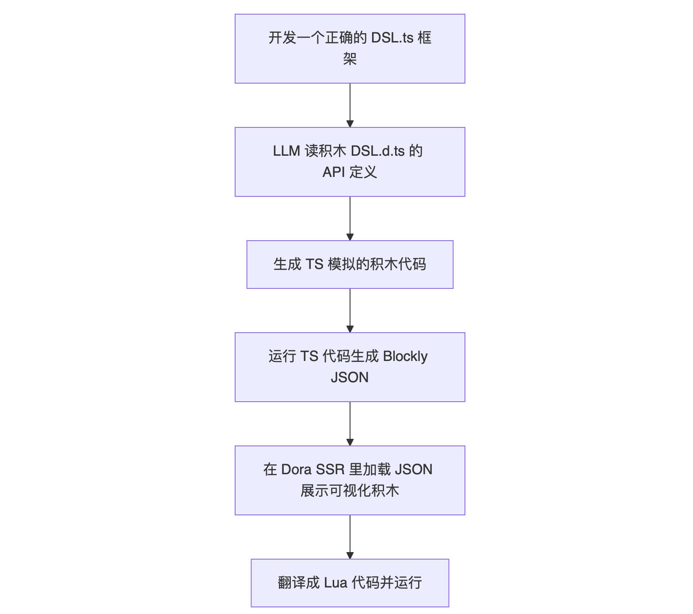
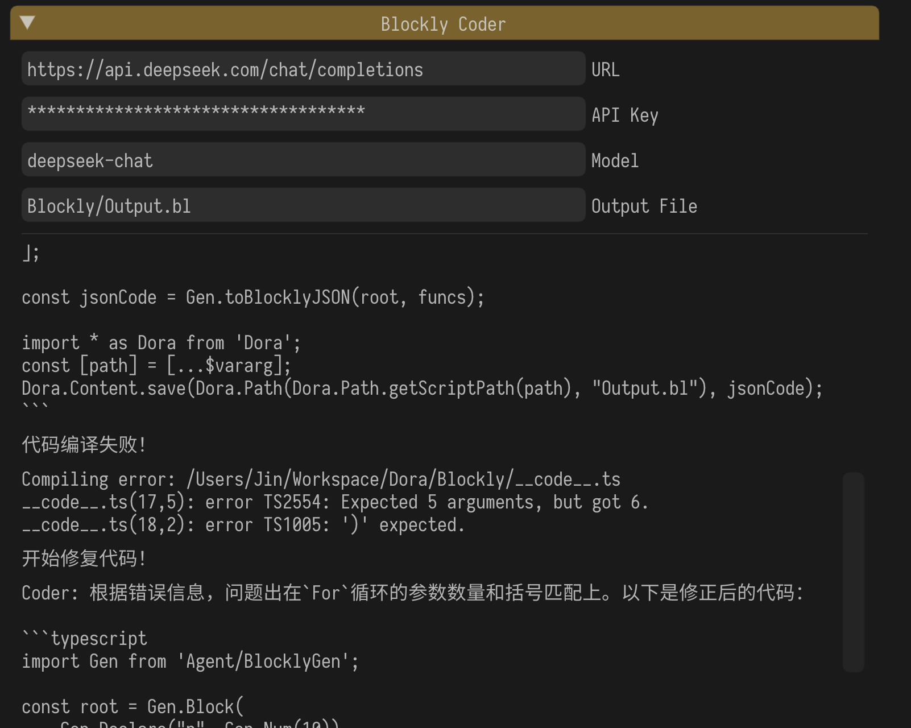
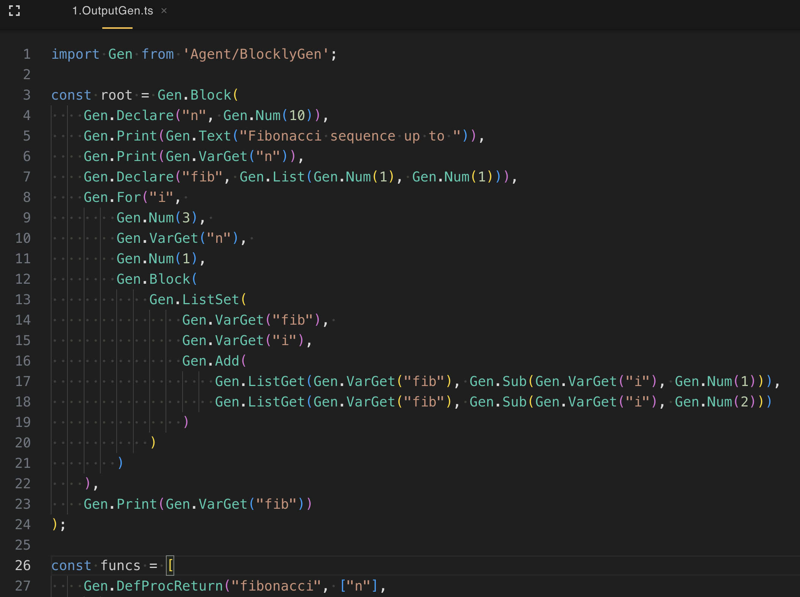
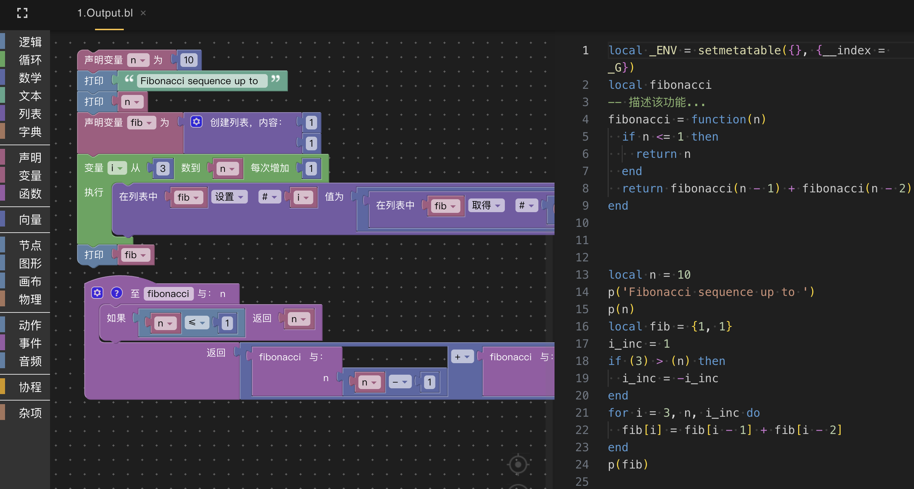
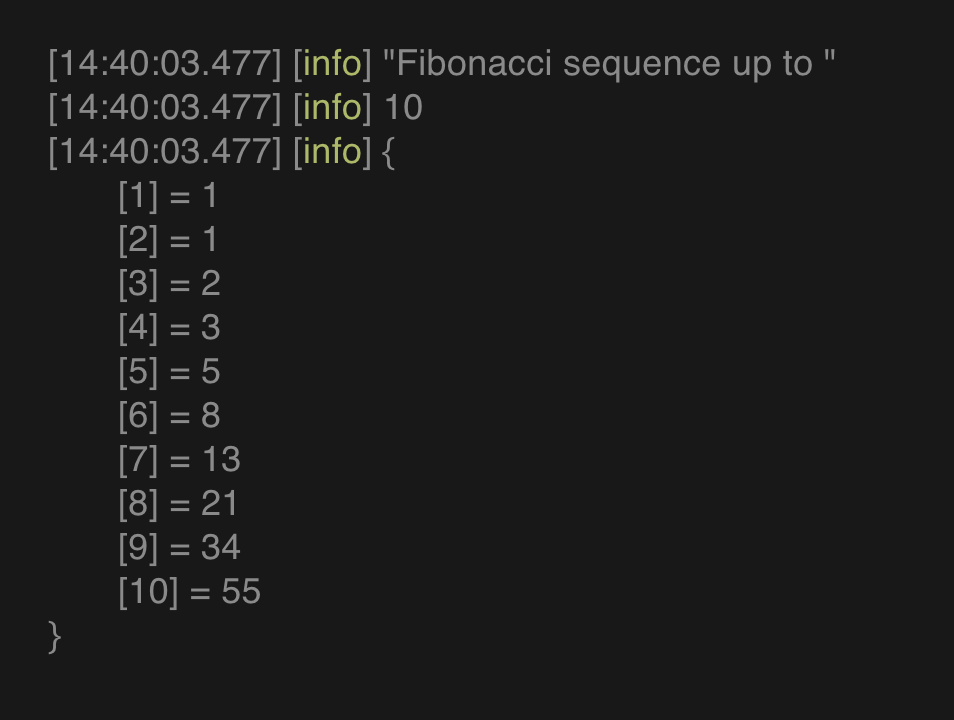
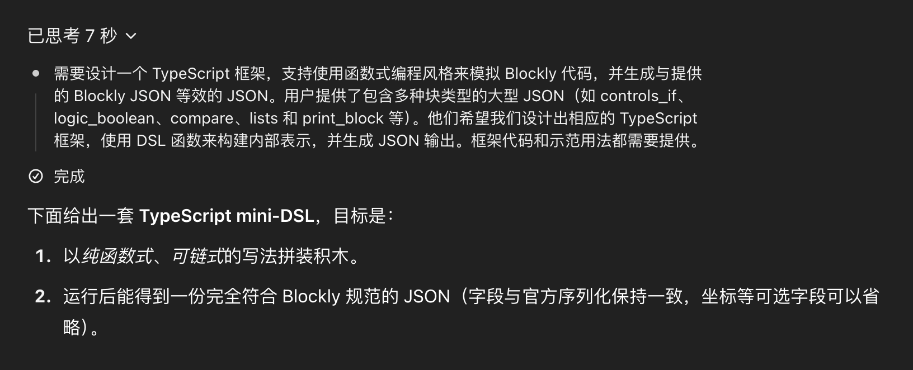
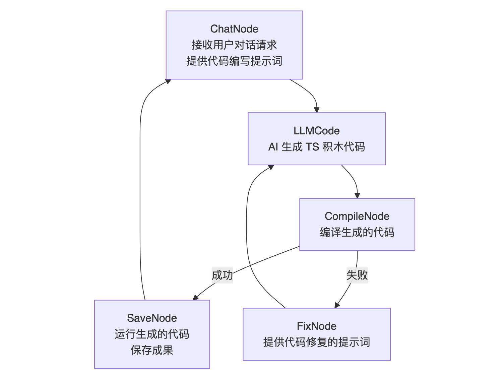
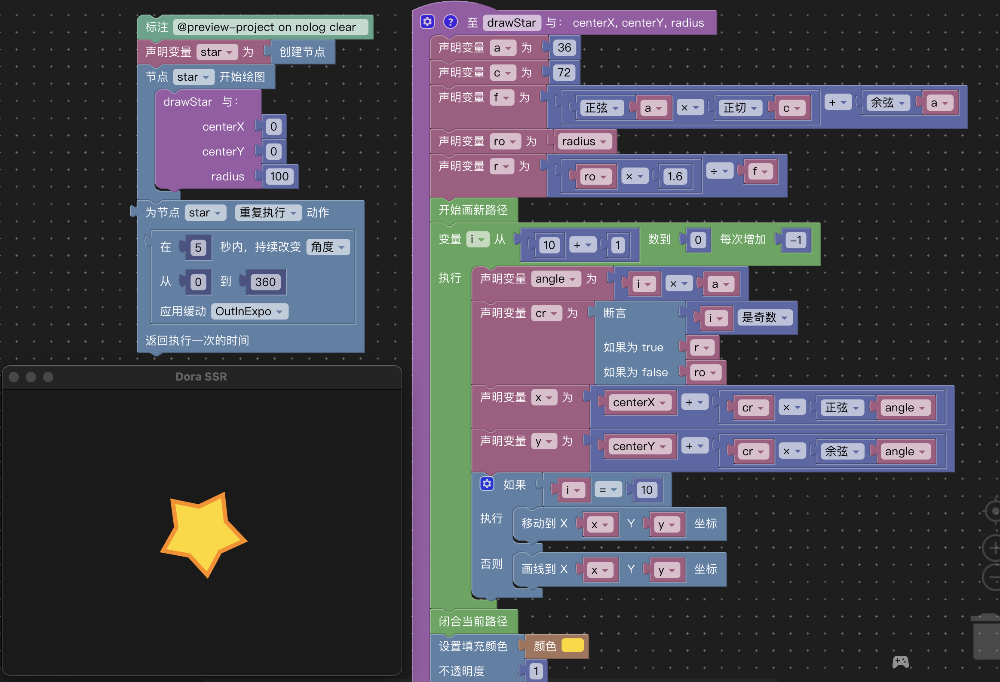
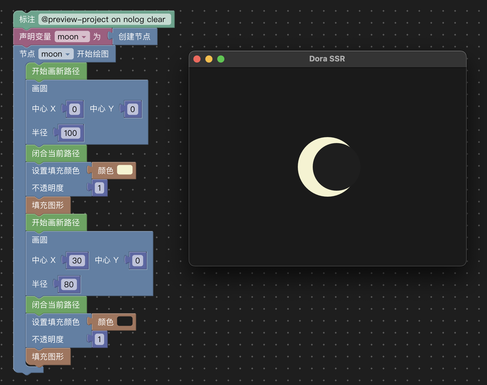

# Dora SSR x AI x Blockly 低科技和高科技的碰撞

## 一、引言：让 AI 和积木愉快地玩耍！

&emsp;&emsp;书接上回，我们给 Dora SSR 开源游戏引擎整了个人类含量过高而 AI 含量不足的功能。所以急需开始整新活：这次要把看似古早又低科技的积木编程，和时髦值很高的 AI 技术硬撮合到一起！

&emsp;&emsp;一开始又是一位路人用户的突发奇想（为什么要说又）：如果 AI 可以帮忙写代码，那它能不能也来帮我——搭编程积木呢？
没错就是我们刚给 Dora SSR 游戏引擎加上的，小朋友玩得飞起、程序员用着头秃的、花花绿绿一堆方块的积木编程。

&emsp;&emsp;积木编程表面上看起来傻乎乎，拖拖拽拽好像很人性化，但背地里其实暗藏玄机——每一块小积木，拼出来的就是一棵棵“抽象语法树”（Abstract Syntax Tree，简称 AST），如果要做的东西复杂了，手动造起来，可能会累到心梗。而如果指望 LLM 模型去模拟人类做手工拖拽？抱歉，模拟笨拙的人手操作，还要保证正确性，使用当下的 AI 技术自动完成，可能不如直接从脑子里长出一棵树来得快！

&emsp;&emsp;那么问题来了，既然大模型如此聪明，为什么不干脆直接生成一颗 AST，把积木块自动排列得整整齐齐？正是基于这个灵感，我们决定彻底给 Blockly 编程这位“拖拉机玩家”减减负，直接让 AI 把抽象语法树的代码用文本代码敲出来，再转成积木布局。

&emsp;&emsp;首先，为了让大家更直观感受我们的骚操作，先来一张流程图镇楼！



&emsp;&emsp;这次有点急，要不在这里就放个已经实现的最终效果演示来快速结束文章吧。（姨马，阔阔尼）

&emsp;&emsp;下面的这张是在 Dora SSR 游戏引擎中运行的 AI Agent 界面截图。已提出需求：“编写一个斐波那契数列算法”。要问为什么选择了`deepseek-chat` 的 大模型 API——因为它价格便宜。



&emsp;&emsp;AI Agent 生成 TypeScript 代码，并反复进行编译检查，直到正确生成了调用 DSL 框架的“积木代码”。



&emsp;&emsp;运行 “积木代码” 生成了 Blockly 积木程序文件。在 IDE 中打开积木文件，自动生成了对应的 Lua 代码。



&emsp;&emsp;运行生成的 Lua 代码，输出运行结果。



&emsp;&emsp;演示结束，文章继续。

------

## 二、设计思路与技术选型：聪明反被聪明误？不存在的！

&emsp;&emsp;其实在正式开始大搞特搞之前，我们先冷静（大概三秒钟）思考了一个问题：
积木编程这么可爱，怎么才能让 AI 更聪明地帮忙呢？

&emsp;&emsp;首先，传统的 Blockly 使用体验是这样的：人类小手一块一块地拖拽积木，然后慢慢搭成一棵程序树，像是造房子一样堆砖头。这种方式对小朋友和初学者超级友好，但对大模型来说……呃，简直就是地狱级副本。毕竟，AI 并没有小手，它靠的可都是一行行生成文字的魔法！

&emsp;&emsp;所以我们灵机一动：既然 Blockly 本质上是构建抽象语法树（AST），那为啥不让大模型直接从文本生成 AST？绕开拖拽，直接建树！

&emsp;&emsp;这样一来，不仅能省去大量的模拟动作，还能让 AI 真正专注于最擅长的领域——思考和生成结构化代码，效率蹭蹭蹭地涨！

&emsp;&emsp;那有没有可能让 AI 直接生成 Blockly 加载使用的 JSON 代码呢，也不是不可能，但是 JSON 代码的冗余信息很多，并且 Blockly 的 JSON 格式文件中包含了除了程序逻辑以外的用于图形显示的额外配置信息，并且根据咱编程老师傅多年的经验判断，用代码框架去正向地生成有效的 Blockly JSON 代码会比编写一个对应的 JSON 格式验证程序要容易得多，AI 敢写你也要敢验证才成。

------

&emsp;&emsp;那么说干就干，可是……用什么语言来设计这套 “写积木” 的 DSL（领域专用语言）呢？
 经过一番激烈的头脑风暴（大概持续了 1 秒钟），作为 TypeScript 爱好者的我们决定：那就 TypeScript 没跑了！

&emsp;&emsp;原因很简单：

- 静态类型保护：TypeScript 能在编译阶段就把你潜伏的 bug 揪出来。
- 开发体验一级棒：写起代码来清晰优雅，语法又不像其他硬核语言那么拗口，最适合给 AI 这种"学霸型选手"准备，当然也适合人类手工给 AI 生成的代码做售后。
- 自动补全友好：以后扩展功能的时候，不仅 AI 写得舒服，人类也能跟着一起快乐修改维护！

&emsp;&emsp;总之，TypeScript + 积木 DSL = AI 高效写积木神器，完美！

------

&emsp;&emsp;当然啦，为了让一切顺利进行，我们还搭了个超灵巧的执行链条—— AI 一边撸代码，一边检查自己是不是写歪了，一旦发现问题还能自我修正，这就进入了下一节的精彩内容啦！

&emsp;&emsp;敬请期待下一集：“AI 特工（Agent）行动大计划”！（才怪）

## 三、实现原理：积木、代码和魔法混合炼金术！

### 再说说基础的 DSL 框架

&emsp;&emsp;这套 TS 的 DSL 框架，本身也是用一种极其"懒惰而高效"的方式搞定的！

&emsp;&emsp;简单来说，这个 DSL 框架的使命，就是在运行之后，自动吐出一份标准、纯净、能直接被 Blockly 引擎吃进去的 JSON 积木定义文件。
 听上去好像很复杂？——其实，连这份 DSL 框架我们都几乎没动手亲自写！

&emsp;&emsp;秘诀在于：直接拿现成的 Blockly 导出的 JSON 代码，丢给大模型，让它自己推理、自己总结、自己动手设计 DSL。

&emsp;&emsp;没错，大模型在这件事情上就像一个聪明又勤快的助理：
 只要给它看一眼示范，它就能自个儿举一反三、归纳总结，一口气生成一整套可以直接使用的 TypeScript 框架。

&emsp;&emsp;而人类呢？人类只需要做好两件事：

- 复制
- 粘贴

&emsp;&emsp;（偶尔心情好可以顺便鼓励一下 AI：“做得好，感谢”）

&emsp;&emsp;于是，一场积木 DSL 的工厂大作战，就在不知不觉中被大模型高效完成。人类变身无情的“复制粘贴器”，只需要轻松点鼠标，就能看到积木 DSL 代码从无到有、呼啸而来！



### 关于 AI Agent 编程：硅基生物开始自己生小孩了？

&emsp;&emsp;有了 DSL 模块之后，当然得搭一个能自己干活的自动化工厂啦！

&emsp;&emsp;这时候，PocketFlow 框架隆重登场！那么 PocketFlow 究竟是个什么神奇玩意呢？这里直接引用作者自己画的一张梗图：


&emsp;&emsp;太喜欢这种极客感拉满的风格了，直接开大嘲讽了一众复杂到飞起的 AI 开发设施项目。

&emsp;&emsp;其实想想也有原因：

&emsp;&emsp;早期大模型还很弱鸡，为了榨出一点点聪明劲儿，只能在外围堆一大堆复杂工程设计来“挤牙膏”；

&emsp;&emsp;而 PocketFlow 出生在大模型能力已经爆棚的今天，因此可以豪气地只用 100 行代码，就做出一个干净利落的基础 AI Agent 框架！

&emsp;&emsp;更酷的是，作者还贴心地给 PocketFlow配了一套辅助提示词系统，加上整理精美、能直接拿来喂给 Cursor 编程工具使用的规则文档。

&emsp;&emsp;最终效果就是：

&emsp;&emsp;只需要用自然语言描述你的需求，然后……

&emsp;&emsp;Boooom～AI Agent 自己开发出了新的 AI Agent！

&emsp;&emsp;（硅基生物居然掌握了劳动力再生产，等等，这难道是 AI 的一种“生育”行为？）

---

&emsp;&emsp;回到 Dora SSR 这边，情况稍微复杂一点点：

&emsp;&emsp;因为我们用的不是常规的 TypeScript 运行环境（比如 Web 浏览器、Node.js），而是一个把 TS 代码编译成 Lua、在 Dora C++ 引擎层运行的神奇环境。

&emsp;&emsp;比如，发起大模型 API 调用，需要通过 Lua 代码调用 C++ 提供的 Http 请求接口。

&emsp;&emsp;这种奇葩（划掉）特别的环境，估计大模型还不太熟，所以……

&emsp;&emsp;我们选择了保守治疗！

&emsp;&emsp;这次的 AI Agent 程序还是手动撸的，不过也没啥压力：

&emsp;&emsp;整个程序加起来才 400 行，在游戏引擎里写得飞快，写起来的手感还行～

---

&emsp;&emsp;这次要写的 AI 工作流也非常简单直接，一句话概括：

&emsp;&emsp;接需求 -> 编码 -> 编译 -> 修错 -> 保存

&emsp;&emsp;画成流程图长这样（或者换个高大上的说法也可以叫做 AI 智能体流程编排图？）：



&emsp;&emsp;可以看到，整个流程就是模拟了人类程序员写代码时的常规动作：

&emsp;&emsp;理解需求 → 写代码 → 编译通过 → 成功保存 or 出错修 bug。

&emsp;&emsp;本来还可以加上处理运行时错误的自动修复流程，不过考虑到使用的是设计良好的 TS DSL 框架，能通过编译的代码大概率也能顺利运行，所以……

&emsp;&emsp;我们又光荣地偷了个懒！

&emsp;&emsp;其实在这个 AI Agent 程序中最核心的代码只有下面这一小段：

```typescript
const chatNode = new ChatNode(); // 和 AI 聊天，下单子
const llmCode = new LLMCode(2, 1); // 让 AI 按照规则写 TypeScript 积木代码
const compileNode = new CompileNode(); // 编译 TS 积木代码
const saveNode = new SaveNode(); // 成功？保存下来！
const fixNode = new FixNode(); // 失败？回去改！

chatNode.next(llmCode);
llmCode.next(compileNode);
compileNode.on('Success', saveNode);
compileNode.on('Failed', fixNode);
fixNode.next(llmCode);
saveNode.next(chatNode);
```

&emsp;&emsp;有没有发现这一段代码很像是在写一个小型的状态机（State Machine）的程序呢？

&emsp;&emsp;对的，虽然咱们看上去只是简单地串了一串 `Node`，但实际上，每个节点（Node）就代表了一个工作状态，每个 `.next()` 和 `.on()` 则定义了状态之间的跳转条件。

&emsp;&emsp;比如：

- 从 `ChatNode` 出发，拿到需求；
- 跳到 `LLMCode`，让 AI 开始写代码；
- 写完以后交给 `CompileNode` 检查；
	- 如果编译成功，就跳到 `SaveNode` 保存成果；
	- 如果编译失败，就跳到 `FixNode` 生成修复提示词；
- 修好以后，重新回到 `LLMCode`，继续尝试；
- 一轮一轮地循环，直到成果入袋！

&emsp;&emsp;整个流程流畅自然，像一台精密运作的小机器，
 只不过这台机器的燃料不是汽油，而是燃烧的大模型 API 的 token 计费。

&emsp;&emsp;其实就把这个代码逻辑换成更加简单的 if-else 控制流也是完全能实现的。用这样的节点连接状态机的方式，最主要还是为了提升代码的可维护性，比如想增加新功能？直接插个新 Node，比如 `RunNode` 做运行测试、`OptimizeNode` 做性能优化。想调整流程？随便换换 `.next()` 的连线，修改很少的代码就能完成，非常灵活。

---

&emsp;&emsp;顺便分享一些实测小趣事：

&emsp;&emsp;在这个流程里，发现 Deepseek V3 的实际表现比 ChatGPT 4o 要弱上好一截。

&emsp;&emsp;起初我以为现在大模型都很强了，就没加思维链提示词优化，结果——

&emsp;&emsp;Deepseek 抽卡脸黑的时候，要反复修 6-10 次才能把代码编译通过，总是莫名其妙括号数不对，气得人想给它塞点编程培训班广告。

&emsp;&emsp;而 ChatGPT 4o 表现就好得多，通常 0-2 次就能修正成功，十分靠谱。

&emsp;&emsp;后来，我简单给 Deepseek V3 加上了思维链优化（引导它多想一想再动笔），才稍微好转了一点。

&emsp;&emsp;不过一到更难的挑战，比如让它自己写一份快速排序算法的积木代码——

&emsp;&emsp;Deepseek V3 彻底缴械投降，直到靠我手动喂了一份 Lua 快排代码给它“照着抄”，才勉强拼出来。

---

&emsp;&emsp;当然，AI 在画画方面的表现还是一如既往地令人欣慰：

&emsp;&emsp;比如下面这两幅，AI 熟练运用类似 Canvas API 的接口，自动绘制出了星星和月亮！



---



&emsp;&emsp;绘图小能手，认证通过！

----

## 四、总结与展望：从造积木到造未来

&emsp;&emsp;这一次的 Dora SSR x AI x Blockly 实验，虽然只是第一步小小的探索，但已经让我们看到了非常激动人心的画面：

&emsp;&emsp;AI 不再只是个听指令的小帮手，它正在成为可以协助设计、协助创造、甚至协助自己"生孩子"（AI Agent 生成 AI Agent）的超级搭档！

&emsp;&emsp;通过给 Dora SSR 增加这样一套 AI 驱动的 Blockly 积木代码自动化生成系统，我们收获了不少有趣的经验，比如：

- 把抽象语法树直接当作生成目标，反而比模拟人工拖拽更靠谱；
- TypeScript + 大模型是超强组合，静态类型检查帮了大忙；
- PocketFlow 框架简单又优雅，让 Agent 流程开发低成本又高效率；
- 现实中的大模型，还远远没有完美，需要设计合理的流程和提示词来"带飞"。

&emsp;&emsp;更重要的是，这套方法论本身并不局限于 Blockly，也不局限于 Dora SSR。
 未来，它可以扩展到任何需要结构化编程、流程式建模、或者人机共创的领域里去！

------

&emsp;&emsp;展望未来，我们还有好多好玩的事情可以继续搞，比如：

- 自动做策划设计的 AI Agent：让 AI 不只是写代码，还能帮我们规划故事大纲、设计玩法、想出奇妙的创意点子！
- 自动编写 Yarn Spinner 剧本，直接能玩的文字冒险游戏 Agent：只要给个大致主题，AI 就能自己生出分支剧情，玩家可以马上沉浸体验。
- 自动生成横版冒险游戏关卡的设计 Agent：地图布局、障碍设置、道具藏点，AI 一条龙打包搞定，让每次游戏都独一无二。
- 自动编写游戏 UI 功能的 Agent：按钮、面板、弹窗、界面逻辑，通通交给 AI，程序员们终于可以摆脱枯燥重复的 UI 小活啦！

&emsp;&emsp;我们相信，只要敢想，AI + 游戏开发的边界还能被不断打破。

&emsp;&emsp;当然啦，梦想的森林需要更多园丁来一起耕耘——

&emsp;&emsp;希望有更多的伙伴加入 Dora SSR 社区，一起来探索，一起尝试，一起共建，让这场属于开源、创意和冒险精神的旅程越走越远！

### 代码地址

- Github：https://github.com/IppClub/Dora-SSR/blob/main/Assets/Script/Tools/BlocklyCoder.ts
- AtomGit：https://atomgit.com/ippclub/Dora-SSR/blob/main/Assets/Script/Tools/BlocklyCoder.ts