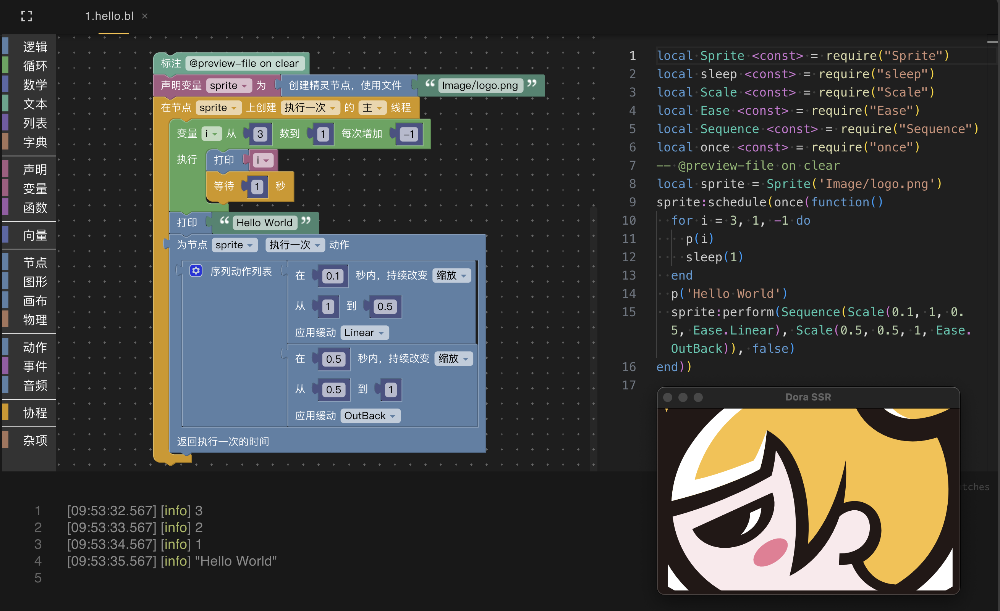

# Dora SSR x Blockly—这种感觉我从未拥有

&emsp;&emsp;我们最近给 Dora SSR 开源游戏引擎整了个“有点可爱、有点大聪明”的新功能——图！形！编！程！（对，就是那种拖积木块写程序的东西~）本来我作为一名（不）正经专业开发者，对这类东西一度嗤之以鼻：“哼，不就是小孩子玩的编程玩具 Scratch 嘛，有啥好整的？”

&emsp;&emsp;结果，万万没想到……我真香了。

## 图形编程，妙不可言

&emsp;&emsp;起初，我们出于想要维持某种癔想中的专业程序员格调的心理需求，其实并没有打算给 Dora SSR 加图形编程的。作为专业开发者，大家潜意识里总会觉得图形化编程是“给小朋友玩的”，和专业代码编辑器之间隔着十万八千行差距。

&emsp;&emsp;但意外的是，在一次社区讨论中，有朋友非常执着地提出：“可不可以给 Dora 加点图形化编程的功能？并不是怕学代码，但希望能在平板或触屏上快速搭建原型，希望你们不要只考虑键盘和鼠标这种代码输入模式。”

&emsp;&emsp;——这个提议一开始只是被轻轻一提，结果得到群友的大量讨论。我们意识到，这或许不是一个“低龄向”的要求，而是一个希望用更轻松方式进入专业游戏开发的真实需求。

&emsp;&emsp;于是我们认真地开始调研市面上的图形编程方案。从 Scratch 到各类魔改版，我们比对了功能、生态和协议兼容性。最终选择了 Google 的 Blockly 框架：

&emsp;&emsp;为什么不用 Scratch，不也是开源的吗，因为它的开源协议 AGPL 限制太多，与我们的开源策略和跨平台支持不完全兼容；

&emsp;&emsp;所以最后选了 Blockly，也因为使用 Apache 2.0 协议，和 Dora SSR 完美适配；

&emsp;&emsp;而且最重要的是——Blockly 原生就支持编译输出 Lua 语言代码！

&emsp;&emsp;这就太适合我们了。因为 Dora SSR 本身就是一个以 Lua 为主要脚本语言的游戏引擎，Blockly 生成的 Lua 代码可以直接在 Dora 上运行，作为已经支持过多种编译到 Lua 的编程语言的 Dora，使用这个新语言工具一点也不“编程审美降级”。

Dora SSR 中已实现的 Blockly 功能展示

## 想好了就动嘴干

&emsp;&emsp;当我们真正动手整合 Blockly、开始定制适用于 Dora 引擎的 API（抽象编程接口）积木块时，我才逐渐意识到，图形编程其实是一种“重新发明代码输入方式”的思路：它不是为了替代代码，而是为了让人更快速、稍微凭着直觉地“写代码”。

&emsp;&emsp;我们精选了 Dora 的核心模块，比如：

- 场景节点系统
- 矢量绘图
- 动作与事件机制
- 物理刚体系统
- 音频播放控制
- 协程（Lua 的神器）

&emsp;&emsp;然后计划把它们通通变成了一个个会自动生成 Lua 代码的积木块。
 组合这些积木块，等于真的在写程序，不是“伪编程”，不是“模拟编程”，是真的可以 1:1 生成 Lua 源码、直接运行在 Dora SSR 上的专业程序！

&emsp;&emsp;当我们决定要落地实现 Blockly 积木块时，本以为会是一项长达数周的繁重工程：毕竟要为每个 Dora SSR 的核心 API 写出定义、图形形态、连接逻辑、翻译为 Lua 的生成器……听起来似乎又要搞一场浩大的体力活（Dora 项目中已经让人疲惫地搞过 C++ 到 Lua，C++ 到 Rust 和 C++ 到凹语言的三场跨语言大型对接活动了）。

&emsp;&emsp;但情理之外意料之中的是，这一次我们没有靠“肝”，而是靠“嘴”——没错哟，就是字面意义上的“动嘴干”。

&emsp;&emsp;这次用了 Cursor 编辑器内置的 Agent 功能配合提示编写策略，仅在前期先花了一天时间：

1. 人工查阅并试用了 Blockly 的接口设计方式；
2. 手工写了一个 Dora 专用积木的定义样例，包括拼搭结构和如何将其翻译成 Lua 代码；
3. 然后……就交给 AI 上班啦。

&emsp;&emsp;有了可行的模板和样例，Cursor Agent 很快就“嘎嘎”地模仿开发，自动生成了成套的 API 积木定义与代码翻译逻辑，短短三天就写出了超过 5000 行可用代码！整个过程不仅快，而且结构清晰、模块标准，远超我们原本对“AI 自动生成代码”的预期。

&emsp;&emsp;甚至还没有明白事情严重性的群友还在提议：“要不你再搞个 IDL 工具，把 API 定义一写，就自动翻译生成 Blockly 积木？”
 时，我们一笑置之：“已经不用再战斗了，AI 已打完收工。”

&emsp;&emsp;这次经验让我们真切感受到了当人工 + AI 配合得当，“想法到产品”的路径真的可以变短很多，享受到一波其实也并不想要的 AI 时代的红利。

“张嘴”就是要 AI 干活

## 积木里也有黑科技

&emsp;&emsp;在开发过程中发现，积木编程其实还有个让人拍案叫绝“这设计真棒！”的地方——那就是：阴影积木（Shadow Blocks）。

&emsp;&emsp;如果你熟悉代码编辑器，你大概知道“代码片段（Snippet）”这种东西，就是你打两个字，IDE 就贴心地弹出一整套函数模板、结构框架啥的一套代码模版进行复制粘贴。而 Shadow 积木块其实就是相当于图形编程里的 Snippet 功能。

&emsp;&emsp;在我们为 Dora SSR 定制的 Blockly 积木系统里，很多 API 块都可以做一套预组合好的“复合积木”：比如一个“移动到位置”积木，默认就带了三个阴影积木——一组内含 x 和 y 坐标积木的二维向量积木。你可以直接拖整块用，也可以点一下，把里面的子块换成变量或其他编程表达式，又有灵活性又能增加操作手速！编程写法的模板化有时候甚至有机会比手敲代码更快，因为你可以为每一个 API 都精心设置阴影积木的常用预制组合来提升每一个 API 的上手体验。

预制的积木组合

## 搭积木简单，但搭积木编程并不简单

&emsp;&emsp;虽然看起来是图形化编程，但咱 Dora 的 Blockly 可不是“只要拖拉拽就能起飞”的超能力。它只是换了种方式在写“真·正·的·代·码”！

&emsp;&emsp;如果是对游戏编程没有概念的用户，一上来还是会晕：

- 场景？节点树？干嘛还要加子节点？
- 方法？属性？这和拼积木搭流程有啥关系？
- 协程？物理系统？事件回调？听起来怎么有点像做“大学物理实验”……

&emsp;&emsp;没法一下子看懂 Dora 提供的编程积木那就对了，因为这里的定位你是在用积木搭专业的游戏代码！

&emsp;&emsp;图形化编程并不能“彻底降低门槛”，但它换了一种更顺手的方式来进入复杂的游戏开发世界。不再是要你对着黑底白字的编辑器发呆，而是阔以试试：“这个积木插这里看看有没有效果？！”

## 是的，我从小也用过图形编程，只是那时候不知道

&emsp;&emsp;说来也有点好笑，在我人生第一次接触图形编程的时候，根本不知道“编程”为何物。那还是小时候玩《魔兽争霸3》的年代，最让我着迷的不是暗夜精灵打天灾，而是——地图编辑器里的触发器编辑器。

&emsp;&emsp;你知道的，就是那个能用“如果发生 XX，就执行 YY”的方式来控制游戏逻辑的小面板。没有代码，全是图形界面点来点去，但你能让单位瞬移、掉血、爆炸、召唤龙，甚至做出一整张 RPG 地图。
 小时候我完全不知道那就是在写“程序”，但现在回过头来看，它的逻辑架构，其实和 Blockly 几乎一模一样——通过图形界面组合模块，背后生成的就是能驱动游戏世界运行的真实代码。

&emsp;&emsp;如今在 Dora SSR 上“重写发明”这么一套东西，说实话，有种说不出的情感在心里翻涌。

&emsp;&emsp;原来童年最爱的“玩具”，如今成了我亲手打磨的开发工具。
 原来我和“编程”的第一次接触，从来都不是写代码，而是把一块块“事件-条件-动作”的逻辑积木拼在一起。

&emsp;&emsp;从那时的触发器，到今天的 Blockly，我忽然觉得，也许我们并不是要“简化”编程，而是试图回到最初让人上瘾的那个“创造感觉”的起点，复古的尝试一点“老”东西。

魔兽争霸3触发器编辑器，所有“代码”都是用鼠标点出来的

## 在宇宙中心呼唤：一起来拼一个游戏吧！

&emsp;&emsp;现在，Dora SSR 的 Blockly 编程系统已经可以用于开发各种小游戏了。虽然它不像 Scratch 那样从场景到角色都预制配好了，但它提供的是一套真实游戏引擎的编程能力——你通过 Blockly 编出来的游戏，是可以真正上架开源掌机和手机、在各种平台运行的！

&emsp;&emsp;都欢迎你来 Dora SSR 社区试试 Blockly！我们也在不断更新 Dora 引擎的功能与教程，来一起快乐拼积木，认真创作游戏吧！

* GitHub：https://github.com/IppClub/Dora-SSR
* Gitee：https://gitee.com/IppClub/Dora-SSR