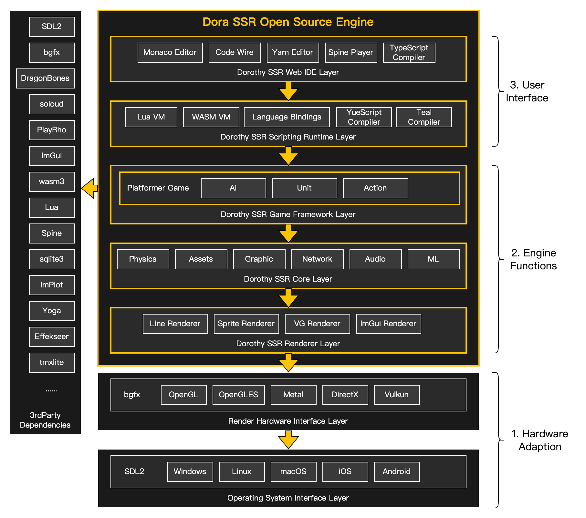
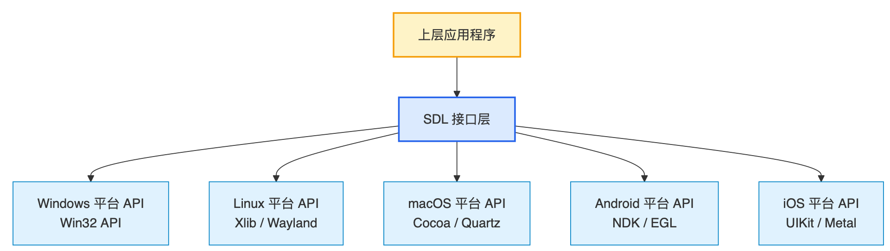
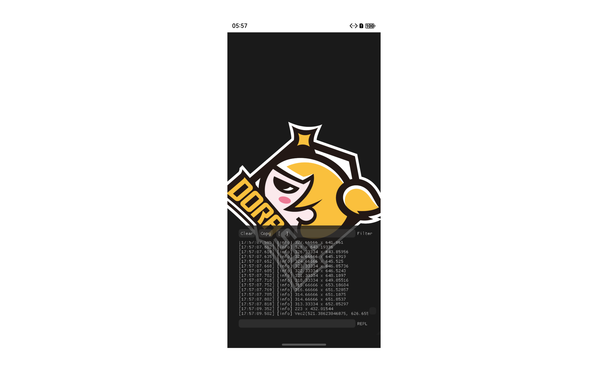
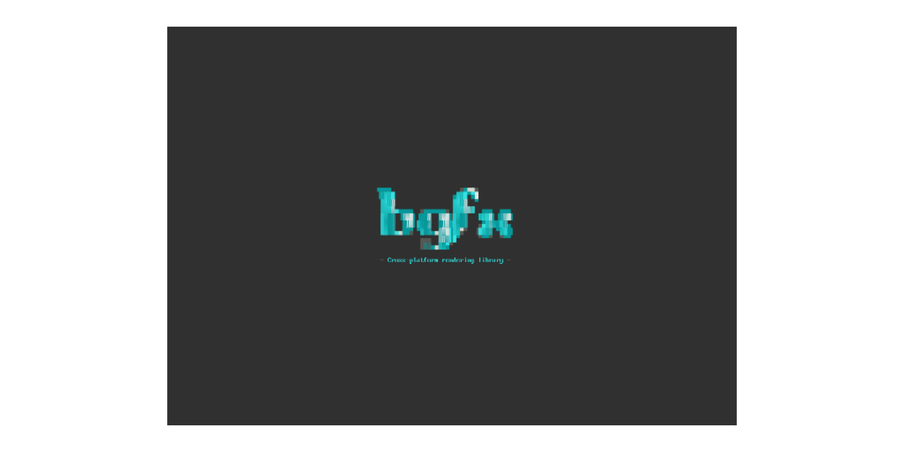
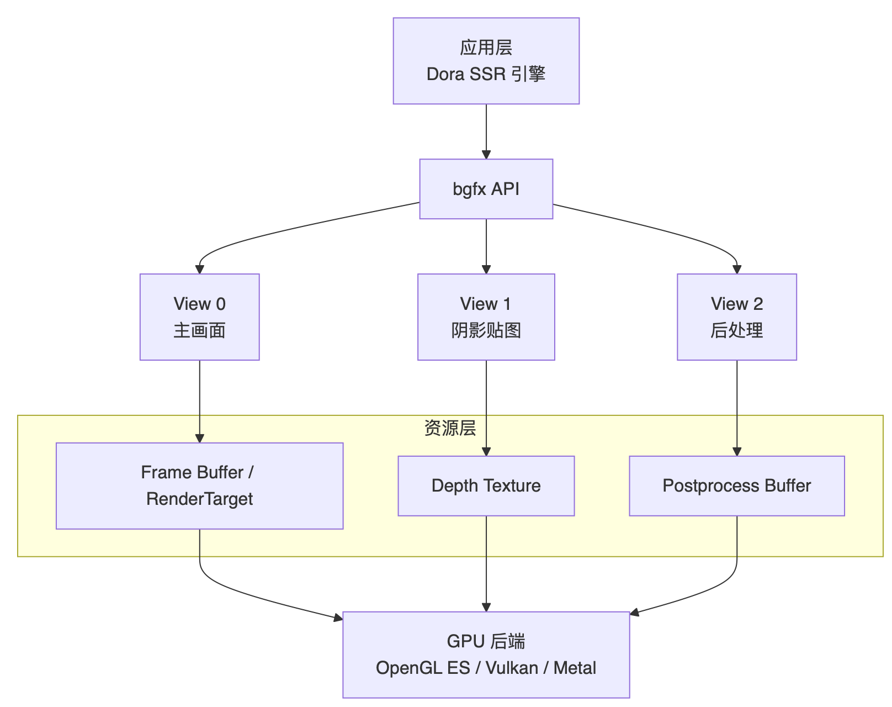
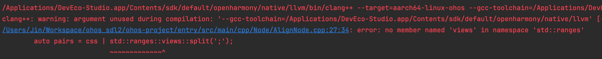
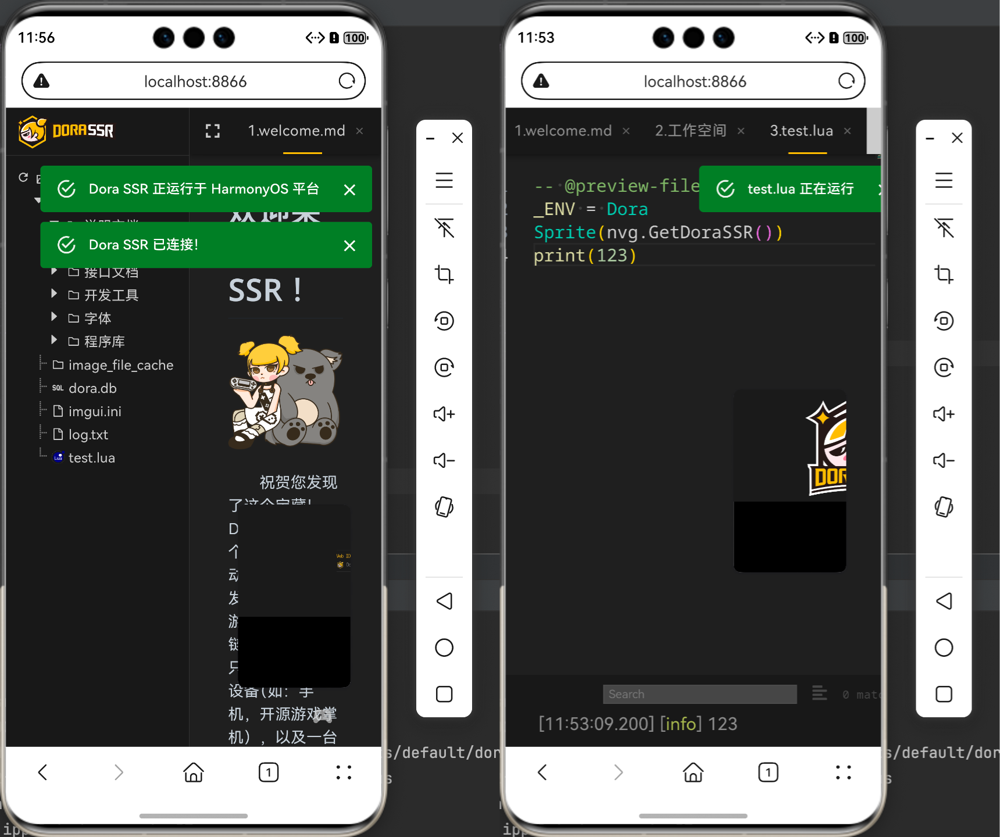
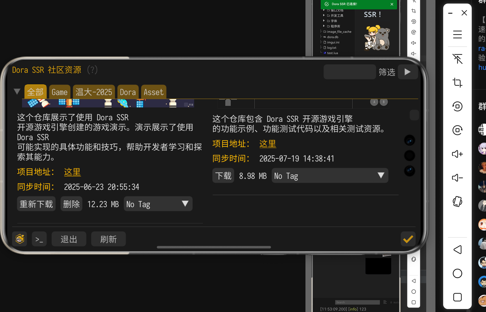
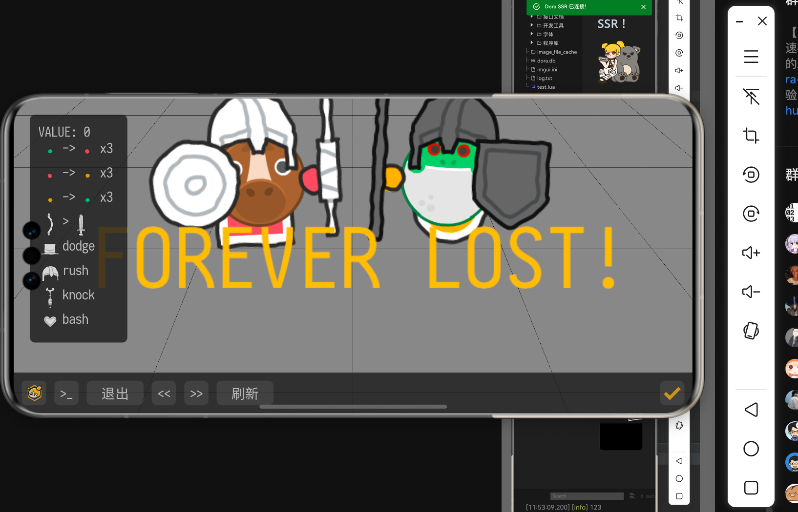

## 开源引擎与鸿蒙平台挑战

&emsp;&emsp;Dora SSR是一款跨平台开源游戏引擎，采用 C++ 编写核心功能。它内置了易用的 Web IDE 开发工具链，支持在移动设备、嵌入式设备和手持游戏机等多种平台直接进行游戏开发。随着华为鸿蒙（HarmonyOS）系统的兴起，我们社区的开发者萌生了让 Dora SSR 引擎在鸿蒙 OS 上原生运行的想法。然而，要让一个游戏引擎登陆全新的操作系统并非易事，需要解决底层系统 API、图形接口等方面的适配挑战。

&emsp;&emsp;我们决定充分利用引擎现有的跨平台架构优势。Dora SSR 原本就高度依赖 SDL2 和 bgfx 这两个跨平台库：SDL2 负责抽象操作系统层的窗口、输入、音频等通用功能，bgfx 则作为跨平台渲染硬件接口（RHI）封装具体图形 API。借助它们，我们希望最大程度减少对鸿蒙系统适配的代码改动，只需在必要处实现 SDL2 和 bgfx 针对鸿蒙的支撑即可完成移植。这个思路也契合 Dora SSR 引擎一贯的设计哲学：引擎自身尽量与平台解耦，依赖中间层的抽象能力来适配不同系统。



&emsp;&emsp;*图：Dora SSR 架构。*

## 操作系统抽象层的利器

&emsp;&emsp;SDL2（Simple DirectMedia Layer）是 Dora SSR 引擎用来处理操作系统相关功能的基础。作为一款跨平台的多媒体开发库，SDL2 提供了控制图像、声音、输入输出等的统一接口，使开发者能够用相同或相似的代码开发出跨多个平台（如 Linux、Windows、macOS 等）的应用。简单来说，SDL2 将不同操作系统的底层函数封装为统一的函数调用。例如，在 Windows 平台 SDL 内部实际调用的是 Win32 API，而在 Linux 上则通过 X11 的 Xlib 或是 Wayland 库来实现窗体图形输出。这种封装让游戏引擎无需关心每个系统的繁杂细节，大幅减少了针对不同 OS 编写和调试底层代码的工作量。



&emsp;&emsp;*图：SDL 在不同操作系统上的封装示意 – SDL会将 Windows 上的 Win32 API、Linux 上的 Xlib 等平台 API封装为统一接口供上层调用。*

&emsp;&emsp;更重要的是，SDL2 不仅提供图形窗口管理，还涵盖文件系统访问、事件处理、音频输出、线程等子系统。这意味着使用 SDL2 编写的游戏引擎，许多平台相关功能都走统一的代码路径。在适配一个新操作系统时，我们并不需要改动引擎的大部分逻辑，只需在新平台上实现 SDL2 用到的那一小部分功能即可。例如，本次将引擎移植至鸿蒙，我们首先考虑的就是鸿蒙上 SDL2 的支持情况。如果 SDL2 已有鸿蒙实现，应用层代码几乎不用改动；即便暂时还没有相关社区的支持，我们也可以自行实现 SDL2 的几个抽象接口（如窗口创建、输入事件、音频播放等）来让引擎跑起来。这种“抽象层适配”的模式，大大提升了引擎代码的可移植性。

&emsp;&emsp;举个例子，在跨平台应用开发中，不同操作系统对消息与事件的处理机制差异巨大：

- Windows 使用消息队列（Message Queue），通过 `GetMessage`/`PeekMessage` 分发窗口消息。
- Linux X11/Wayland 有各自的事件循环接口。
- macOS 则依赖 Cocoa 的事件分发模型。

&emsp;&emsp;如果开发者需要在这些平台间编写统一代码，往往要自己封装大量冗余逻辑。

```cpp
SDL_Event event;
while (SDL_PollEvent(&event)) {
    if (event.type == SDL_QUIT) {
        running = false;
    } else if (event.type == SDL_KEYDOWN) {
        printf("Key pressed: %d\n", event.key.keysym.sym);
    }
}
```

&emsp;&emsp;上面的示例代码无需区分 Windows/Linux/macOS/Android/HarmonyOS，在所有支持 SDL2 的系统上都能一致工作。这种“事件抽象层”设计，把平台间千差万别的消息系统统一成一套干净、轻量、适合实时应用的接口，极大地提升了跨平台开发效率。

&emsp;&emsp;在实践中我们发现鸿蒙的社区对 SDL2 已有开源项目的支持了，但也遇到了一些细节问题。例如，SDL2 的音频格式支持在鸿蒙上不完整：一开始 Dora 通过 SDL 接口请求鸿蒙不支持的音频输出格式时，没有得到错误提示，程序继续执行直到发生随机崩溃，一度令我们摸不着头脑。最终我们还是定位到了 SDL 音频初始化流程，避免使用鸿蒙未支持的格式才解决了这个问题。此外，我们还修正了 SDL 输入事件坐标计算在鸿蒙上的偏差，保证触摸/鼠标事件的位置与窗口像素正确对应。由此可见，虽然 SDL2 极大简化了跨平台适配工作，但在一个新系统上跑通它仍需要针对性地调优。不过，相比完全从零适配整个引擎，改动 SDL2 封装的少量代码已经是很小的成本。



&emsp;&emsp;*图：在鸿蒙平台上修正 SDL2 的触摸事件坐标。*

## 跨平台图形渲染的底层能力

&emsp;&emsp;在图形渲染方面，Dora SSR 引擎采用了 bgfx 库。bgfx 是一个跨平台、图形 API 无关的渲染库，强调 “Bring Your Own Engine/Framework”，即引擎自带架构而 bgfx 专注提供底层渲染支持。它内部封装了多种图形后台，可根据平台能力选择使用 Direct3D 11/12、Metal、OpenGL 2.1/3.x、OpenGL ES 2/3、Vulkan、WebGL 等不同渲染 API。对于我们的鸿蒙移植，这意味着：无需重写渲染模块，只要 bgfx 支持鸿蒙上的图形接口，我们就能让引擎渲染出画面。

&emsp;&emsp;起初我们担心过鸿蒙是否存在对图形 API 的支持不足。Dora SSR 引擎依赖了一些 ES 3.0 的特性，如果有不兼容直接运行可能会报错甚至无法启动。不过深入研究后我们发现，鸿蒙实际上已经支持到 OpenGL ES 3.2，是我们传递给 SDL 的 OpenGL 版本参数有误，才让初始化时识别成了 2.0。纠正配置后，引擎成功获取到了 ES 3.x 上下文。然而，事情并非一路顺遂：华为设备上的 OpenGL 实现还是缺失了 bgfx 所需的一部分 OpenGLES 扩展接口的功能。我们最后尝试让 bgfx 跳过那些鸿蒙暂不支持的特性，最终终于使渲染器初始化成功——屏幕上出现了应有的清屏背景，这标志着 SDL2 + bgfx 在鸿蒙上跑通了。这一步非常关键，意味着引擎核心的图形渲染循环已在新平台上正常运转。



&emsp;&emsp;*图：bgfx Hello World 程序在鸿蒙上启动成功。*

## 关于 bgfx 如何消弭多平台渲染差异

&emsp;&emsp;在鸿蒙移植过程中，SDL2 负责操作系统层的统一接口，而 bgfx 则在渲染层面抹平了不同图形 API 的差异。这一点在工程实践中尤为关键，下面结合几个典型设计，简单介绍一下 bgfx 的特点。

1. **能力自描述（Caps）**
	 bgfx 会在运行时检测当前后端（OpenGL ES、Vulkan、Metal…）支持的功能，并通过 `bgfx::Caps` 返回一份能力表。
	 例如，某些平台不支持 sRGB 贴图或 Instancing，bgfx 会提供标记，开发者即可自动选择降级方案，而不用写平台特定的代码分支。

```cpp
const bgfx::Caps* caps = bgfx::getCaps();
bool hasInstancing = 0 != (caps->supported & BGFX_CAPS_INSTANCING);
```

2. **统一状态接口（State Flags）**
	 在不同 API 中，混合、深度、剔除的设置方式各异。bgfx 把这些全部抽象为统一的位标志。
	 一次写好，到处通用。

```cpp
uint64_t state = BGFX_STATE_WRITE_RGB | BGFX_STATE_DEPTH_TEST_LESS | BGFX_STATE_CULL_CW;
bgfx::setState(state);
```

3. **View/Submit 渲染模型**
	 bgfx 把渲染通道抽象成 View，开发者通过 `submit()` 将 draw call 提交给指定视图。
	 在不同后端，这些 View 对应的实现可能是 FBO、RenderPass 或 CommandBuffer，但应用层逻辑始终一致。

```cpp
bgfx::setViewRect(0, 0, 0, width, height);
bgfx::setViewClear(0, BGFX_CLEAR_COLOR | BGFX_CLEAR_DEPTH, 0x303030ff);
bgfx::submit(0, program);
```

4. **跨平台着色器编译**
	 bgfx 提供 `shaderc` 工具，把一份 HLSL/GLSL 源码编译成各平台二进制（DXBC、MSL、SPIR-V 等）。
	 应用只需加载统一的 `ProgramHandle`，不必关心底层差异。

5. **Transient Buffer 与资源生命周期**
	 通过 `TransientVertexBuffer` 等机制，bgfx 自动处理帧级资源的分配与回收，屏蔽了不同 API 在同步和内存管理上的差异。

------

### 视图 / 资源关系示意图



&emsp;&emsp;图中可以看到：应用只和 bgfx 的统一 API 打交道。View 定义了渲染通道和顺序，资源（RT/Texture/Buffer）在内部绑定到底层图形 API。这样无论底层是 OpenGL ES 还是 Vulkan，逻辑都保持一致。

&emsp;&emsp;值得一提的是，bgfx 还提供了切换渲染后端的灵活性。如果 OpenGL 在某个平台表现不佳，我们可以改用 Vulkan 等后端。鸿蒙系统理论上支持 Vulkan，但当我们考察切换 Vulkan 时发现工作量较大：需要修改 SDL2 窗口与鸿蒙图形栈的集成代码，而 OpenGL 路线问题相对更少。因此目前 Dora SSR 在鸿蒙上仍采用 OpenGLES 渲染，但保留了将来升级为 Vulkan 的可能性。bgfx 的多后端设计让我们有信心，在未来鸿蒙图形能力提升或需要支持更多设备时，可以较容易地替换底层渲染接口以获得最佳效果。

## 从编译工具链到运行验证的适配总结

&emsp;&emsp;在实际移植过程中，我们遵循“自底向上”的顺序逐步攻克难题：

&emsp;&emsp;**1. 编译环境与依赖库适配：** Dora SSR 引擎依赖的 bgfx 库及其子库 bx、bimg 等需要先能在鸿蒙下编译通过。然而 bgfx 的官方构建系统使用的是名为 GENie 的项目生成工具，其预置支持的平台并不包括鸿蒙（OpenHarmony）。bgfx 通常通过 GENie 脚本生成各个平台的工程文件——这对常见的 Windows、Linux、Android 都很有效，但面对鸿蒙这个当时的新平台，GENie 无能为力。为了解决这个问题，我们采取了替代构建方案：使用跨平台构建工具 Xmake 重写工程配置。Xmake 早在 v2.9.1 版本就原生支持了鸿蒙 OS 的交叉编译工具链，只需指定平台为 `harmony` 即可自动检测本地的鸿蒙 SDK 并编译。于是我们将 bgfx 的构建脚本从 GENie 生成的 Makefile/CMake 配置逆向“翻译”成 Xmake 脚本。这里我们方便地借助了 AI 大模型的力量——我们把 GENie 生成的 Makefile 丢给 AI，请它转换为 Xmake Lua 脚本，结果一次生成的脚本就几乎可以直接使用，省去了大量人工摸索的时间。

```lua
-- 3rdParty/bgfx/xmake.lua 的部分关键配置示例，就是很简单
set_project("bgfx")
add_rules("mode.debug", "mode.release")
set_languages("cxx17")

target("bgfx")
  set_kind("static")
  -- 鸿蒙平台特定配置
  add_defines("BGFX_CONFIG_RENDERER_OPENGLES=30")
  add_defines("BGFX_CONFIG_RENDERER_OPENGLES_MIN_VERSION=30")

  ...

  -- 编译参数
  add_cxflags("-Wall", "-Wextra", "-ffast-math", "-fomit-frame-pointer")
  add_cxxflags("-fno-rtti", "-fno-exceptions", "-fPIC")

  ...

  -- 平台架构输出目录
  if is_arch("x86_64") then
    set_targetdir("../../Dora/entry/src/main/cpp/3rdParty/bgfx/Lib/x86_64")
  elseif is_arch("arm64-v8a") then
    set_targetdir("../../Dora/entry/src/main/cpp/3rdParty/bgfx/Lib/arm64-v8a")
  end
```

&emsp;&emsp;多个 bgfx 静态库的构建脚本：

```bash
# 3rdParty/makefile 中的鸿蒙构建命令
define build_cmd
  cd $(ROOT_DIR)/$(1) && \
  xmake f -p harmony -m $(2) -a arm64-v8a && xmake && \
  xmake f -p harmony -m $(2) -a x86_64 && xmake
endef

# Release 构建
release:
  @for dir in $(SUBDIRS); do \
    $(call build_cmd,$$dir,release); \
  done
```

&emsp;&emsp;借助 Xmake 对鸿蒙的支持，我们顺利编译出了 bgfx 及其依赖库针对鸿蒙平台的静态库。需要注意的是，鸿蒙采用 musl C 库和特定的 NDK 工具链，与 Linux glibc 或 Android bionic 略有不同。Xmake 中自动配置了鸿蒙提供的 sysroot 和工具链参数，解决了 C++ 标准库链接和 CPU 架构指令集等底层兼容问题。最终，bgfx、bx、bimg 三个基础库都成功产出了鸿蒙版本的库文件，为后续引擎主体的编译奠定了基础。

&emsp;&emsp;**2. 引擎代码调整：** 当 Dora SSR 引擎主体代码切换到鸿蒙NDK编译后，大部分逻辑都无需修改就通过了，这是跨平台设计带来的直接好处。不过仍有一些细节值得记录。例如，鸿蒙使用的 Clang 编译器声称支持到 C++23 标准，但我们遇到了 C++ ranges 库的实现缺失，导致引擎中使用 C++20 ranges 功能的代码无法编译。对此我们临时采取了替换方案，将相关代码改用传统标准库算法，以及改写为手动迭代方式实现，绕过了这个坑点。类似地，个别 SDL2 调用在鸿蒙上尚未实现，我们也对引擎做了宏判断：如果在鸿蒙编译，则跳过或改用替代方案。例如针对前述的输入法（IME）问题，暂时禁用了 SDL 文本输入获取，计划后续再完善。



&emsp;&emsp;**3. 调试运行：** 完成编译后，将生成的 Dora SSR 引擎应用包部署到鸿蒙设备上，开始了令人紧张的首次运行测试。最初的几次尝试难免遇到崩溃和黑屏。例如在音频子系统没修复前，应用一启动就由于 SDL 初始化音频时的 Bug 导致崩溃。修复这些问题后，再次运行，终于看到了引擎启动界面！我们成功加载了引擎自带的 Web IDE 开发环境，并在鸿蒙手机上打开了引擎的调试界面。进一步地，我们尝试运行引擎的示例游戏和开源 Demo 项目，发现游戏图形正常渲染，音频和输入也基本工作。当熟悉的游戏画面和操作响应出现在鸿蒙设备屏幕上时，整个开发团队都异常激动——移植工作取得了第一个里程碑的胜利。



&emsp;&emsp;*图：Dora SSR 引擎及内置 Web IDE 运行成功。*

## 对比 Android 适配有哪些异同？

&emsp;&emsp;由于鸿蒙 OS 与 Android 设计同源（同为 Linux 内核衍生，并参考部分 AOSP 的框架设计演进），将 Dora SSR 移植到鸿蒙的过程在很多方面与移植 Android 十分类似。比如，两者都使用 Clang 编译、都支持 OpenGLES 图形接口，应用打包方式也相仿。这种熟悉的环境降低了我们的学习成本。此外，Android 上原有的 SDL2 和 bgfx 移植经验很大程度上可复用到鸿蒙中。然而，我们也注意到了一些细节层面的区别：

- **资源文件访问机制不同：** Android 平台的 APK 中附带的资源通常打包在 assets 或 res 中，运行时需要通过 AssetManager 读取或者手动解压。而鸿蒙则支持自动将应用包中打包的资源文件解压到沙盒目录供程序直接访问。鸿蒙应用通过 Context 的 `resourceDir` 属性即可获得资源文件所在路径（虽然目前测试在鸿蒙 5.1 的模拟器中发现存在有获取到路径为空的 bug），然后就能像普通文件一样读取资源。这意味着在鸿蒙上，我们不再需要编写 JNI 代码解压或映射应用 zip 包中的资源，简化了引擎加载资源的流程。例如，引擎启动时直接从鸿蒙提供的资源目录读取游戏引擎脚本和素材，相比 Android 上通过读取压缩包，效率和便利性有一些提升。
- **NDK 与系统库差异：** 鸿蒙使用的标准 C/C++ 库是 musl，实现细节上与 Android 的 bionic 库有差别。这导致某些边缘函数行为和可用的 C++ 特性不同。比如前面提到的 C++20 ranges 在鸿蒙 NDK 不可用，而在 Android NDK（更贴近 GNU libstdc++ 实现）上可能就能正常使用。我们在适配过程中对此有所体会，但总体而言这些差异带来的修改工作量不大。社区维护的工具链（如 Xmake 等）已经对鸿蒙做了支持，让我们构建鸿蒙应用的体验与 Android 相差无几。
- **SDL2 官方支持度不同：** Android 作为 SDL2 的重点支持平台，很多坑在社区多年使用中都被填平了；相对的，鸿蒙上的 SDL2 还不成熟，一些功能需要我们自己去完善。在本次移植稳定后，我们会向 SDL2 的鸿蒙版本提交补丁，修复音频格式和输入坐标等的问题。这些修复不仅让 Dora SSR 引擎运行更稳定，也为后续其它 SDL 应用适配鸿蒙提供了借鉴。可以预见，随着更多开发者尝试鸿蒙移植并反馈问题，SDL2 对鸿蒙的支持未来会更加健全。

&emsp;&emsp;总体说来，Dora SSR 在鸿蒙的适配难度和 Android 相当。这也许也验证了此前宣传的一种说法：“如果你的应用良好地支持 Android，那迁移到 HarmonyOS 并不需要花太多功夫。” 我们的实践确实印证了这一点：借助良好的跨平台基座，开发者可以在较短时间内让应用登陆新系统。正如华为宣称的“两天适配一个 App”也许并非空穴来风，我们的引擎在新平台很快跑了起来。当然，更多细节上的调优和 bug 修复仍需花费更多时间，但主要框架在短时间内即告成型，这也是出乎我们预料的。





## 开源社区的协作与展望

&emsp;&emsp;经过这段集中的攻关，我们成功让 Dora SSR 开源游戏引擎在鸿蒙 OS 上原生运行。从最初的疑虑到最终的验收，这次移植之旅充分体现了跨平台开发的威力和开源社区的合作精神。社区开发者们在 Dora 社区群实时分享进展、交流心得（本篇故事内容也来源于期间的开发日志交流片段），正是这样的群策群力使得诸多难题迎刃而解。在初接触鸿蒙系统短短不到一周的时间里，引擎从无法运行到基本功能完备，进度甚至超出了我们的预期。

&emsp;&emsp;目前，Dora SSR 鸿蒙适配版本的源代码已经在 GitHub 上开源（地址：[ohos_dora_ssr](https://github.com/IppClub/ohos_dora_ssr)）。有兴趣的开发者可以访问项目仓库（**IppClub/ohos_dora_ssr**）了解更多技术细节，甚至亲自编译运行体验。在未来，我们计划进一步完善对鸿蒙系统特性的支持，例如集成鸿蒙特有的互联能力，以及适配鸿蒙的输入法框架等。不仅如此，我们也希望借此机会吸引更多开发者参与，共同优化 Dora SSR 在鸿蒙上的性能和功能，实现更流畅的游戏开发体验。

&emsp;&emsp;Dora SSR 引擎移植鸿蒙的成功，是开源社区合作与技术共享的新范例。这既为鸿蒙生态引入了新的游戏引擎选择，也为 Dora SSR 拓展了用户群体。一款真正跨平台的游戏引擎，就应该如这般在不同设备和系统上自由驰骋。展望未来，我们相信随着鸿蒙系统的成熟和社区的壮大，Dora SSR 也会在鸿蒙平台上大放异彩，驱动更多精彩的游戏和创意应用诞生！