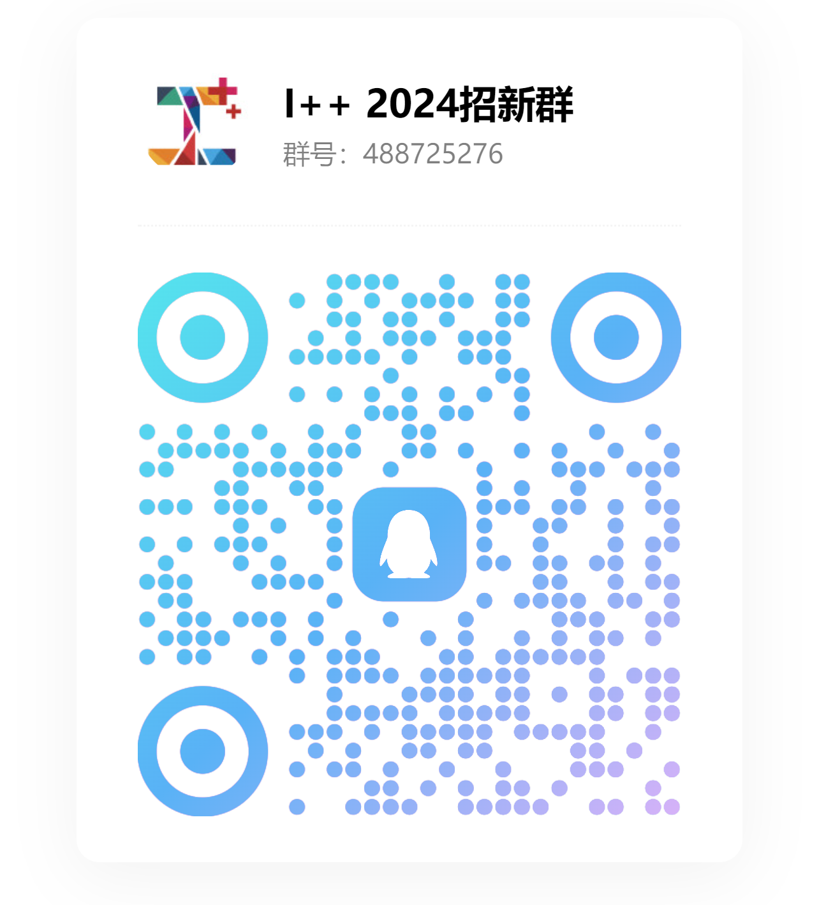

🎉 **I++ 俱乐部诚招新成员！** 🎉

🌟 **I++，加你所想，向创造和想象的边界进发！**  

这里是技术和创意的世界！我们有经验丰富的指导老师，有优秀的学长学姐，还有和谐有趣的氛围。无论你是初学者还是有经验的技术爱好者，都可以在俱乐部中找到志同道合的伙伴、获得充分的交流和指导。

📂**开源文化**  

想要拥抱开源文化，参与开源项目？I++俱乐部提供了进行开源交流的平台，让你能够熟悉Github等开源平台的基础操作，了解开源文化的内涵，并有机会成为各大开源社区的贡献者！

💻 **计算机图形学**  

你是否被《黑神话：悟空》等游戏精美的游戏画面与光影效果所震撼？如果你想了解背后的三维重建、图像渲染等技术，那么欢迎加入I++俱乐部！在这里，你能够学习并实践计算机图形学技术，打造出令人惊叹的三维世界。

📚 **程序设计与基础算法**  

想要了解程序设计流程与相关的算法？I++俱乐部会与你一起探索这些技术！从设计思维到编译运行，从编程语言到算法应用，你可以在这里打下扎实的编程基础，迈出成为技术大佬的第一步！

🌐 **JavaWeb 全栈开发与服务器搭建**  

想成为全领域开发高手？I++俱乐部为你提供从前端到后端，从数据库管理到服务器搭建的交流平台，帮助你掌握 JavaWeb开发的关键技术，打造功能齐全的All in One服务器！

**尽情提出你的想法和兴趣，他们有可能成为俱乐部未来的方向！**

🚀 **加入"I++"俱乐部，探索前沿技术，开创属于你的精彩未来！**  

📱 扫码进群，加入我们~ 🎉

***计软智俱乐部联合招新宣讲将在10月9日（周三）举行，进群填写抽奖收集表，就有可能在宣讲现场领取精美小礼品~***

