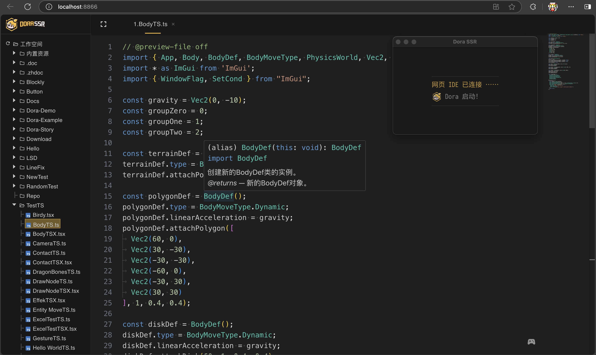
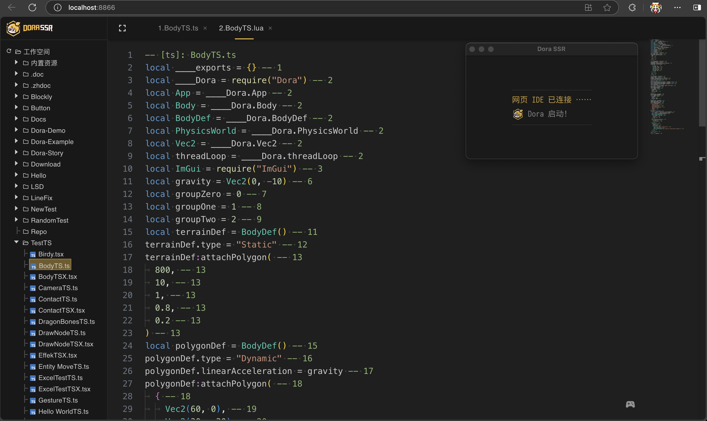
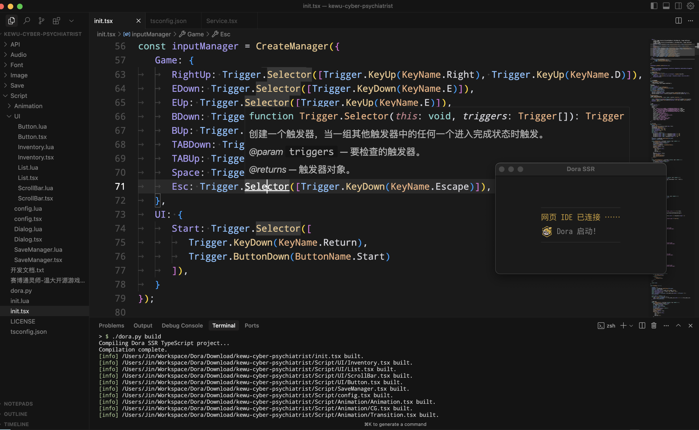

## Lua 轻量级脚本语言的利与弊

&emsp;&emsp;Lua 是一门以“小巧快速”著称的脚本语言。它的解释器源代码和编译后体积都非常小，往往比 Python 等流行语言小一个数量级以上 。这意味着我们完全可以把整个 Lua 解释器嵌入到自己的项目中，而不需要引入庞大的外部依赖 。得益于精简的设计，Lua 在同类脚本语言中性能表现突出——Lua 解释器通常比大多数同样是解释型执行的脚本语言快一个数量级， 如果使用 LuaJIT 即时编译器，速度更是进一步逼近 C 语言的水平 。正因为运行高效且易于嵌入 C/C++，Lua 长期以来广受游戏行业青睐，常被集成到游戏引擎中用于编写游戏逻辑 。

&emsp;&emsp;然而，“简洁”既是 Lua 的优点，也是它的局限。Lua 是动态类型语言，没有静态类型约束，灵活但缺乏编译期检查，这在大型项目中会埋下隐患。对来自静态类型语言的开发者而言，Lua 缺少编译器的保护和完善的 IDE 提示 。正如一位开发者的经验所言：“用 Lua 编程时，代码自动完成远不如静态语言那么给力，编译器也无法在你手误时帮你纠错” 。一些拼写错误甚至在运行时都不会报错，因为在 Lua 里对不存在的表项访问只会得到 nil ，这可能导致问题潜伏更久 。Lua 语法极简，这使得语言本身的表达力偏弱，很多高级抽象需要靠约定或手动实现。在工程实践中，大型 Lua 项目往往难以维护，开发者不得不频繁查阅文档来确认 API 用法；如果这些类型信息能直接体现在编辑器中，该有多好 ！

&emsp;&emsp;动态语言缺乏强类型支撑，也使得主流 IDE 无法提供与静态语言媲美的智能提示、跳转和重构支持 。总的来说，Lua 的动态特性在提高灵活性的同时，也带来了可维护性和工具支持方面的不足。

## 为 Lua 加装上强类型的引擎

&emsp;&emsp;有没有可能找到一种“甜蜜点”，既享受静态类型带来的可靠性，又保留 Lua 脚本的轻便灵活？早在若干年前，就有开发者在使用 Lua 后发出感叹：静态类型对大型项目有极大裨益，要是有一种脚本语言能同时支持运行时快速迭代和编译时类型检查就好了 。TypeScriptToLua (TSTL) 的出现，正是朝着这个方向迈出的一大步。

&emsp;&emsp;TSTL 是一个将 TypeScript 编译（准确说是转译）为 Lua 的工具链。它充当 Lua 和 TypeScript 之间的桥梁，将 TypeScript 代码转化为功能等价的 Lua 代码。在这个过程中，我们等于是给 Lua 嫁接上了 TypeScript 的强类型检查和丰富语法，却依然运行在精巧高效的 Lua 虚拟机上。借助 TSTL，我们可以用 TypeScript 来编写游戏或应用的逻辑代码，享受高级语言的语法糖和编译期错误检查，最终再由转译器输出性能不错的 Lua 脚本在目标环境中运行 。这样的方案极大弥补了 Lua 在语言层面和周边工具上的短板——一方面，TypeScript 强大的类型系统和编译期检测可以捕获很多错误，让开发者“未雨绸缪”；另一方面，丰富的编辑器支持（如 VS Code 的智能提示）大幅提升了编码体验 。有开发者指出，基于 TypeScript 的方案带来了“一流的 IDE 工具支持和优秀的类型检查系统”，让在嵌入式 Lua 环境下编程变得更加轻松 。可以说，TSTL 把强类型的护航和 Lua 虚拟机的优点融于一炉，形成了优势互补的技术组合。

&emsp;&emsp;当然，将一种高级静态语言转译为另一种动态语言并非易事。好在 Lua 简洁的语法使其非常适合作为“目标语言”——事实上，Lua 社区早已有多种转译器，从 YueScript、Teal，一直到 Haxe、C# 等都有了方案能编译成 Lua 代码。TypeScript 相较于这些语言，与 Lua 更为接近（同为原生支持原型链和相近动态特性的语言），因此 TSTL 转出的代码相对易读，和手写的 Lua 相差不大 。同时，社区也为许多常见的宿主环境提供了对应的类型声明文件，使得 TSTL 在不同平台上都能方便地调用原有 Lua API 。

&emsp;&emsp;通过 TSTL，我们在保持 Lua 运行时高效、可嵌入、易移植优点的同时，引入了TypeScript 静态检查、模块系统、面向对象等现代特性，为开发大型项目保驾护航。这无疑为 Lua 开发者打开了一扇窗，让他们能用更高级的方式去驾驭这一“小而美”的语言。

## Dora SSR 引擎无缝集成 TypeScript 开发的巧思

### 如何跨平台打包使用 TSTL 编译器

&emsp;&emsp;TypeScriptToLua 的强大也吸引了不少游戏引擎开发者的目光。Dora SSR 这个开源跨平台游戏引擎就巧妙地将 TSTL 纳入了它的工作流程，打造出一种开箱即用的 TypeScript 脚本开发体验。就传统而言，游戏引擎中使用 TypeScript 需要额外安装 Node.js、npm、TSTL 编译器等工具链，这在某些设备（如移动设备）上并不方便。而 Dora SSR 的开发者另辟蹊径，直接将 TypeScript 编译器、TSTL 转译器和 Monaco 编辑器（VS Code 所用的浏览器版编辑器）一起打包进了引擎。引擎内置一个小型 Web 服务器，当引擎运行时，可以在浏览器中打开它的 Web IDE。这样一来，无论是在手机、平板还是 PC 上，无需安装任何额外软件，你都可以通过浏览器访问引擎的 Web IDE，在其中编写 TypeScript 代码，然后由内置的 TSTL 即时编译成 Lua 并在游戏中运行。

&emsp;&emsp;这个方案极大地方便了跨设备的开发者。例如，你可以在平板电脑上启动 Dora SSR 引擎的 App，然后用同一部平板的浏览器（或电脑浏览器通过局域网）打开引擎提供的编辑器页面，直接编写 TypeScript 脚本。每当你按下保存，Web IDE 会调用内置的 TSTL 将代码转译为 Lua，热加载到引擎中执行。整个过程就像在使用一个网页版本的 VS Code 编辑器：语法高亮、代码自动完成、实时错误检查一应俱全。

&emsp;&emsp;Monaco 编辑器提供了强大的智能感知功能，例如当你使用 Dora SSR 的 API 时，会自动显示函数签名和文档提示。这是因为 Dora SSR 随引擎一起提供了一套 TypeScript 的声明文件 ( .d.ts )，涵盖了引擎的所有脚本接口。编辑器加载这些声明后，便能做到对引擎 API 的语义感知，帮你在编写代码时如虎添翼。对于习惯了 Lua 开发的朋友，这种体验无疑是耳目一新的——过去也许需要查阅文档确认函数用法，现在 IntelliSense 已经把答案送到你指尖。

&emsp;&emsp;同时，Dora SSR 把整套 TypeScript 编译环境都当作资源内置，使其可移植性非常高。你不需要在设备上安装 npm 包，也不需要担心不同版本依赖，因为无论你把引擎部署到Windows、Linux 还是安卓手机，Monaco 编辑器和 TSTL 都随引擎一起提供。同样，由于这一机制基于浏览器技术，你甚至可以把它当作教学或演示的利器——任何人只要启动一个 Dora SSR，引擎就会充当服务器，让他们可以立即在浏览器里试验脚本创作。这种将 Web IDE 镶嵌进游戏引擎的设计，让脚本创作和环境准备变得零门槛、跨平台，无怪乎有人戏称“在 Dora SSR 上开发游戏本身就像玩一个游戏”！



&emsp;&emsp;在 Dora SSR 中编写 TypeScript 代码。



&emsp;&emsp;查看编译生成的对应 Lua 代码。

### 简单配置使用外部编辑器

&emsp;&emsp;当然，如果你偏好传统的开发方式，Dora SSR 也支持直接使用外部工具链编译 TypeScript。引擎的 Tools 目录下提供了 dora-ts 等辅助工具，你可以在 PC 上通过一个辅助 Python 脚本使用 TSTL 将 TypeScript 项目编译成 Lua，然后将生成的 Lua 脚本部署到引擎中运行。这种方式适合结合本地的版本控制、单元测试等流程，还可以方便地运用各类 AI 编程助手。

&emsp;&emsp;值得强调的是，由于 TypeScript 拥有完善的类型定义和注解，在这种环境下使用 AI 编程工具（如 Copilot 或 Cursor）效果非常好。静态类型提供了精确的语义信息，AI 可以根据接口约定自动补全代码或生成代码片段。例如，当引擎提供了完整的 .d.ts API 定义时，AI 模型能够理解引擎的功能，从而给出更准确的代码建议。这一点动态语言难以企及：在缺少类型提示的 Lua 环境中，AI 往往无法确定参数和返回值的含义，而 TypeScript 的类型系统恰恰解决了这层含糊，大大提升了 AI 辅助编程的可靠性。再配合 TypeScript 严格的编译检查，AI 生成的代码即使有瑕疵，也能在第一时间被编译器捕获并提示修改方向。这使得 TypeScript + Dora SSR 成为一套非常适合 AI 参与开发的组合——开发者可以把繁琐的代码交给 AI 初步生成，然后利用类型检查和引擎提供的接口定义快速调试修正，最终高效地完成游戏功能开发。



&emsp;&emsp;在 Cursor 中进行 AI 辅助编码，并编译为 Lua 代码在游戏引擎加载执行。

## TypeScript 与 Lua 的差异：从语法到运行时

&emsp;&emsp;将 TypeScript 转译为 Lua 并非简单的逐字替换，两种语言在设计上的差异可能会影响代码语义。在实践 TSTL 开发时，有几处关键差异和注意点值得了解：

- **数组索引**

	值得注意的是，TSTL 会自动将 TypeScript 中数组的下标从 0 转换为 Lua 中的 1 起始下标。也就是说，在 TypeScript 中对 `arr[0]` 的访问，转译后会变成 Lua 中的 `arr[1]`。这项设计是为了更好地适配 Lua 的数组使用习惯（Lua 数组默认从 1 开始），但它也带来一些行为上的差异。

	举个例子：

	```ts
	const arr = [10, 20, 30];
	console.log(arr[0]); // TypeScript 中输出 10
	```

	在 TSTL 转译后：

	```lua
	local arr = {10, 20, 30}
	print(arr[1]) -- 输出 10
	```

	这种自动偏移机制在内置数组中是有明确规则，但开发者需要特别注意与 Lua 原生 API 的交互。例如，如果你在 TS 中使用一个数组作为参数，传给一个要求 Lua 下标从 1 开始的 C API 或 Lua 库函数，而你在 TS 端手动做了偏移计算（比如 `arr[i - 1]`），则可能会出现不一致行为。

	此外，对于某些直接使用 Lua 表进行访问的情况（比如自定义字典或对象），TSTL 并不会进行数组语义上的解释，因此下标偏移不会生效，开发者需要自行判断是否需要加减 1。总结来说，TSTL 会尽量帮你处理好数组下标的偏移问题，但当涉及与 Lua 原生环境交互或使用非标准数组结构时，仍需开发者自己保持清醒的“索引感知”。

- **this / self 参数**

	在 TypeScript（以及 JavaScript）中，函数和方法调用会隐式携带调用者上下文，即 this 变量。Lua 中则通过冒号语法糖显式地传递 self 参数。如果用 TSTL 将 TS 类和函数编译成 Lua，为了保留 JavaScript 的语义，TSTL 默认会在函数定义中插入一个 self 参数，以模拟 this 的行为。这意味着，TS 中声明的普通方法在 Lua 侧通常会变成带 self 的函数，对应 Lua 中用 `:` 调用。
	
	Dora SSR 中出于兼容考虑开启了 `noImplicitSelf` 设置，使得 TS 中的顶层函数默认不再附带 self 参数，以免滥用。但类的方法和对象字面量的函数成员仍然会隐含 self。开发者需要留意在哪些场景下需要或不需要 self 。例如，当要把 TS 写的回调函数交给纯 Lua 调用时，需要使用 this: void 显式声明没有使用 this ，避免编译后的 Lua 函数多出额外的 self 参数。理解并正确处理 this / self 的差异，对编写混合 TS/Lua 项目很重要。

- **Promise 异步机制**

	TSTL 提供了对 JavaScript Promise 和 async/await 的支持，其底层通过 Lua 协程等机制来模拟。不过，由于 Lua 没有浏览器或 Node.js 那样的事件循环，Promise 的执行顺序和异常传播规则与原生 JavaScript 略有不同。在 JavaScript 中，Promise 的解析（resolve/reject）会被微任务机制延后到当前同步代码执行完之后再处理，而在 TSTL 实现中，为了简化模型，Promise 会立即执行后续逻辑。举个例子，下面这段 TS 代码：

	```ts
	console.log("before");
	const p = new Promise(resolve => {
		console.log("in promise");
		resolve("done");
	});
	p.then(res => console.log(res));
	console.log("after");
	```

	在 JavaScript 下，会输出顺序： before -> in promise -> after -> done （因为 "done" 的日志被延后）；但在 Lua 中，TSTL 可能会输出： before -> in promise -> done -> after。Promise 一旦 resolve，就立即执行了后续 then 回调，把“done”打印出来，然后才继续后面的逻辑。这种执行次序的差异通常不影响业务逻辑，但如果你依赖原生 Promise 那种严格的异步顺序，可能需要调整思路。另外，关于异常的传播，在 Lua 中如果 Promise 回调里抛出错误，需要借助 pcall/xpcall 捕获，否则错误会直接终止协程而不会像 JS 那样冒泡到全局。因此，在使用 TSTL 的 Promise 时，最好养成显式捕获异常的习惯，避免未捕获的错误中断 Lua 运行环境。

- **其它差异**

	由于语言特性的不同，还有一些细节需要注意。例如，Lua 中条件判断里 0 和空字符串  "" 都被视为真，而在 JavaScript 中它们是假值。TSTL 编译后会遵循 Lua 的真值规则，所以在 TS 代码里不要想当然地把 0 当作 false 来用。再比如，Lua 的 == 本质上就是严格比较，不区分 == 和 === ，因此 TSTL 下无论使用哪种等号，效果都是一样的。Lua 没有 null 值，undefined 和 null 在转译后都会变成 nil ——这意味着如果你用 obj.someProp = undefined ，在 Lua 中相当于删掉了这个表字段。针对这些差异，TypeScriptToLua 文档中提供了详细的指南和建议。归纳起来就是：充分利用编译期提示（开启严格的布尔检查、避免松散比较符等），遵循 Lua 惯例（如用 nil 删除表键时谨慎），就能在大部分情况下避免踩坑。

### 进阶玩法，用 TSX 构建游戏 UI

&emsp;&emsp;除了基础的 TypeScript 到 Lua 转译，TSTL 还支持 TSX（TypeScript + JSX）语法，这为开发者提供了构建 UI 的一种更直观、更声明式的方式。TSX 是一种被广泛应用于 React 等框架的语法扩展，它允许使用类似 HTML 的语法直接在 TypeScript 中创建界面元素。

&emsp;&emsp;在 TSTL 中，TSX 元素会被编译成标准的 `createElement()` 函数调用。例如，以下 TSX 语法：

```tsx
<Label text="Hello" fontSize={24} />
```

将会被转译为：

```ts
createElement(Label, { text: "Hello", fontSize: 24 })
```

&emsp;&emsp;这意味着我们可以自定义 createElement 的行为，将其映射为 Dora SSR 中任意的 UI 节点创建逻辑。例如，在 Dora SSR 的 UI 框架中，只需实现一个 `createElement` 函数，并定义各类 UI 元素的构造方式，就可以使用 TSX 来构建整个游戏界面。这种写法不仅结构清晰，还天然支持组合、属性传递与嵌套，并且提供对设置属性的静态类型检查，非常适合用于减少差错的构建复杂的 UI 组件树。

&emsp;&emsp;更进一步，我们还可以定义自己的 TSX 元素组件，例如：

```tsx
const MyButton = (props: { text: string }) => (
  <Button width={200} height={60}>
    <Label text={props.text} />
  </Button>
)
```

&emsp;&emsp;这样的组件在 TSTL 中是被完整支持的，转译后同样会生成对 `createElement` 的嵌套调用。这使得 UI 组件开发在 Lua 游戏引擎中也能具备类似 React 的开发体验，大大提升了游戏 UI 的模块化、可维护性和表达力。

&emsp;&emsp;如果你曾习惯使用前端框架来开发界面，那么在 Dora SSR 中使用 TSTL + TSX 的组合，将会是一次非常自然的迁移与延展。

## Lua 拥抱强类型脚本的未来

&emsp;&emsp;TypeScriptToLua 技术为 Lua 开发者打开了一道新大门。在保留 Lua 简约、高性能基因的基础上，我们终于可以借助静态类型的力量来构建更健壮、更大型的应用。从 Dora SSR 引擎大胆融合 Web IDE 与 TSTL 的实践可以看出，业界对这种强类型脚本方案充满期待。如果你是 Lua 爱好者，不妨关注一下 TSTL 项目，或亲自到 Dora SSR 引擎中体验一番——不用安装繁杂的环境，就能在浏览器里写 TypeScript 脚本，在 C++ 写的引擎中跑出游戏效果，感受一下强类型护航下写脚本的畅快淋漓。相信在不久的将来，Lua + TypeScript 的组合会在更多领域绽放光彩，为更多场景的脚本开发带来体验提升。欢迎大家加入 TypeScriptToLua 技术的探索之旅，也期待大家能在 Dora SSR 上创造出让人喜欢的作品！

