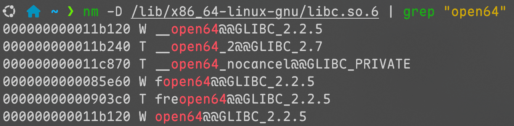
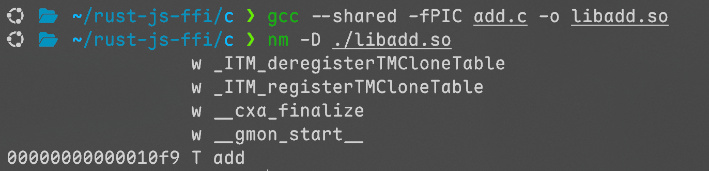
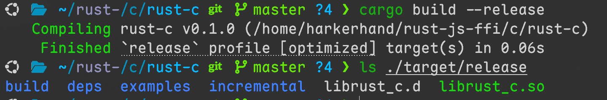
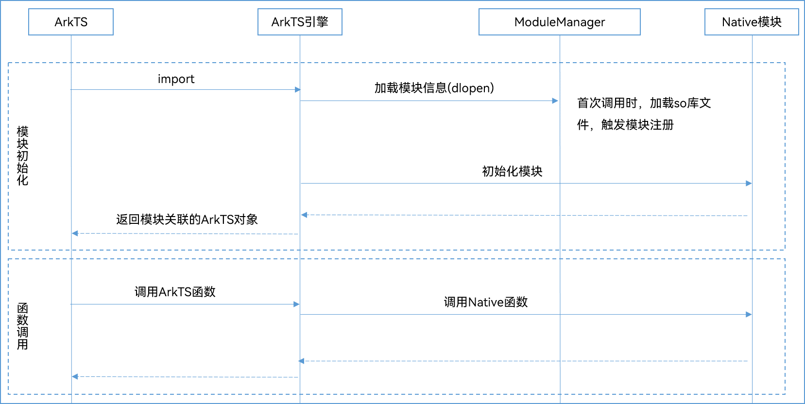

# 什么是 FFI

FFI (Foreign Function Interface，外部函数接口) 是一种编程机制，允许一种编程语言调用另一种编程语言编写的代码或与另一种语言进行交互。它打破了语言之间的壁垒，使得不同语言编写的模块能够相互协作。

## 引入：open() 系统调用

1. **Rust**: `std::fs::File::open()` → `libc::open()` → `syscall(SYS_open)`
2. **C**: `fopen()` → `open()` → `syscall(SYS_open)`
3. **C++**: `std::fstream` → `libc::open()` → `syscall(SYS_open)`

open() 是 OS kernel 的编译产物，


也就是说，只要将我们想要分享的代码也打包为类似的形式，就可以被其他程序所链接使用。

## 例子

```c
// add.h
int add(int a, int b);

// add.c
#include "add.h"
int add(int a, int b)
{
    return a + b;
}
```

编译一下，shared表示共享库，fPIC表示位置无关



```c
// useadd.cpp
#include <iostream>
extern "C"
{
#include "add.h"
}
int main()
{
    int x = 5;
    int y = 10;
    int result = add(x, y);
    std::cout << "The sum of " << x << " and " << y << " is " << result << std::endl;
    return 0;
}
```

-L表示库路径，-l表示链接add库（链接时检查）


很好，成功了

# Rust与C/C++的FFI

## 案例再现

```rust
#[unsafe(no_mangle)]
pub extern "C" fn add(left: i32, right: i32) -> i32 {
    left + right
}

```

在 `Cargo.toml` 中添加

```toml
[lib]
crate-type = ["cdylib"]
```



编译后得到库，链接这个库来编译刚刚的cpp文件


很好，依然是成功的。

也就是说，无论是C/C++/Rust，只要按照C的规范对接口进行暴露，按照C的规范对库进行链接，就可以进行代码复用。

## FFI 规范

### 内存布局

编译器可能会对结构体数据成员进行重排，目的是在对齐的要求下更好的利用内存。

对于如下的cpp结构体

```cpp
struct CppStruct {
    char a;      // 1字节
    int b;       // 4字节
    short c;     // 2字节
};
```

内存可能是12位


| a    |      |      |      | b    | b    | b    | b    | c    | c    |      |      |
| ---- | ---- | ---- | ---- | ---- | ---- | ---- | ---- | ---- | ---- | ---- | ---- |

Rust类似的结构体重排后可能是8位


| b    | b    | b    | b    | c    | c    | a    |      |
| ---- | ---- | ---- | ---- | ---- | ---- | ---- | ---- |

要求rust不要重排

```rust
#[repr(C)]
struct RustStruct { ... };
```

### 调用约定

规则上，如何传递参数、返回值以及管理栈和寄存器等底层细节需要一致，实践上一般不用在意，使用`extern "C"`即可（Rust函数需要`#[unsafe(no_mangle)]`）。

习惯上，栈区的小数据通过值传递，堆区的大数据通过指针传递。

```cpp
#ifndef CPPLIB_HPP
#define CPPLIB_HPP

#ifdef __cplusplus
extern "C" {
#endif

// 用 C 链接导出这些函数
void* create_person(const char* name, int age);
void delete_person(void* person);
const char* get_person_name(void* person);
int get_person_age(void* person);
void set_person_age(void* person, int new_age);

#ifdef __cplusplus
}
#endif

#endif // CPPLIB_HPP
```

Person对象通过指针传递，名字字符串通过指针传递，年龄通过值传递

### 错误处理

一般来说，一个语言的异常无法被另一个语言捕捉，所以一般要通过错误码传递错误信息，或者设置专门传递错误的结构体。

### 一些可能忽视的问题

#### 内存泄漏

上面提到的 Person 的例子，如果在执行 `create_person` 后没有对应的 `delete_person`，person则会成为内存垃圾。

解决方案：

- 记得delete！
- C++调用时，可以使用智能指针自动销毁

  ```cpp
  struct PersonDeleter {
       void operator()(void* p) const { delete_person(p); }
   };
   using PersonPtr = std::unique_ptr<void, PersonDeleter>;
  
   PersonPtr person(create_person("Alice", 30));
   // 退出作用域时自动调用 delete_person
  ```
- Rust调用时，为Person的包装实现Drop Trait

  ```rust
  pub struct Person {
      ptr: *mut c_void,
  }
  impl Drop for Person {
      fn drop(&mut self) {
          unsafe { delete_person(self.ptr) }
      }
  }
  // Person生命周期结束时自动 drop
  ```

#### 二次销毁

上面提到的场景，如果手动调用了delete，那么在变量自动销毁时会出现二次销毁。
需要在销毁时增加一些额外的检查。

```rust
impl Drop for Person {
    fn drop(&mut self) {
        if !self.ptr.is_null() {
            unsafe { delete_person(self.ptr) }
            self.ptr = std::ptr::null_mut(); // 防止二次销毁
        }
    }
}
```

#### 悬垂指针

假设存在场景，异步接口传递临时指针

```cpp
void call() {
    Stream stream;
    std::string stage = "initial";
    stream.stage = const_cast<char *>(stage.c_str());
    stream.node_id = 1;
    stream.session_id = 1001;
    stream.err_code = 0;
    std::string data = "Hello, World!";
    stream.data = const_cast<char *>(data.c_str());
    stream.stream_end = false;
    sync_call(stream);
    async_call(stream);
}

int main()
{
    call();
    std::this_thread::sleep_for(std::chrono::seconds(10));
    return 0;
}
```

这里的async_call在调用后立即返回，随后string析构，但传递的指针在一段时候后才被解引用。

解决方法：

- 使用Rust编写库函数，上面的例子中，`*mut c_char` 没有实现 `Send` Trait，所以需要先对传入的临时字符指针进行**同步**拷贝，再将拷贝值 move 到**异步**回调中。
  为了实现上面的例子，不得不使用unsafe

## Rust C FFI 的便捷实现

使用bindgen自动生成绑定

```toml
[build-dependencies]
bindgen = "0.72.0"
```

在项目根目录下新建一个 `build.rs` 文件即可

```rust
use std::path::PathBuf;

fn main() {
    // 告诉 Cargo 在哪里找到链接库
    println!("cargo:rustc-link-search=native=/root/rust/rust-ffi/cpp/lib");

    // 链接需要的C++库
    println!("cargo:rustc-link-lib=dylib=person");
    println!("cargo:rustc-link-lib=dylib=callback");

    let bindings = bindgen::Builder::default()
        .clang_arg("-xc++")
        .header("/root/rust/rust-ffi/cpp/include/person.h")
        .header("/root/rust/rust-ffi/cpp/include/callback.h")
        .generate()
        .expect("Failed to generate bindings");

    let _ = bindings.write_to_file(PathBuf::from("src/bindings.rs"));
}

```

# Rust与JS的FFI

## **NodeJS运行时调用流程**

1. **JS 发起调用**

   ```javascript
   const tool= require('libadd.node');
   tool.add(3, 5);
   ```

   *对于常规的js模块，在require时会执行一次这个模块，返回一个exports对象*
   同样的，require引入Native库会自动执行库中的`napi_register_module_v1`，这个函数需要返回一个exports对象
2. **Node.js 引擎处理**

   - Node.js 将 JS 参数转换为 N-API 可识别的数据结构。
   - 创建一个 `napi_callback_info` 对象，封装调用上下文（参数、this 值等）。
3. **C函数执行**

   - N-API 的绑定函数被调用，接收 `napi_env` 和 `napi_callback_info`。
   - 从 `napi_callback_info` 中提取参数，转换为 C 类型。
   - 调用底层 C 函数。
4. **返回结果给 JS**

   - C 将结果通过 `napi_env` 转换为 JS 类型。
   - Node.js 将结果返回给 JS 调用方。

## 初始化部分

```rust
#[unsafe(no_mangle)]
unsafe extern "C" fn napi_register_module_v1(env: napi_env, exports: napi_value) -> napi_value {
    let register_name = CString::new("rustAdd").unwrap();
    let register_desc = [napi_property_descriptor {
        utf8name: register_name.as_ptr(),
        name: nullptr(),
        method: Some(add::rust_add),
        getter: None,
        setter: None,
        value: nullptr(),
        attributes: napi_property_attributes::napi_default,
        data: nullptr(),
    }];

    unsafe { napi_define_properties(env, exports, 1, register_desc.as_ptr()) };
    exports
}
```

做了很简单一件事，将一些 `napi_property_descriptor` 添加到exports对象中

```rust
pub struct napi_property_descriptor {
    pub utf8name: *const ::std::os::raw::c_char,
    pub name: napi_value,
    pub method: napi_callback,
    pub getter: napi_callback,
    pub setter: napi_callback,
    pub value: napi_value,
    pub attributes: napi_property_attributes,
    pub data: *mut ::std::os::raw::c_void,
}

pub fn napi_define_properties(
    env: napi_env,
    object: napi_value,
    property_count: usize,
    properties: *const napi_property_descriptor,
) -> napi_status;
```

相关的定义可以使用bindgen工具生成，[napi-sys](https://codehub-y.huawei.com/g50049197/napi-sys/home)，这个库中有详细的README；也可以直接使用 [crates.io/crates/napi](https://crates.io/crates/napi) 库。

## 参数转化与返回值处理

上文提到的 `napi_property_descriptor` 中的成员`method`类型为`napi_callback`，

```rust
pub type napi_callback = ::std::option::Option<
    unsafe extern "C" fn(env: napi_env, info: napi_callback_info) -> napi_value,
```

nodejs引擎会将函数调用转化为环境+上下文信息的形式，需要对信息进行解析

- 获取入参

```rust
pub fn napi_get_cb_info(
    env: napi_env,
    cbinfo: napi_callback_info,
    argc: *mut usize, // 入参个数
    argv: *mut napi_value, // 预分配的入参数组
    this_arg: *mut napi_value, // 接收js调用者
    data: *mut *mut ::std::os::raw::c_void, // 注册函数时附加的信息
) -> napi_status;
```

- napi值转化为rust值

```rust
let mut a: i32 = 0;
let mut b: i32 = 0;
unsafe {
    napi_get_value_int32(env, argv[0], &mut a);
    napi_get_value_int32(env, argv[1], &mut b);
}
```

- 具体Rust逻
- rust值转化为napi值

```rust
let sum = a + b;
let mut result = nullptr();
unsafe { napi_create_int32(env, sum, &mut result); }
result
```

## 编译并从JS侧使用

`Cargo.toml` 中需要标注

```toml
[lib]
crate-type = ["cdylib"]
```

才会编译出动态链接库

将编译的库重命名为 `*.node`，在js中通过require导入使用

```js
const { rustAdd } = require('./libtool.node');
console.log(rustAdd(1, 2)); // Should print 3
```

## Rust JS FFI 的便捷实现

假设一个场景，rust需要向js暴露一个类，提供构造函数和成员的getter setter，同时暴露一个函数，有一个入参是这个类。（只是举个例子，实际上不推荐这么做）

上面的需求让AI生成，大概300行，可以使用现有的库来简化（前文提到的napi-rs），各种详细用法的文档位于 [napi.rs](https://napi.rs/)

```rust
use napi::{Error, Result};
use napi_derive::napi;
#[napi]
pub struct MyClass {
  value: i32,
  name: String,
}
#[napi]
impl MyClass {
  #[napi(constructor)]
  pub fn new(value: i32, name: String) -> Result<Self> {
    if name.is_empty() {
      return Err(Error::new(
        napi::Status::InvalidArg,
        "Name cannot be empty".to_string(),
      ));
    }
    Ok(MyClass { value, name })
  }
  #[napi(getter)]
  pub fn value(&self) -> i32 {
    self.value
  }
  #[napi(getter)]
  pub fn name(&self) -> &str {
    &self.name
  }
  #[napi(setter)]
  pub fn set_value(&mut self, value: i32) {
    self.value = value;
  }
  #[napi(setter)]
  pub fn set_name(&mut self, name: String) -> Result<()> {
    if name.is_empty() {
      return Err(Error::new(
        napi::Status::InvalidArg,
        "Name cannot be empty".to_string(),
      ));
    }
    self.name = name;
    Ok(())
  }
}
#[napi]
pub fn print_myclass(obj: &MyClass) {
  println!("[Rust] MyClass: value={}, name='{}'", obj.value, obj.name);
}

```

## napi库的一些小问题

JS是单线程语言，通过事件循环处理异步

- 普通函数，只能在主线程执行
- 线程安全函数，可以在线程间移动，一般用于回调

场景：JS可以使用number注册一个入参为string的回调，并使用number调用。

这种情况，可以将传入的回调（普通函数）转为线程安全函数来存储

```rust
#[napi]
pub fn send_rust_callback(
    id: i32,
    callback: Function<'static, String>,
) -> Result<()> {
    let tsfn = callback
        .build_threadsafe_function()
        .callee_handled::<true>()
        .build()
        .unwrap();
    let map = CALLBACK_MAP.get_or_init(|| Mutex::new(std::collections::HashMap::new()));
    let mut map = map.lock().unwrap();
    map.insert(id, tsfn);
    Ok(())
}
#[napi]
pub fn call_rust_callback(id: i32, message: String) -> Result<()> {
    let map = CALLBACK_MAP.get().unwrap().lock().unwrap();
    if let Some(cb) = map.get(&id) {
        cb.call(
            Ok(message),
            napi::threadsafe_function::ThreadsafeFunctionCallMode::NonBlocking,
        );
    } else {
        return Err(Error::new(
            napi::Status::InvalidArg,
            format!("No callback found for id: {}", id),
        ));
    }

    Ok(())
}
```

自动生成的 `d.ts` 文件会是

```ts
export declare function callRustCallback(id: number, message: string): void
export declare function sendRustCallback(id: number, callback: any): void
```

这样调用，看起来完全没问题

```ts
sendRustCallback(114, (message: string) => {
  console.log('Callback from Rust called!', message)
})
callRustCallback(114, 'Hello from TypeScript!')
```

但会输出

```bash
Callback from Rust called! null
```

因为回调的约定实际上是 `(err: Error | null, arg: string) => void`

* `Ok(value)` → `(null, value)`
* `Err(e)` → `(new Error(e), undefined)`

解决方案：

- 手动修改`d.ts`文件的类型约束
- 所有回调函数入参全部使用线程安全函数（这样自动生成的dts文件就是正确的）

# Rust与OH的FFI

## 与常规JS的区别

JSNAPI 通过 dlopen 打开 node 包，然后执行 `napi_register_module_v1`  来注册包

OH通过将包的注册函数添加到 `.init_array` 段，当程序启动，这个库被链接时自动调用


其余部分几乎完全一致

## Rust OH FFI的便捷实现

使用 [ohos.rs](https://ohos.rs/)

用法几乎与上文 napi-rs 类似的方式相同

```rust
#[napi(object)]
pub struct Person {
    pub name: String,
    pub age: u32,
}
#[napi]
pub fn say_hello(person: Person) -> String {
    format!("Hello, {}! You are {} years old.", person.name, person.age)
}
#[napi]
pub fn rust_call_function(func: ThreadsafeFunction<Person, ()>) -> bool {
    let person = Person {
        name: "Alice".to_string(),
        age: 30,
    };
    func.call_with_return_value(
        Ok(person),
        ThreadsafeFunctionCallMode::NonBlocking,
        |ret, _env| {
            println!("{:?}", ret);
            Ok(())
        }
    ) == Status::Ok
}
```

`ohrs build`  编译后即可得到 `index.d.ts` 与 `libxxx.so`（也可以使用GN + Ninja编译，文档位于[Rust模块配置规则和指导](https://docs.openharmony.cn/pages/v5.1/zh-cn/device-dev/subsystems/subsys-build-rust-compilation.md) ）

## 在鸿蒙项目中使用 so

新建一个NativeC++项目后，有关cpp的目录中

`types`文件夹中的每一个子文件夹声明一个模块的类型，在 `entry/oh-package.json5` 中引入。CMakeLists用于编译 `napi_init.cpp`，在 `entry/build-profile.json5` 中引入，对于Rust自行编译so来说意义不大。

```json
{
  ...
  "dependencies": {
    "libentry.so": "file:./src/main/cpp/types/libentry"
  }
}
```

对于刚刚编译的 `libdemo.so`，项目路径应该是这样的，在`types`文件夹中声明类型，在在 `entry/oh-package.json5` 中引入，将so放入libs下对应平台的文件夹，就可以直接在app中使用了

```ts
import { add, Person, rustCallFunction, sayHello } from 'libdemo.so';
hilog.info(DOMAIN, TAG, 'Message changed to %{public}s', this.message);
hilog.info(DOMAIN, TAG, 'Test Hello 2 + 3 = %{public}d', add(2, 3));
rustCallFunction((err: Error | null, person: Person) => {
	if (err) hilog.error(DOMAIN, TAG, 'Error calling Rust function: %{public}s', err.message);
    hilog.info(DOMAIN, TAG, 'Say Hello from Rust %{public}s', sayHello(person));
    hilog.info(DOMAIN, TAG, 'Rust function returned: %{public}s, %{public}d', person.name, person.age);
});
```

## 鸿蒙系统库

`d.ts` 文件位于SDK目录中，接口库位于 `/sys/lib64/module`
