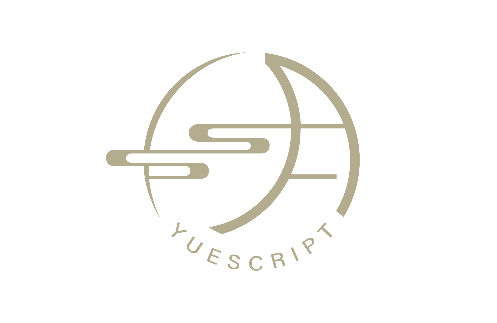

> 本文中，我们将展示 YueScript 独特的语法糖设计，包括管道操作符、可选链与空值合并、箭头函数、循环表达式、连锁比较与反向回调语法。通过代码示例，让你轻松感受 YueScript 如何提升编程的愉悦感。

&emsp;&emsp;文中的编程语言项目请参见：

- 官网：https://yuescript.org/zh

- GitHub：https://github.com/IppClub/YueScript
- Gitee：https://gitee.com/IppClub/YueScript

## AI 自动编程的时代，我们为什么还要设计面向人类的编程语言？

&emsp;&emsp;AI 大模型时代已经悄然来临，越来越多的代码正被自动生成，“让 AI 写程序”似乎是技术发展的必然趋势。也许不久之后，我们连一行代码都不必亲手编写了，随便说两句话，AI 就自动帮你写好，甚至自动帮你修复 Bug。

&emsp;&emsp;那么，既然如此，我们为什么还要花费精力去设计一门面向人类手写体验的编程语言呢？

&emsp;&emsp;原因很简单：在自动驾驶的时代，仍会有人喜欢亲自开车；在 AI 制作音乐的时代，仍然有人热爱亲自弹奏乐器。技术的发展从来不是为了剥夺我们动手创造的乐趣，相反，它应该不断提升我们创造的愉悦感，释放更多的创造力和想象力。

&emsp;&emsp;对编程也是如此。在不远的未来，AI 可能会接管大部分机械式的代码生成任务，但人类的创意、直觉、以及对代码之美的感受仍然无可取代。我们希望在 AI 主导自动编程的时代，人类程序员写代码不再是痛苦的任务，而是一种真正的享受和一种艺术的表达。

&emsp;&emsp;这正是 YueScript 诞生的初心——通过精心设计的语法糖与表达方式，让代码变得简洁、优美、富有表现力，让程序员重新享受亲手编程的乐趣。 同时转译为 Lua 语言，复用 Lua 的语法和生态，让 Lua 生态的开发者可以无缝切换到 YueScript 的语法，享受 YueScript 的语法糖带来的便利。

&emsp;&emsp;那么，现在，让我们一起走进 YueScript 的世界，看看它是如何让“手写代码”成为一种甜蜜的享受的吧。

## 语法糖示例，让代码更甜蜜

&emsp;&emsp;YueScript 信奉一个核心理念：*“让常见的代码模式变得简单，让写代码的人更开心。”* 为此，它引入了大量语法糖，把繁琐的代码套路封装成优雅简洁的表达。在轻松的故事中，让我们通过几个例子来看看 YueScript 如何施展仙法，把苦涩的代码变甜。

### 管道操作符，告别嵌套调用地狱

&emsp;&emsp;还记得写过那种把函数调用层层嵌套的代码吗？就像俄罗斯套娃，一层套一层，看的时候脑壳疼。来看一个典型场景：我们要读取文件，提取内容，解析后再渲染并打印。如果用传统方式（比如 Lua 或 JavaScript），代码可能长这样：

```lua
-- 常见语言的嵌套调用示例（伪代码）
print(render(emit(parse(extract(readFile("example.txt"), {}), language))))
```

&emsp;&emsp;一大串括号天团扎堆，是不是眼晕？每次读到里面都要数好几个括号才能理清调用顺序。YueScript 决定来点不一样的。它端出了一个管道操作符 `|>`，让函数调用像排队上传送带一样顺序清晰：

```lua
-- YueScript 的管道操作符示例
readFile "example.txt"
  |> extract language, {}
  |> parse language
  |> emit
  |> render
  |> print
```

&emsp;&emsp;看，多顺眼！通过 `|>`，我们把上一步的输出“倒进”下一步。这样的代码像流水线一样一步步往下阅读，再也不用费神去数那些烦人的右括号了。YueScript 在背后会把这些管道展开成嵌套调用的形式，但对我们人类来说，这样写代码舒服多啦。正如 YueScript 悄悄吐槽的：“括号多了消化不良，不如排成一列慢慢吃。”

### 可选链和空值合并，对付顽固的 nil

&emsp;&emsp;除了嵌套调用，另一个常打的编程“小怪兽”就是 空值检查。在很多语言（比如 JavaScript、Lua）里，我们拿到一个深层次的对象时，要一层层检查是否存在，生怕哪层是 `nil` 或 `null` 导致报错。例如获取用户昵称这个场景：

```lua
-- Lua 深层属性检查
local username
if data != nil then
    local user = data.user
    if user != nil then
        local profile = user.profile
        if profile != nil then
    		username = profile.name
        end
    end
end
if username == nil then
    username = "匿名"
end
```

&emsp;&emsp;上面代码里，为了安全获取 `data.user.profile.name`，我们写了一长串条件，手指都要打结了。YueScript 的语法糖瞧着心疼，决定撒点仙法之尘：它提供了可选链操作符 `?` 和 空值合并操作符 `??`。利用这两个好搭档，上面的逻辑可以浓缩成一句：

```lua
-- YueScript 可选链与空值合并
username = data?.user?.profile?.name ?? "匿名"
```

&emsp;&emsp;是不是赏心悦目？这里的 `?.` 会一级级检查下去：如果 `data` 不存在，整个表达式直接返回 `nil`（后面的 `.user?.profile?.name` 就跳过了）；一旦某个链条不存在，连锁反应终止，省去了显式的层层 `if` 判断。紧随其后的 `??` 则负责兜底：“如果左边结果是 nil，就用右边的默认值”。因此 `username` 会在有值时拿到真实名字，否则就是 `"匿名"`。YueScript 等于帮你把那些啰嗦的检查逻辑都藏起来，用简单的符号表达出“如果有值就拿，否则用默认”的人话语义。

### 缩进与箭头函数，少写符号，多写想法

&emsp;&emsp;YueScript 深谙“少即是多”的奥义。在它的世界里，很多冗余的符号都被悄悄省略，让代码更贴近人类的直觉。首先，YueScript 和它的前辈 MoonScript 一样，采用缩进来表示代码层次，而不是依赖繁杂的括号或 `end`。这意味着什么呢？意味着你写 `if`、`for` 等控制结构时，不需要在结尾画蛇添足写上 `end`。只要通过缩进排版，代码块的边界一目了然，干净又清爽。

&emsp;&emsp;我们来对比一下，假如我们想写一个带默认参数的问候函数，用 Lua 可能这么写：

```lua
-- Lua 的函数定义和条件判断示例
function greet(name)
    if name == nil then
        name = "world"
    end
    print("Hello, " .. name .. "!")
end
```

&emsp;&emsp;上面的代码里，有 `function`、`end`、`then`、`..` 字符串拼接，一堆杂七杂八的符号。轮到 YueScript 出场，它会说：“这些啰嗦的关键字我来帮你处理吧，你只管表达业务逻辑！” 于是，用 YueScript 可以这样写同样的功能：

```lua
-- YueScript 的箭头函数和默认参数示例
greet = (name = "world") ->
  print "Hello, #{name}!"
```

&emsp;&emsp;怎么样，是不是清爽很多？我们逐句尝尝其中的糖分：首先，`greet = (name = "world") ->` 这行用到了 箭头函数语法，`->` 表示定义一个函数并将其赋给变量 `greet`。我们不再需要写冗长的 `function ... end`，一个箭头就完成了函数定义。接着，`name = "world"` 一次性完成了空值检查和参数的默认赋值，不再需要啰嗦的 if 判断。

&emsp;&emsp;最后一行，`print "Hello, #{name}!"` 展示了 YueScript 的字符串插值能力。双引号字符串中可以用 `#{...}` 插入表达式结果，所以相比 Lua 的字符串拼接 (`"Hello, " .. name .. "!"`)，YueScript 直接写成模板字符串的形式，更直观地表达出输出内容。（顺带一提，`print` 在这里直接跟着字符串，没有括号包裹，YueScript 允许这种简洁的调用方式，省掉无谓的括号。）

&emsp;&emsp;可以看到，YueScript 相比 Lua 省略了许多语言繁琐的礼节：没有`then`、没有`end`，字符串拼接也优雅得多。代码里的每个字符几乎都是在表达业务含义，而不是为语法服务。这就是 YueScript 想给程序员的礼物：少写那些机器看得懂却让人分心的符号，多写人类真正关心的逻辑。 写代码再也不像写仪式文书，更像是在用自然语言沟通思想。

### 循环也玩出花样，for 循环当表达式

&emsp;&emsp;写过编程作业的同学们肯定对 for 循环不陌生吧？可你见过能直接返回结果的 for 循环吗？是的，YueScript 的 for 循环也有点不一样，它不光用来循环，还能直接变身表达式，把循环过程中计算的结果直接装进一个数组里！看看下面这个“变身术”：

```lua
-- YueScript 中用 for 循环表达式计算结果
doubled_evens = for i = 1, 20
  if i % 2 == 0
    i * 2
  else
    i
```

&emsp;&emsp;这里发生了什么呢？简单来说，循环里的最后一句话的计算结果，会被 YueScript 自动收集起来，放进一个新数组里，直接赋给了变量 `doubled_evens`。不用手动新建数组，不用挨个插入元素，YueScript 一行代码帮你统统搞定！就像一个勤快的小助手，一边循环一边记录结果，效率翻倍。

&emsp;&emsp;不仅如此，YueScript 的 for 循环还学会了一个更炫的技巧：带返回值的提前退出（break）！想象一下，我们要从一堆数字里找出第一个大于 10 的数字，用传统方法要写好几行代码。可 YueScript 只用两行：

```lua
-- 查找第一个大于 10 的数字
first_large = for n in *numbers
  break n if n > 10
```

&emsp;&emsp;注意那个可爱的 `break n if n > 10`，简直像在跟 YueScript 聊天一样：“找到一个大于 10 的就赶紧停下来，把它交给我！”YueScript 一听，立马停下循环，把找到的数字交到你的手里。再也不用像以前那样一边写循环、一边还要额外定义变量存结果了！

### 链式比较，写出数学书上的优雅判断

&emsp;&emsp;有些语法糖，是为了美化代码；而有些语法糖，是为了让代码更像人类思考的方式。YueScript 的链式比较（Chaining Comparisons），就是后一种——它让程序员终于能像写数学课本那样写判断式了！

&emsp;&emsp;来看个眼熟的例子：

```lua
-- YueScript 支持链式比较
a = 5
print 1 <= a <= 10
```

&emsp;&emsp;这个写法是不是让你有点恍惚？像极了高中数学书里的“不等式组”：1 ≤ a ≤ 10。你没看错，这在 YueScript 中是合法且推荐的写法！它会被自动转化为：

```lua
1 <= a and a <= 10
```

&emsp;&emsp;但你不用手动写 `and` 啦，YueScript 帮你一气呵成处理得妥妥当当。

&emsp;&emsp;不仅如此，这个链还可以无上限地串下去，你甚至可以把所有比较运算符串成一支“比较队列”，搞个花式输出：

```lua
print 1 < 2 <= 2 < 3 == 3 > 2 >= 1 == 1 < 3 != 5
-- output: true
```

&emsp;&emsp;你没有看错，这种像“逻辑体操”一样的表达式也完全合法！每一段相邻的比较都会被分别处理，再用 `and` 连接在一起。如果有任何一环判断为假，整个比较链就会立刻返回 false。

&emsp;&emsp;这不仅让代码看起来更像人话——“某个值落在哪个区间”可以像数学书一样表达——也让逻辑判断写得更紧凑、更优雅。终于不用为那一堆 `and` 而心烦意乱啦！

### 反向回调语法，低成本实现异步代码改同步写法

&emsp;&emsp;在异步编程里，我们经常被各种回调函数层层包裹，写代码像搭积木，一不小心就陷入“回调地狱”。尤其在 Lua 或 JavaScript 这类不自带 async/await 的语言里，想写出像同步一样可读的逻辑，通常需要付出很多额外的代价。

&emsp;&emsp;于是 YueScript 使用了一种非常巧妙又省力的写法：Backcall（反向回调）语法 `<-`。

```lua
-- Backcall 简写方式
data <- fetchData
print "收到结果", data
```

&emsp;&emsp;上面这段代码的语义非常简单直白：“调用 `fetchData`，并传一个回调函数进去，这个函数会在数据回来之后执行。” 实际上它等价于这样写：

```lua
fetchData (data) ->
  print "收到结果", data
```

&emsp;&emsp;但是使用 Backcall，你不需要自己写额外的代码块缩进。这让异步逻辑的书写方式瞬间变得像同步代码一样自然！

&emsp;&emsp;再比如模拟一个顺序处理流程：

```lua
user <- loadUser
perm <- loadPermissions user
<- renderDashboard perm
```

&emsp;&emsp;这三行乍一看像同步代码，其实它们每一步都是异步调用，前一步完成后才继续下一步执行。YueScript 用这种写法，让你在没有协程、没有 Promise 的前提下，也能写出“顺序逻辑”。

&emsp;&emsp;这种“低成本改写”的设计哲学非常 YueScript：不引入复杂的语法结构，不需要运行时黑魔法，单靠编译阶段转换，就让写代码的人过得更舒服

&emsp;&emsp;而且视觉上也更加扁平，不会陷入深深的缩进地狱。回调函数变得直观、线性，逻辑阅读顺序天然从上到下，不再被层层嵌套打断思路。

&emsp;&emsp;可以说，Backcall 是 YueScript 为异步代码做的温柔的革命。

&emsp;&emsp;这样的设计是不是特别贴心呢？YueScript 就是喜欢用这些巧妙的语法糖，让程序员少做琐碎的重复工作，多享受代码带来的乐趣！

&emsp;&emsp;可以看到，YueScript 省略了许多语言繁琐的礼节：没有`then`、没有`end`，字符串拼接也优雅得多。代码里的每个字符几乎都是在表达业务含义，而不是为语法服务。这就是 YueScript 想给程序员的礼物：少写那些机器看得懂却让人分心的符号，多写人类真正关心的逻辑。 写代码再也不像写仪式文书，更像是在用自然语言沟通思想。



*YueScript 的 Logo 蕴含一轮弯月，象征着它继承自 MoonScript 的“月之力量”，也代表它给代码世界带来的皎洁月光般的语法之美。*


### 附录：关于语法糖的历史渊源小科普

&emsp;&emsp;我们在前面欣赏了 YueScript 提供的一系列精致语法糖，你也许不禁会好奇：这些“甜”到发光的设计，都是 YueScript 首创的吗？其实，这些语法糖大多都有“前辈语言”开过路。YueScript 作为一门年轻的语言，并不是在语法语义上“发明轮子”，而是一个糖果挑选高手——从历史中精选出最人性化、最有表达力的设计，再组合打磨成更适合人类手写的形状。

| 语法糖 | 相关设计最早出现/广为人知的语言 | 代表语法特性示例 |
| - | - | - |
| Pipe Operator (\|>) | F#, Elixir | `val \|> f1 \|> f2` |
| Chaining Comparisons | Python | `1 < a <= 10` |
| `for` as expression | Python, Scala | `[x * 2 for x in ...]` |
| `break` with value | Rust | `break value;` |
| Backcall | LiveScript | `x <- map`<br/>`x * 2` |


## 写给人类的编程语言：YueScript 的来历

  看到上面这些例子，你也许会好奇：YueScript 怎么这么执着于语法糖？其实，这背后有段挺有意思的故事。要从 MoonScript 说起——一门一度非常小众的语言。小众到什么程度？据说全球活跃用户可能还不到三十个。MoonScript 是一种运行在 Lua 虚拟机上的“亲戚语言”，语法上借鉴了 CoffeeScript，讲究的是用尽可能少的代码写出清晰的逻辑。实际用下来，写游戏逻辑时，MoonScript 的代码量常常只有 Lua 的一半甚至更少。代码少了，出错的概率也随之降低，这点让人很上头。

  只可惜，MoonScript 的作者后来不再维护新特性，问题修复也很慢，基本处于半退隐状态。但喜欢它的那群人没走，他们在不同项目里，继续用这门“月亮语”默默耕耘。

  YueScript 就是在这样的氛围中诞生的。它从 MoonScript 那儿继承了不少好东西，也大胆尝试了许多新语法，是一次“延续月光”的探索。

  YueScript 的初衷其实很简单：让写代码这件事对人来说更轻松一点。电脑当然不在乎你多打几个字，但人是有精力成本的。YueScript 更愿意在编译阶段多做点事，换取你少写点重复的代码，让你能把注意力放在真正重要的逻辑上。这种“考虑人感受”的设计理念，正是它大量加入语法糖的原因。

  当然，加糖不是乱来。YueScript 在设计语法时，一直在努力保持代码的清晰度和直觉感。比如它采用缩进结构，不靠一堆看不懂的符号；而它加的“糖”，也大多是程序员日常写代码时最常遇到的场景。它希望带给你的是“甜而不腻”，让你写得开心、看得明白、改起来也不费劲。换句话说，YueScript 想做的是好吃不长“蛀牙”的语法糖。

  更酷的是，YueScript 还内建了宏系统。你觉得哪里不够顺手？那就自己来写“糖”！宏可以让你在编译时动态生成或改写代码，是留给高级用户的一把“魔法钥匙”。对语言设计爱好者来说，这简直就是游乐场，可以尽情发挥自己的奇思妙想。

  放眼整个开发圈，YueScript 的出现其实也不算偶然。现在的硬件性能早就今非昔比，语言执行的开销已经不是最主要的问题。程序员反而越来越看重代码是不是好写、好读、好维护。如果一门语言能帮我们省力气、多表达点想法，大家自然也愿意多花点时间去学习它。YueScript 就是顺着这个方向走的：用更丰富的表达力，换取更轻松愉快的开发体验。换句话说，它相信“糖要有，关键时刻还得多放点”。

------

## YueScript 从哪里来？

  YueScript 的开发，其实是从 [Dora SSR](https://ippclub.atomgit.net/Dora-SSR/zh-Hans/) 这个开源游戏引擎项目中自然生长出来的。最初是为了提升游戏脚本的编写体验，后来逐渐独立发展起来。它被用在引擎工具、游戏原型、Demo 等多个方面，一边用、一边打磨，最后成了 Dora SSR 生态里一门表达力与实用性并重的脚本语言。

------

## 来尝尝写代码的另一种快乐方式

  如果要给 YueScript 一个比喻，它就像是深夜厨房里的点心师，认真地为你烤出一块块带着语法糖香气的代码饼干。对于刚接触编程的朋友，它减少了许多让人头大的细节负担；而对于喜欢折腾语言设计的人来说，它也提供了自由发挥的空间。

  当然，这里只是简单介绍了 YueScript 的一些想法和背景。这门“月亮语言”里还有很多有趣的语法设计和理念，等你去慢慢挖掘。如果你对它已经有点好奇，不妨直接去 [YueScript 官方网站](https://yuescript.org/zh) 看看完整教程，或者读一读 Dora SSR 官方博客上的那篇文章：[《给 Moonscript 重写编译器的故事》](https://dora-ssr.net/zh-Hans/blog/2024/4/17/a-moon-script-tale)，了解更多背后的故事。

  希望在你未来的某个项目里，YueScript 能成为那个陪你一起写出优雅、轻松、甚至有点甜蜜代码的好伙伴。
