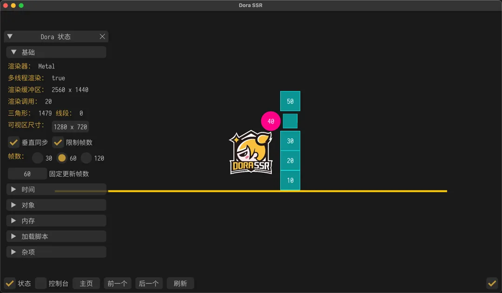
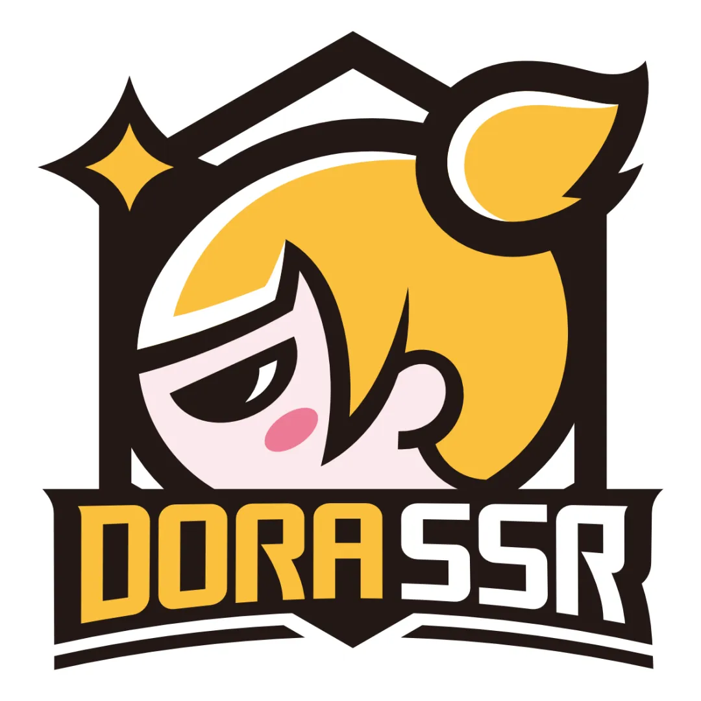

大家好，我是一个游戏引擎技术探索者，同时也是一名做过不少前端开发工作的程序员。如果你想知道如何从编写网页到开发游戏，那你来对地方了！

今天我们聊聊如何使用 Dora SSR，一个支持 TSX 且跨平台在 native 运行的游戏引擎，助你轻松跨入游戏开发的世界。

不必担心，说到游戏引擎并不是啥高不可攀的技术，反而和我们熟悉的前端开发工具可以有惊人相似之处。


## 一、游戏客户端开发也可以是一种前端开发

首先，让我们解释一下什么是游戏引擎。

简单来说，游戏引擎就是一套工具和库的集合，帮助开发者构建游戏，管理图形、声音、物理计算或碰撞检测等。

对于前端开发者来说，你可以把它想象成就是一种特殊的浏览器，专门用来运行游戏。

Dora SSR 的游戏场景管理使用了类似于 HTML DOM 的树形结构，这对我们来说再熟悉不过了。

想象一下，将 div 元素换成游戏中的各种对象，CSS 动画换成游戏动画，概念也差不多，代码写法上可能也差不多，是不是觉得有点意思了？

## 二、从 TypeScript 到 TSX：前端技术在游戏中的应用

许多前端开发者都熟悉 TypeScript 和 React 的 JSX 语法。

在 Dora SSR 开源游戏引擎中，我们通过支持 TSX，提供了与前端开发编程模式相似的游戏开发接口。

是的你没听错，就是那个 TSX。

使用 TSX 开发游戏，意味着你可以利用已有的前端技术栈 — 组件、模块和其他现代前端技术，直接在游戏开发中复用这些概念。

而且，Dora SSR 的性能优化确保了即使是在复杂的游戏场景中，也能保持流畅的运行。

## 三、挑战 100 行代码以内，教你写一个 “愤怒的小鸟” like 的游戏

好了，理论知识够多了，让我们来点实际操作吧。

来看看如何在 Dora SSR 中用 100 行以内的 TSX 代码编写一个类似 “愤怒的小鸟” 的小游戏。

当然，在开始之前还是要准备开发环境，做这个事用 Dora SSR 就很简单：我有一个**安装包一装**，我有一个**浏览器一开**，嗯，开始**写代码**运行吧。

安装启动参见：Dora 启动！
*(https://dora-ssr.net/zh-Hans/docs/tutorial/quick-start)*


*不小心装成了APK包在手机上？那就在同局域网下访问，直接在手机上进行开发调试吧*

### 1. 编写最简单游戏场景

在编写实际的代码之前，我们可以先写一个有特别功能的注释，它可以告诉 Dora SSR 的 Web IDE 在我们按下 Ctrl + S 保存文件时，自动热更新运行的代码，以实现代码运行结果的实时预览功能。

```tsx
// @preview-file on
```

然后，我们引入必要的库和组件。

当然我们的代码编辑器也会提示辅助我们自动引入需要的模块，可以放到后面编码过程中再完成：

```tsx
import { React, toNode, useRef } from 'DoraX';
import { Body, BodyMoveType, Ease, Label, Line, Scale, TypeName, Vec2, tolua } from 'Dora';
```

在 Dora SSR 中显示一个图片很简单，只要使用 `<sprite>` 标签，最后通过 `toNode()` 函数将标签实例化为一个游戏对象就可以了。

```tsx
toNode(<sprite file='Image/logo.png' scaleX={0.2} scaleY={0.2}/>);
```

好的，至此你已经基本掌握大部分 Dora SSR 游戏开发的诀窍了，开始做你自己的游戏吧（认真）。

### 2. 编写游戏箱子组件

接下来我们在游戏中碰撞的箱子会由 `Box` 组件定义，它接受 `num`、`x`、`y` 和 `children` 等属性：

```tsx
interface BoxProps {
  num: number;
  x?: number;
  y?: number;
  children?: any | any[];
}

const Box = (props: BoxProps) => {
  const numText = props.num.toString();
  return (
    <body type={BodyMoveType.Dynamic} scaleX={0} scaleY={0} x={props.x} y={props.y} tag={numText}>
      <rect-fixture width={100} height={100}/>
      <draw-node>
        <rect-shape width={100} height={100} fillColor={0x8800ffff} borderWidth={1} borderColor={0xff00ffff}/>
      </draw-node>
      <label fontName='sarasa-mono-sc-regular' fontSize={40}>{numText}</label>
      {props.children}
    </body>
  );
};
```

我们使用仿 React 的函数组件的写法来完成我们箱子组件的定义，其中：

- `body` 组件的 `tag` 属性：用于存储箱子的分数。
- `rect-fixture` ：定义了箱子的碰撞形状。
- `draw-node` ：用于绘制箱子的外观。
- `label` ：用于显示盒子的分数。

### 3. 创建 TSX 实例化后的对象引用

使⽤ useRef 创建两个引⽤变量进行备用，分别指向⼩⻦和分数标签：

```tsx
const bird = useRef<Body.Type>();
const score = useRef<Label.Type>();
```

### 4. 创建发射线

发射线由 `line` 变量创建，并添加触摸（同时也是鼠标点击）的事件处理：

```tsx
let start = Vec2.zero;
let delta = Vec2.zero;
const line = Line();

toNode(
  <physics-world
    onTapBegan={(touch) => {
      start = touch.location;
      line.clear();
    }}
    onTapMoved={(touch) => {
      delta = delta.add(touch.delta);
      line.set([start, start.add(delta)]);
    }}
    onTapEnded={() => {
      if (!bird.current) return;
      bird.current.velocity = delta.mul(Vec2(10, 10));
      start = Vec2.zero;
      delta = Vec2.zero;
      line.clear();
    }}
  >
    {/* ...在物理世界下创建其它游戏元素 ... */}
  </physics-world>
);
```

- 在 `onTapBegan` 事件中，记录触摸开始的位置并清除发射线。
- 在 `onTapMoved` 事件中，计算触摸移动的距离并更新发射线。
- 在 `onTapEnded` 事件中，根据触摸移动的距离设置小鸟的发射速度并清除发射线。

### 5. 创建其它游戏元素

接下来，我们以 `<physics-world>` 作为游戏场景的父级标签，在它下面继续创建游戏场景中的各个元素：

#### 5.1 地面

首先，我们使用 `body` 组件创建一个地面，并将其设置为静态刚体：

```tsx
<body type={BodyMoveType.Static}>
  <rect-fixture centerY={-200} width={2000} height={10}/>
  <draw-node>
    <rect-shape centerY={-200} width={2000} height={10} fillColor={0xfffbc400}/>
  </draw-node>
</body>
```

- `type={BodyMoveType.Static}`：表明这是一个静态刚体，不会受到物理模拟的影响。
- `rect-fixture`：定义地面碰撞形状为一个矩形。
- `draw-node`：用于绘制地面的外观。
- `rect-shape`：绘制一个矩形，颜色为黄色。

#### 5.2 箱子

接下来，我们使用之前写好的 `Box` 组件创建 5 个箱子，并设置不同的初始位置和分数，在创建时播放出场动画：

```tsx
{
  [10, 20, 30, 40, 50].map((num, i) => (
    <Box num={num} x={200} y={-150 + i * 100}>
      <sequence>
        <delay time={i * 0.2}/>
        <scale time={0.3} start={0} stop={1}/>
      </sequence>
    </Box>
  ))
}
```

- `map` 函数：用于遍历分数数组从 10 到 50，并为每个分数创建一个需要小鸟撞击的箱子。
- `Box` 组件：用于创建箱子，并传入以下属性：
  - `num={num}`：箱子的分数，对应数组中的数字。
  - `x={200}`：箱子的初始 x 轴位置，为 200。
  - `y={-150 + i * 100}`：箱子的初始 y 轴位置，根据创建序号递增。
- `sequence` 组件：用于创建要在父节点上播放的动画序列，包含以下动画：
  - `delay time={i * 0.2}`：延迟播放动画，延迟时间根据创建序号递增。
  - `scale time={0.3} start={0} stop={1}`：缩放动画，从不显示到完全显示，耗时 0.3 秒。

#### 5.3 小鸟

最后，我们使用 `body` 组件创建小鸟，并设置碰撞形状、外观和分数标签：

```tsx
<body ref={bird} type={BodyMoveType.Dynamic} x={-200} y={-150} onContactStart={(other) => {
  if (other.tag !== '' && score.current) {
    // 累加积分
    const sc = parseFloat(score.current.text) + parseFloat(other.tag);
    score.current.text = sc.toString();
    // 清除被撞箱子上的分数
    const label = tolua.cast(other.children?.last, TypeName.Label);
    if (label) label.text = '';
    other.tag = '';
    // 播放箱子被撞的动画
    other.perform(Scale(0.2, 0.7, 1.0));
  }
}}>
  <disk-fixture radius={50}/>
  <draw-node>
    <dot-shape radius={50} color={0xffff0088}/>
  </draw-node>
  <label ref={score} fontName='sarasa-mono-sc-regular' fontSize={40}>0</label>
  <scale time={0.4} start={0.3} stop={1.0} easing={Ease.OutBack}/>
</body>
```

- `ref={bird}`：使用 `ref` 创建引用变量，方便后续操控小鸟。
- `type={BodyMoveType.Dynamic}`：表明这是一个动态刚体，会受到物理模拟的影响。
- `onContactStart={(other) => {}}`：小鸟的物理体接触到其它物体时触发的回调处理函数。
- `disk-fixture`：定义小鸟形状为一个圆盘。
- `draw-node` ：用于绘制小鸟的外观。
- `label` ：用于显示小鸟的累积分数。
- `scale` ：用于播放小鸟的出场动画。

### 6. 完成游戏逻辑

至此，我们已经完成了小游戏的核心逻辑。你可以根据自己的想法进一步完善游戏逻辑和增加功能。

完整的 demo 代码可以见这个链接：

*https://github.com/IppClub/Dora-SSR/blob/main/Assets/Script/Test/Birdy.tsx*

下面是一些运行效果的截图。



*拖拽屏幕发射了“愤怒的小鸟”*


*高超的技巧，使我一击获得了所有得分*

## 四、简单揭秘一下

### 1. 是鹿还是马

事实上我们写的这段游戏代码，在 Dora SSR 引擎的能力下是可以确保在跨 Linux、Android、iOS、macOS 和 Windows 获得一致的运行结果。

但是为了运行这段代码，我们的 Dora SSR 引擎甚至都没有做 JavaScript 运行环境的支持……（你说什么？）

是的，Dora SSR 的底层技术实现其实是基于 Lua 和 WASM 虚拟机作为脚本语言运行环境的。

对 TypeScript 的支持其实是通过整合了 TypescriptToLua 这个编译器提供的。
（*https://github.com/TypeScriptToLua/TypeScriptToLua* ）

TSTL 通过重新编写了 TypeScript 语言编译器的后端，将 TS 和 TSX 的代码编译为了等价运行的 Lua 代码，从而使得 TS 代码可以在 Dora 上加载运行。

在 Dora 自带的 Web IDE 的代码编辑器下，可以帮助大家做 TS 的语言检查和补全以及 Dora 内置库 API 的提示。

最终的使用体验，大家就可以不用管最后是鹿还是马，只要代码能通过了 TS 的编译检查，拉出来那都是一样的跑啦。

### 2. 和 React 有关系吗

这个问题的答案目前是：可以有（所以截至发文前还没有）。

React 最重要的能力是通过 Virtual DOM 和执行 Tree Diff 处理的过程来进行渲染组件和业务数据的状态同步，目前这个机制还没有在 Dora SSR 中实现，所以大家目前看到的用 TSX 编写出的类似 VDOM 的构建代码只会在运行时做一次性的游戏渲染对象的构建，往后都是底层 C++ 实现的引擎功能在负责继续处理。

也许有一天我们会为游戏 UI 的开发，提供仿 React 通过执行 Tree Diff 做状态同步的能力，或是仿 SolidJS 基于 TSX 实现其它的渲染组件状态同步的机制。

所以在这里也诚挚地邀请广大前端开发的朋友，加入我们，一起玩 Dora SSR 项目，一起研究怎么运用前端开发技术思想，为游戏开发也引入更多好用便捷的轮子吧。

最后我们的 Q 群在这里，欢迎过来玩：
512620381

<br />

> **延伸阅读：**[**用Rust开发跨平台游戏是怎样的体验？**](http://mp.weixin.qq.com/s?__biz=MjM5NzM0MjcyMQ==&mid=2650204639&idx=1&sn=01192c5d715677a63e894032d8abf7f2&chksm=bed932b189aebba7f95b8ed5d3c97584f4d330d98928ac31ebfa0db89d4a17bf14b5546dad04&scene=21#wechat_redirect)

------

**作者介绍**

李瑾：金融行业大数据工程师，Dora SSR 和 Yuescript 开源软件作者。

**项目介绍**

Dora SSR（多萝珍奇引擎）是一个用于多种设备上快速开发2D游戏的游戏引擎。
它内置易用的开发工具链，支持在手机、开源掌机等设备上直接进行游戏开发。



**项目仓库**

*https://gitee.com/pig/Dora-SSR
https://github.com/IppClub/Dora-SSR*


本文转载自 [这款中国程序员开源的游戏引擎，让你用不到100行代码就写出“愤怒的小鸟”](https://mp.weixin.qq.com/s/kJEGSNGdC7VsY3H-B_GNJA)


