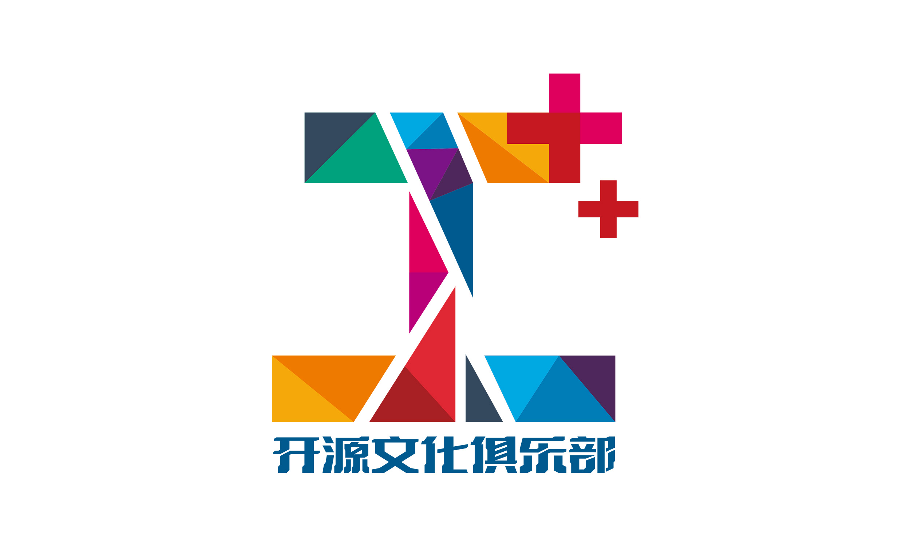

&emsp;&emsp;***Logo 的演变，不仅是视觉上的升级，更是 I++ 俱乐部精神的映射。***

&emsp;&emsp;从最初的极客手绘风，到如今的七巧板设计，I++ 俱乐部的 Logo 见证了我们的成长。今天我们来聊聊这背后的故事。

------

## 一、老版 Logo：黑白之间的极客浪漫

&emsp;&emsp;最早的 I++ Logo 充满了极客风格，黑白手绘的笔触，简洁又带点叛逆感。但如果你细看，会发现 Logo 里藏着一只表情不耐烦的猫——这正是 I++ 俱乐部最早的吉祥物：**“毛”**。

### “毛”：从黑猫到白猫

&emsp;&emsp;“毛”原本是一只黑猫，设计灵感来自于俱乐部早期成员喜欢的一只在宿舍楼游荡的黑猫。它代表了一种独立、自主、不受拘束的极客精神。

&emsp;&emsp;但在 Logo 里，它变成了一只白猫，原因很简单：黑猫在黑色背景下难以辨认！于是我们决定让它在 Logo 里“变色”，让它的形象更清晰。

&emsp;&emsp;“毛”不仅仅是一只猫，它是 I++ 俱乐部早期文化的象征——带着一点傲娇，又充满创造力的极客精神。

### 从“爱加加”到 I++

- 早期 Logo 的核心是 **“I++”**，象征代码里的递增，也寓意成员们不断进步、探索；
- **“爱加加”** 这个名称则让技术多了一份温度，表达了社区的归属感和互助精神。

&emsp;&emsp;这个 Logo 见证了 I++ 从一个纯技术兴趣小组，逐步成长为一个兼具技术、创意和文化的开源社区。

------

## 二、新版 Logo：七巧板的巧思

&emsp;&emsp;随着 I++ 俱乐部的成长，我们的 Logo 也迎来了升级。我们不再只是一个编程俱乐部，而是一个涉及 **开源、游戏、数字艺术** 的文化社区，因此，新 Logo 需要体现更强的包容性和创意感。

### 七巧板：从几何到灵感的碰撞

&emsp;&emsp;新 Logo 的设计核心是 **七巧板（Tangram）**，这个选择背后也有一段有趣的故事：

&emsp;&emsp;最初的想法是想用标准七巧板拼出 “I++” 这个图案，但我们发现：

- **用的积木块多，拼得太规整，就缺少了创意**；
- **用的积木块少，拼得太写意，又难以辨识 I++ 的形状**。

&emsp;&emsp;正当大家一筹莫展时，一位社团伙伴**灵机一动，大笔一挥**，在完整的图案上随机切割了几笔。这一改造巧夺天工，瞬间让图形变得更流畅、更富有灵动感！

&emsp;&emsp;这个设计不仅让 Logo 保持了七巧板的元素，同时也展现了 I++ 俱乐部的开源精神——打破常规，敢于创新。

### lowpoly 风格：科技与艺术的融合

&emsp;&emsp;在最终的设计方案中，我们进一步优化了 Logo 的视觉表现——通过对组成图案的三角形拼图块进行色调设计，使其呈现出一种 lowpoly 风格，让图形既有清晰的几何感，又不失层次感：

- **lowpoly（低多边形）风格** 是计算机图形学中常见的设计语言，它代表着 **技术与艺术的结合**，也象征着 I++ 俱乐部跨越编程、游戏、设计等多个领域的探索精神；
- **色块的渐变拼接** 让 Logo 呈现出一种 **数字化** 的视觉效果，同时也避免了单一色彩的呆板感，让整个图案更具动感和未来感；
- **多角度、多层次的几何构造**，也呼应了 I++ 俱乐部成员们来自不同背景，大家的思考和创造力交汇在一起，共同构建这个开放的社区。

### 新版 Logo 设计理念

- 多彩几何拼接，代表多元的开源文化，不同形状和颜色的组合，象征着我们包容不同背景、不同技能的成员；
- “I++” 依然是核心，但更具现代设计感，展现俱乐部不断发展的活力；
- 开放性与创造力：七巧板的玩法无穷无尽，就像我们鼓励的开源精神，每个人都能找到属于自己的拼图方式！

&emsp;&emsp;这个新版 Logo，不仅延续了 I++ 俱乐部的技术底蕴，也体现了它更开放、更有趣、更充满创造力的全新形象。

------

## 三、从 Logo 看见 I++ 俱乐部的成长

&emsp;&emsp;从手绘风格的“毛”猫，到七巧板的自由组合，我们的 Logo 进化，正是 I++ 俱乐部不断成长的象征：

- 过去，我们是一个以技术为核心的极客组织；
- 现在，我们不仅有编程，还有 **游戏开发、开源文化、数字艺术**；
- 未来，我们希望 I++ 俱乐部能成为一个真正属于开源人的“**Geek Utopia**”，一个每个人都能找到自己拼图位置的社区。

&emsp;&emsp;Logo 变了，但 **I++ 的精神始终延续**。我们始终是那个热爱创造、喜欢挑战、不断加加加的俱乐部！

&emsp;&emsp;到最后，你有没有发现 I++ 的 logo 中的字母“I”很奇怪，胖到像一个“工”字呢？是否和这个字也确实有一些隐喻呢。客观来讲，程序员实质也是官方认证的民工群体，随着移动互联网兴起时代的泡沫吹过，世道也并没有发生真正“fancy”的改变。认清现实，大家在一起哪怕只是创造“乐趣”，可能才是能超越一切的真正有意义的事。

&emsp;&emsp;并且在这个 AI 技术飞速演进的时代，我们也一直在思考——I++ 俱乐部的意义是否需要随着时代而不同？结论就是，我们一直怀有的目标的内核应该不只是代码的递增，而是不断延伸的 **人与人的连接与共创**，是用我们的智慧去激发更多人的创造力。世界在变，我们希望让更多人看到，人类的智能、直觉、好奇心，依然是每个时代最独特的光芒。

&emsp;&emsp;我们做技术，但并不为强调技术本身，而是关注人和人之间的互动，关注如何用技术去放大个体的思考与表达。无论技术如何发展，我们始终相信：**人的智慧不会被取代，只有被重新发现**。

&emsp;&emsp;所以，无论你是开发者、创作者，还是任何热爱探索的人，都欢迎来到 I++ 俱乐部。让我们一起，把创造力加加加！

------

### 你更喜欢哪个版本的 Logo？

&emsp;&emsp;欢迎在评论区聊聊你对 **I++ 俱乐部** 的回忆，或者你对新 Logo 的看法！也许，下一次 Logo 迭代的设计故事里，就会有你的参与！
