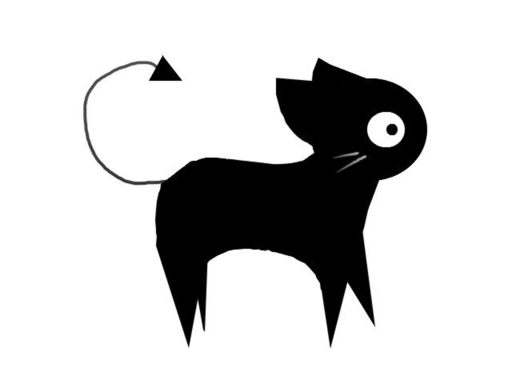
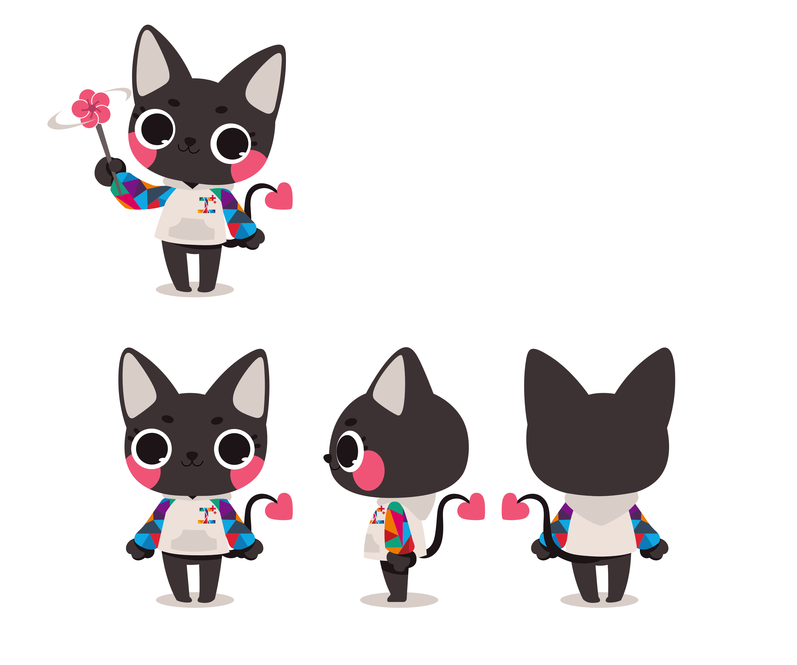
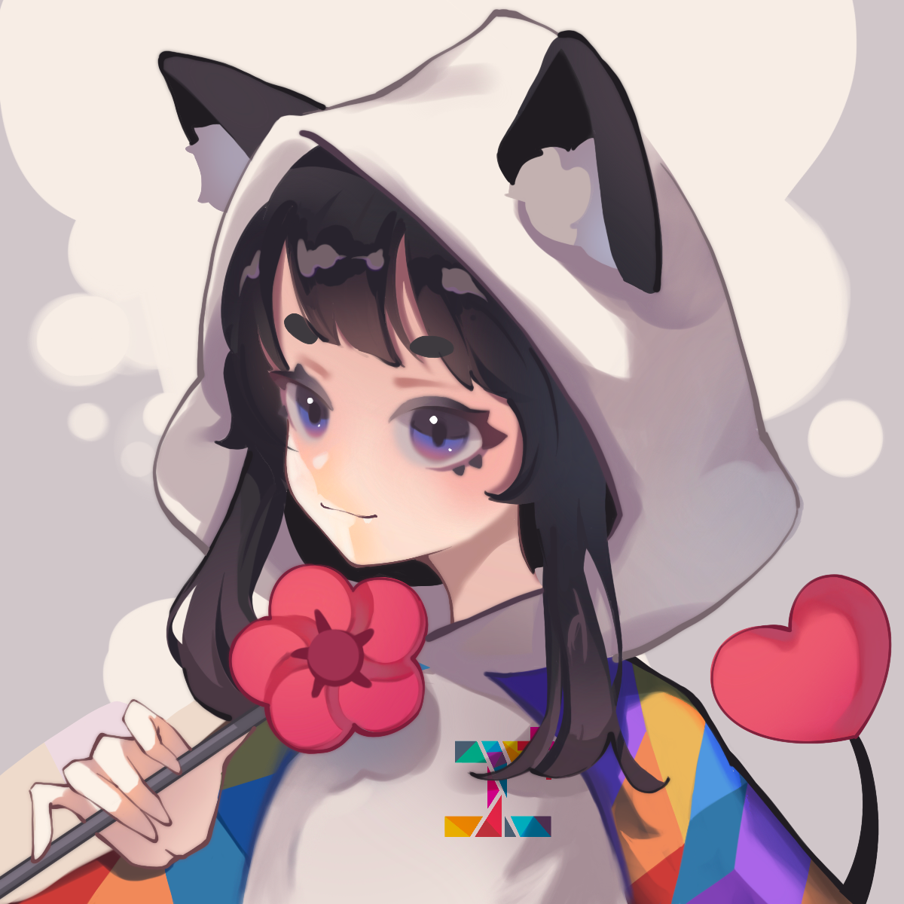
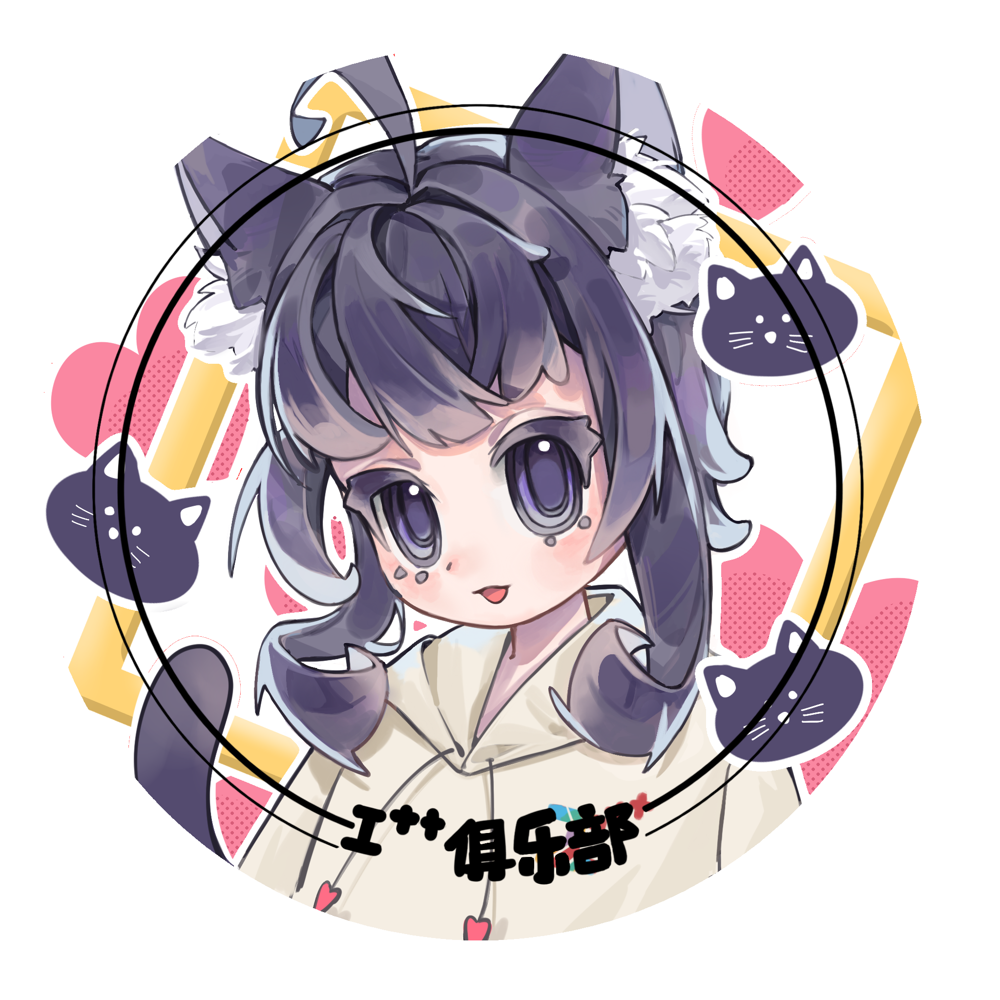
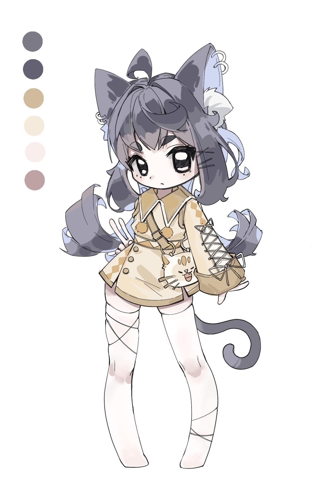
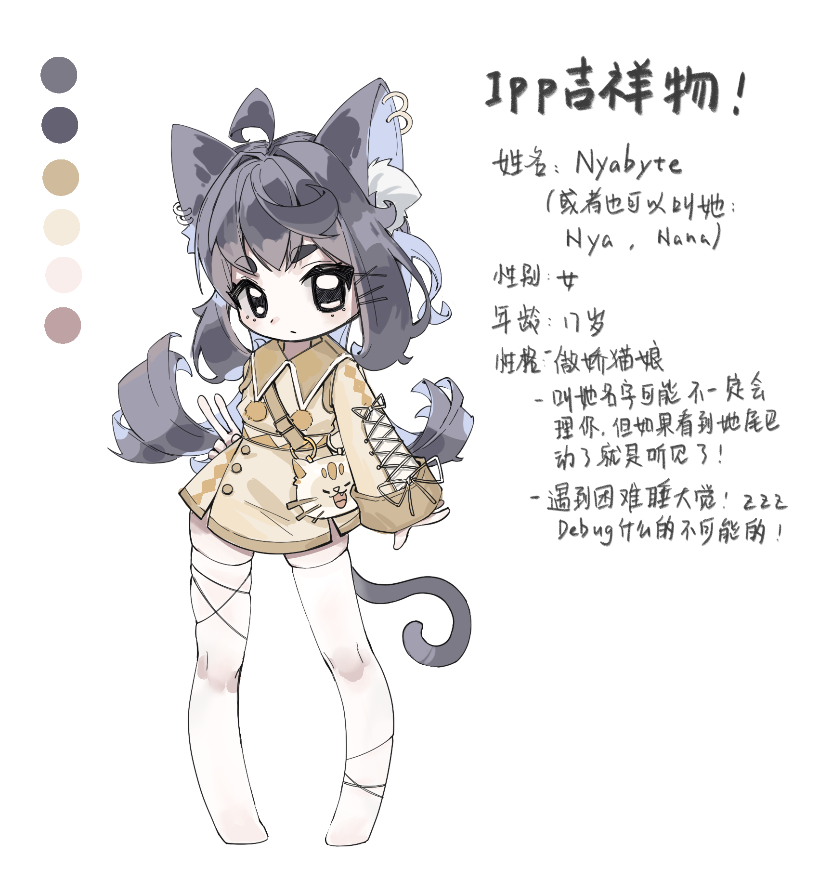
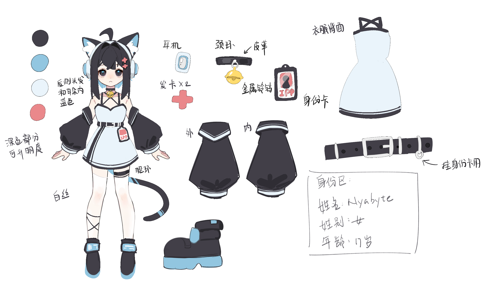

# 小黑猫进化啦！一起见证I++的成长

&emsp;&emsp;每个社群都有自己的故事，而 I++ 俱乐部的故事，从一只小黑猫开始。最初，它只是简单的一抹剪影，后来，它变成了一只更可爱的猫咪，最后，它进化成了活力满满的猫娘。每一次变化，都是俱乐部成长的见证，也藏着那些年我们一起熬夜、写代码、开脑洞的回忆。

------

## 1. “毛”——叛逆又神秘的小黑猫

“毛”——设计于2010年，使用了先进的 Windows XP 系统自带绘图板程序创作

&emsp;&emsp;在 I++ 俱乐部刚刚成立的时候，我们的吉祥物“毛”是一只风格极简的小黑猫。没有多余的修饰，只有几笔干净利落的线条，带着一点冷酷，一点神秘，就像那个时候的我们——一群沉迷开源、喜欢折腾、热衷于挑战规则的极客。

### 它的样子

- 一双大大的眼睛，总像是在盯着某个 Bug，不服输地想要 debug 到底。
- 尾巴上的**箭头**，就像一个循环符号，象征着永远在学习和进步的程序员精神。
- 颜色是极客们最爱的**黑白配**，简单、直接，充满 hacker 风格。

&emsp;&emsp;“毛”就像是那个时代的 I++，锋芒毕露，带着一股初生牛犊不怕虎的劲儿。但很快，我们发现，俱乐部不只是一个极客实验室，它也是一个温暖的大家庭。于是，毛也悄悄地变了样。

------

## 2. “小黑”——温暖又活泼的小伙伴

“小黑”——设计于2022年

&emsp;&emsp;随着俱乐部越来越多人加入，我们的吉祥物也从“毛”变成了更可爱、更有亲和力的“小黑”。它的轮廓变得更圆润，眼睛更大，脸颊上多了一抹可爱的红晕，看起来就像是一只随时想要黏着你的猫咪朋友。

### 它的变化

- 尾巴末端从三角形变成了**心形**，代表着俱乐部里每个人的热爱和归属感。
- 它穿上了一件**印着 I++ logo 的卫衣**，俱乐部的身份感更强了。
- 最特别的是，它的手里多了一只**梅花形的风车**，这不只是一个装饰，而是满满的回忆。

**这个风车其实藏着两个故事：**

- 一个是，南京的市花是**梅花**，它象征着俱乐部的诞生地。
- 另一个是，俱乐部早期的成员们住在一个叫**“梅园”**的宿舍区，那里种植了很多腊梅，这个风车也像是一个小小的纪念，记录着我们一起度过的那些日子。

&emsp;&emsp;“小黑”比起“毛”，多了一点亲切感，它更像是一只真正的俱乐部吉祥物，一个陪伴大家成长的伙伴。

&emsp;&emsp;但 I++ 俱乐部还在继续进化，属于我们的故事还没写完。于是，“小黑”又开始新的蜕变……

### “猫娘”原型——从猫到人的蜕变

&emsp;&emsp;在“小黑”活跃了一段时间之后，俱乐部的成员们开始思考一个问题：

&emsp;&emsp;如果我们的吉祥物不仅仅是一只猫，而是可以和大家互动的角色呢？

&emsp;&emsp;于是，这幅“猫娘”原型插画诞生了。

小黑的首次“猫娘二创”——设计于2023年

------

# 3. “猫娘”——俱乐部的个性化代言人

&emsp;&emsp;其实对于俱乐部真正的猫娘设计起源于一次周边设计。在刚开始还没有重新设计”猫娘"人设的想法，只是想根据之前“小黑”的二创猫娘形象进行了“二创的二创”，产出了设计稿以及一些衍生的周边实物：

I++猫娘徽章——设计于2024年

&emsp;&emsp;设计图顺利完工，周边制品也陆续生产完成交到社员手上。当实物徽章在社员间传递时，意外的热烈反响让我们意识到：这个偶然诞生的形象或许能承载更多社团记忆。我们希望产出更多更丰富的“猫娘”形象图，更好地体现我们社团的形象，也同时产出更多的周边设计。在之前的图的设计基础上，画师太太（比大佬还要强一点的厉害程度）又绘制了以下这张用于立牌制作的图（头发走向出于审美角度的融入了一些新的想法，并未完全按照设定来画）：

I++猫娘立绘——设计于2024年

&emsp;&emsp;这算是“猫娘”形象的初版的初版，本是为了周边设计而诞生的她，让人又萌生了为她完善人设的想法。我们希望能够赋予她以血肉，成为一个更活生生的角色。于是她的简单人物设定诞生了：

I++猫娘立绘补充人设

&emsp;&emsp;由于没有更好的起名灵感，暂时将她的名字定为了 Nyabyte，将日语猫叫拟声词"Nya"与计算机术语"byte"嫁接，不仅承载着猫娘的灵动可爱，也延续了社团技术基因，又为角色注入数字生命的隐喻。

&emsp;&emsp;当然，必须承认，这样的设定相当简单粗糙，不过是一拍脑袋的灵光一现（笑）。她的故事，她的性格，甚至她的真正名字，并不会也不能止步于此。大家期待着，随着相关衍生品的不断丰富，随着社团成员们的参与与创造，她能够逐渐摆脱“模板化角色”的束缚，融入大家的喜好、个性与情感，最终成长为一个真正鲜活的存在。

&emsp;&emsp;**她不只是个人的设计，而是属于大家的创造。**

&emsp;&emsp;绘制完成后，反复审视着这张画，形象无疑是符合“猫娘”了，但是这身衣服总感觉还差一点意思，不够贴合社团风格，各部分设计也不够明晰。但无论如何，”黑发黑瞳猫娘“这一核心设计是确定下来了。于是在此基础上发挥，有了 Nyabyte 现在的初版形象：

I++猫娘人设初版——设计于2025年

&emsp;&emsp;角色的整体配色以微偏蓝的黑色和天蓝色为主调，营造出未来科技感，与“I++”技术社团的形象相契合。蓝银配色的耳机不仅增添了科幻氛围，也呼应了技术元素，使角色更具辨识度。

&emsp;&emsp;在设计上，这个版本特别强调了她的独特性——耳朵内侧与后发的蓝色赋予她区别于传统猫娘的视觉特征，使她既保留了可爱的元素，又展现了一种冷静而充满智慧的气质。这种配色巧妙地融合了科幻感与个性化，使她在众多虚拟角色中脱颖而出，成为“I++”社团专属的象征。

&emsp;&emsp;刘海边显眼的粉色“++”发卡与她腰间的身份卡相互呼应，巧妙地传达了“I++”社团的核心概念。这不仅是一个标志性的设计点，更暗示了她作为社团虚拟成员的身份，使其不仅仅是一个象征符号，而是一个真正融入社团文化的存在。

&emsp;&emsp;至于短裙、宽大的袖子、颈环、腿环、白丝等细节元素，则是在保持整体科技感的同时，赋予她一份俏皮与可爱，使她更具亲和力与吸引力。（绝对不是什么夹带私货）（嗯）

---

&emsp;&emsp;到了这里再引用社团画师太太个人的感言，让大家一探作者的创作心路啦：

> 这张设计，或许已经是当前的终版，也是最为满意的一版。然而，我仍称她为“初版”，因为在我看来，这份设计尚未真正完成。
>
> 首先，我始终觉得，她身上能够代表“I++”的锚点仍不够鲜明，不足以让人一眼便联想到“I++”社团。尽管已有粉色“++”发卡、腰间身份卡等元素作为标志，但它们仍显得零散，未能形成独特且深刻的视觉符号——她应当拥有更多、更具辨识度的设计，使她不仅仅是一位精致的猫娘，而是“I++”精神的化身。
>
> 其次，我不希望她只是一个穿着好看服饰的角色，而是一个拥有灵魂、承载故事的存在。她的性格不该是空白的——她可以是傲娇、可以是呆萌、可以是理性又带点中二的技术宅，也可以是温柔的学妹……她的形象不应止步于外表，而应当拥有更丰富的内核，让人们不仅被她的外貌吸引，更能因她的个性而喜欢她、记住她。
>
> 但她的塑造，并不该仅由我一人胡写一气。我希望余下的设计，能够由社团的成员们共同完成，让她成为属于大家的虚拟社员，而非我个人的OC。她的名字、她的性格、她的故事……这些都应当由“I++”的大家一同赋予，而非仅由我的笔触来勾勒。
>
> 所以，她的故事，未完待续……

------

## 其实吉祥物的故事，就是我们的故事

&emsp;&emsp;从**“毛”**到**“小黑”**再到**“猫娘”**，I++ 俱乐部的吉祥物一次次改变，每一版的更新，都藏着俱乐部成长的印记。

- “毛”代表了最初的我们，锋芒毕露，充满极客精神。
- “小黑”让吉祥物变得更温暖，承载了俱乐部的归属感。
- “猫娘”是更具象的 I++ 形象，她不仅是一个符号，更是一个能和大家持续互动更新的虚拟角色。

&emsp;&emsp;未来，猫娘也许会有自己的故事，自己的台词，甚至自己的声音。也许有一天，她会成为一个游戏角色，甚至是 I++ 俱乐部真正的虚拟 AI 伙伴。

&emsp;&emsp;但无论怎么变，她的核心不会变，就像 I++ 俱乐部的精神——自由、开源、探索、创造，一直都在。

&emsp;&emsp;你呢？你更喜欢哪一版的吉祥物？还是，你也想要为她创造更多的故事？

