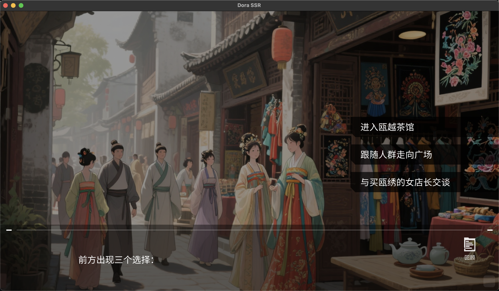

# 开源共创，游戏温州——15 天创意狂欢

&emsp;&emsp;我们的社区最近和温州大学学子一起，搞了场说干就干的实践——温州大学开源游戏开发大赛！

&emsp;&emsp;本届大赛以“开源共创，游戏温州”为口号。什么意思呢？一方面，我们要求参赛同学使用 Dora SSR、Godot 等完全开源的游戏引擎开发作品，并鼓励大家大胆使用 AI 来辅助创作（没错，AI 绘图、AI 写文案都算数，只要标明出处就行）。另一方面，大赛主题聚焦在温州本地文化“瓯·越”，希望大家把传统与科技结合，用游戏这一载体焕发瓯越文化的新魅力。比如可以挖掘瓯剧、瓯绣等非遗文化做游戏背景，或者融合白鹿传说、东海龙王等本地神话元素，让传统故事焕然一新。总之主题很灵活，只要既开源又有创意，同时贴合温州元素，就欢迎来试！

&emsp;&emsp;赛程安排也相当紧凑刺激：5 月底统一发布命题，参赛队伍有 15 天开发时间，从零开始做出一个能玩的游戏 Demo！期间组委会还提供了 Dora SSR 引擎的技术支持、低代码文字冒险框架等资源，官方 QQ 群里 24 小时轮班答疑，随时帮同学们解决开发难题。可以说后勤保障相当到位，目的就是让大家勇敢释放创意。

&emsp;&emsp;15 天后，参赛队伍如期提交了自己的游戏作品源码和演示视频。接下来经过紧张的评审环节——我们邀请了专家评委，也让所有参赛者互相打分，最终评出各大奖项。评分维度涵盖创意、玩法、叙事、音效、视觉等多个方面，每项都有对应的“最佳奖”。当然，最重要的奖项还是综合评分第一名的“最佳游戏奖”。值得一提的是，我们特别设立了“开源鼓励奖”，凡是按照要求开放源代码的完赛队伍都平分奖金，鼓励大家迈出开源分享的第一步。

&emsp;&emsp;最终，《赛博通灵师》《锦绣语幕：瓯越星图》《睁越迷影（穿越瓯越大陆）》等一批风格各异的原创游戏作品脱颖而出，分获最佳游戏、最佳叙事、最佳音效等奖项。这些学生作品让人眼前一亮：有的把温州非遗“瓯绣”化作科幻文字解谜游戏；有的把校园欺凌防治做成了互动小说；还有的把温州美食和愤怒的小鸟玩法结合，设计出轻松有趣的弹射游戏……短短两周内 8 支队伍完成了可玩的游戏原型，并全部开源分享了代码成果！可以说，本次比赛本身就是一次开源精神的最佳实践：大家共享创意、共享代码，用开源的方式共创出了一个又一个脑洞大开的游戏世界。

&emsp;活动网站：https://www.osgame.org/

*温大开源游戏开发大赛活动官网作品展示*

*“温大开源游戏开发大赛优秀作品展”线下展出和试玩*

*为获奖者们设计准备的“奖牌”*

## 参赛者的故事——每个人都可以创造游戏

&emsp;&emsp;更令人欣喜的是，很多参赛者在这次经历中找到了属于自己的闪光点。他们的故事证明：无论专业背景如何，只要有热情和开源社区的帮助，每个人都可以尝试创造游戏！下面就分享其中几个有代表性的真人真事：

### 《锦绣语幕：瓯越星图》开发团队

&emsp;&emsp;开源游戏仓库：https://atomgit.com/zhanyang/xuanzhe

*《锦绣语幕：瓯越星图》作品展示*

&emsp;&emsp;首先是一位署名为 zhan 的温大学子，他的团队作品《锦绣语幕：瓯越星图》在比赛中获得了“最佳音效奖”。令人惊讶的是，他几乎没向官方提问过技术问题，独立高效地完成了整个游戏开发。赛后我们和他交流时才发现，原来他充分发挥了 AI 助手的威力。从代码调试到内容生成，很多环节都借助了 AI 来加速。

&emsp;&emsp;组委会的伙伴表示肯定：“这个年代，AI 的能力已经是个人能力的重要组成部分了，能驾驭 AI 也是本事！”而 zhan 同学也坦言：“大部分开发工作都是尽可能借助 AI 完成的。”这种熟练运用 AI 工具的能力，正是当代开发者的新技能点。通过 AI 辅助再加上开源引擎的灵活性，他在短时间内打造出完整游戏，一举夺奖，可见AI与开源的结合威力十足。赛后 zhan 同学意犹未尽，已经打算继续尝试制作新的游戏作品，和寻找类似的比赛和交流机会了。看得出来，这次比赛让他对游戏开发的兴趣更浓，也让我们期待未来能在更多舞台看到他用开源和 AI 碰撞出的火花。

### 《睁越迷影》开发团队

&emsp;&emsp;开源游戏仓库：https://atomgit.com/haiyangxing/haiyangxing

*《睁越迷影》作品展示*

&emsp;&emsp;接下来这位也非常厉害——像素大作战团队的主创同学居然是生物专业出身！她完全是凭着一腔热爱报名参赛，硬是自学开源引擎 Dora SSR 的使用，在短时间内完成了一款文字冒险游戏《睁越迷影》，斩获了本次大赛的“最佳叙事奖”。

&emsp;&emsp;要知道，编程对非科班出身的同学来说确实有难度，用开源引擎开发游戏更是挑战。但她展现出了惊人的学习和创作能力。不仅剧情构思巧妙，她还充分利用了 AI 来打磨剧情文本。正如她分享的创作心得：“我先写了剧情提纲，让 AI 生成了几个版本的细节对白，再挑出符合我预期的版本自行修改润色，最后让 AI 帮忙润色调整。”通过这种人机结合的方法，她的文字内容既有 AI 辅助带来的高效，又保留了作者本人的独特风格。

&emsp;&emsp;值得一提的是，她原本野心勃勃打算做一款像素风的互动冒险游戏，甚至为此写了好几天的脚本。但由于学业繁忙，留给开发的时间所剩无几，无奈之下临阵调整方案，改做相对简单的文字冒险。哪知道成品效果却意外地好：恰到好处的文字留白与紧张刺激的情节设置，让玩家穿梭在架空的瓯越大陆冒险！评委们一致认可了她作品的创意和叙事。赛后我们夸赞她天赋出众时，她还谦虚地笑道：“其实多亏了你们经常帮我解决问题，我才能完成得这么好。”原来比赛过程中她也遇到不少技术难点，但通过QQ群和社区求助都一一攻克。开源社区的热心指导加上她个人的努力，让一个生物专业的学生成功变身游戏开发者！目前这位同学已经计划想利用暑假继续把当初那个像素游戏梦想实现，我们 Dora 引擎的开发群里也早早为她敞开了大门，随时准备提供技术支持。相信在开源社区的陪伴下，她一定能创造出更多惊喜。

### 《赛博通灵师》开发团队

&emsp;&emsp;开源游戏仓库：https://atomgit.com/kewu/Cyber_Psychiatrist

*《赛博通灵师》作品展示*

&emsp;&emsp;还有我们的“最佳游戏奖”获得者——一元二次方程组团队，他们开发的赛博朋克风冒险游戏《赛博通灵师》拿下了比赛最高荣誉。据了解，这支队伍里既有美术、程序这样的技术人才，也有像未名同学这样的策划/文案担当。正是分工协作的力量，加上对游戏的热爱，让他们在短时间内做出了一个玩法、美术、音乐都相当完整的作品。

&emsp;&emsp;尤其值得点赞的是，他们的像素风格的美术设计相当精良，国风赛博感的场景和角色立绘让人很让人惊叹这是学生作品。未名同学赛后和我们聊天时很谦虚，觉得作品还有很多不足、未来改进空间很大。但我们从主办方视角看，他们团队在项目管理、创意实现方面都表现出色——策划、程序、美术各司其职又紧密沟通，这种团队协作能力正是我们举办比赛希望锻炼的。

&emsp;&emsp;正如一位组织者所说：“程序和美术再专业，没有良好的策划和项目管理统筹，项目也走不远。” 开源开发也同样如此，一个成功的开源项目离不开多人协作和统筹。虽然据他们队长后来透露，团队计划下一步也会尝试使用其他开源引擎（如 Godot 等）来尝试创作游戏，但这也正体现了开源的可贵之处——大家有自由选择技术栈的权利。无论用什么工具，开源的理念已在他们心中生根。他们在比赛中对 Dora SSR 引擎提出的宝贵建议和反馈，也将帮助我们的开源社区不断改进。在最后，这支队伍也真诚地祝福：“希望 Dora SSR 越做越好！” 这让我们深受感动。开源的世界里没有，也绝不可能做强制绑架，只有因志同道合而默契同行的伙伴，或许这正是最好的注脚。

## 为什么开源很重要？最后再聊聊“佃农”与“土地的主人”

&emsp;&emsp;说到这里，可能有同学要问：为什么我们这么热衷推广“开源”？

&emsp;&emsp;先讲个游戏开发圈发生过的一件大事件——去年 9 月，Unity 公司突然宣布，以后开发者除了要付授权费、订阅费，还得按“安装次数”额外付钱。意思是：你做的游戏装得越多，哪怕免费游戏，开发者要付的钱反而越多！

&emsp;&emsp;消息一出，独立游戏圈几乎全炸了。许多小团队本来利润就很薄，这样一改，可能直接破产，甚至不得不下架作品。更离谱的是，这种政策没有提前沟通，没有合理解释，就突然生效，开发者们才恍然大悟：

> “原来这块我们以为可以安心耕耘的 ‘土地’，其实一直是别人的私产，人家想改规则，分分钟的事！”

&emsp;&emsp;这情景很像旧社会的佃农：辛苦耕种却永远没有掌控权，随时可能被地主涨租、改契约甚至赶走。而很多现代开发者，其实也和佃农差不多——用商业公司完全控制的引擎，埋头苦干，却随时可能被“天降规则”左右命运。

&emsp;&emsp;但软件界的开源运动正是为了改变这种状况才诞生的。1980 年代，斯托曼等技术理想主义者发起“自由软件运动”，提出“四项自由”理念：自由使用、自由修改、自由分发、自由改进。它真正做到把工具的掌控权交回到开发者自己手中。

&emsp;&emsp;在游戏开发领域，开源文化也同样焕发了巨大活力。Godot、Dora SSR 等开源引擎，就是属于所有开发者的“公共土地”——没有幕后老板突然宣布加收费用，没有封闭黑箱，代码全开源，规则透明、决策公开。每一位开发者都能亲自参与，决定引擎未来的发展方向。

&emsp;&emsp;这正是我们举办这次大赛，推广开源文化背后的初心：让每一个创作者都成为“土地的主人”，而不再是佃农。

&emsp;&emsp;在开源世界里，你不仅能自由创造和学习，还能与全球的伙伴们一起协作，让自己的作品走得更远，成长得更好。希望未来，有更多同学加入进来，勇敢开源，勇敢分享，勇敢在属于自己的土地上，种下梦想的种子！

## 彩蛋

&emsp;&emsp;还有一个特别暖心的小故事想和大家分享：

&emsp;&emsp;在这次温州大学开源游戏开发大赛的氛围感染下，我们 Dora SSR 社区里一位长期潜水的朋友也“浮出水面”了！他说看了同学们的努力与分享，深受触动，于是专门把自己原本用 Unity 开发的个人项目《时空红璃》搬上了开源平台，并将代码和资源全部开放共享。

&emsp;&emsp;他的作品放在这里：https://gitcode.com/dfer/shi_kong_hong_li

&emsp;&emsp;对他而言，这不只是作品的开源，更是一次“观念的转变”：从独自埋头做项目，到愿意把自己的成果贡献出来，与更多人一起学习、交流、进步。正如 dfer 在社区群里的留言：“看完比赛有点感动，我也决定加入开源了。”

&emsp;&emsp;这就是开源文化的魔力——也不用什么大道理去感召，看到他人的行动也能打动你。开源其实很简单，从分享第一行代码开始，我们就已经是彼此的伙伴啦！