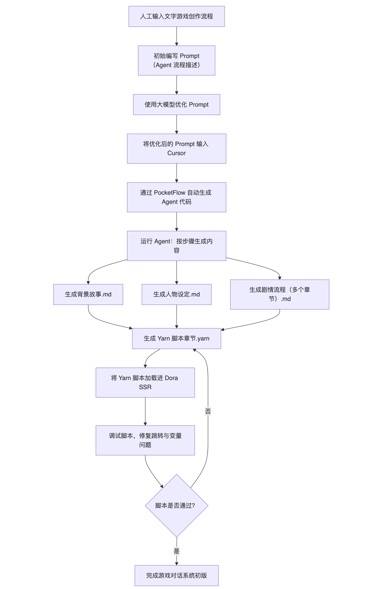

&emsp;&emsp;大家好！今天来继续聊一聊如何利用大语言模型自动编写 Yarn Spinner 脚本，并进一步分享我们是如何将这一过程**完全自动化**的 —— 不仅让 AI 帮我们写剧本，甚至连 “写剧本的 AI 工具” 都是 AI 自己写出来的。

### 相关链接：

* **PocketFlow**：https://github.com/The-Pocket/PocketFlow-Template-Python

* **本文实践（Yarn Agent）**：https://github.com/pigpigyyy/PocketFlow-Yarn-Story

* **Dora SSR 开源引擎**：https://github.com/IppClub/Dora-SSR

------

## 1. Yarn Spinner 简介与 AI 创作的新可能性

&emsp;&emsp;在我们进入今天的分享主题之前，首先需要快速了解一下什么是 Yarn Spinner，它的特点，以及为什么它特别适合与人工智能结合，进行自动化的剧本创作。

### 什么是 Yarn Spinner？

&emsp;&emsp;Yarn Spinner 是一个用于叙事驱动游戏的**对话脚本语言**和执行系统，它最早是为了叙事游戏《Night in the Woods》开发的，如今已经成为许多独立游戏开发者首选的对话系统之一。它具备以下几个特性：

* **语法简洁清晰**：每一行就是一段对话；
* **内置交互选项机制**：使用箭头 `->` 就可以定义玩家选项；
* **支持变量和条件逻辑**：可以根据玩家选择控制后续剧情；
* **结构清晰的节点跳转**：用 `<<jump NodeName>>` 即可跳转对话流程；
* **易于嵌入引擎**：可以快速集成到 Unity、Dora SSR 等游戏引擎中。

&emsp;&emsp;这种脚本语言的本质非常接近一种**结构化的小说文本**，它不依赖复杂的代码逻辑，也不要求开发者具备编程能力，因此天然也很适合用大语言模型进行生成。

### 为什么 Yarn Spinner 是 LLM 写作的理想目标？

&emsp;&emsp;与传统游戏脚本（如 Lua、C#）不同，Yarn Spinner 脚本更接近人类对话与剧情组织的自然表达方式。这就使得 LLM（大语言模型）在以下方面具备天然优势：

* **对话生成**：语言模型擅长写故事、生成自然语言对话，而这正是 Yarn 的核心；
* **选项分支设计**：模型可以根据用户需求自动设计剧情分支，实现多结局走向；
* **情节连贯性控制**：通过变量追踪，模型可以控制剧情走向的一致性与逻辑合理性；
* **模板学习快**：Yarn 的结构固定、语法清晰，非常容易通过范例学习实现模板化写作；
* **语义清晰，无需上下文执行环境**：不像代码那样需要运行测试，Yarn 脚本可以“读即理解”。

&emsp;&emsp;举个例子，我们只需要对 AI 说一句：“请帮我写一个校园恋爱题材的文字冒险游戏脚本，主角是一名刚转学的高中生，在第一天遇到三位性格不同的同学”，AI 很快就能输出符合 Yarn 格式的剧本结构。

&emsp;&emsp;甚至我们可以进一步要求：“请为这个脚本添加三条分支选项、使用变量跟踪好感度，并写一个第一章的完整对话”，它也可以理解并执行。这种能力让 Yarn Spinner 成为一个非常适合被 AI 扩展、辅助甚至完全自动生成的目标语言。

### 但问题也来了：能不能一键完成整套剧本的自动创作？

&emsp;&emsp;虽然通过各家大语言模型聊天工具，我们可以通过交互的方式逐步引导模型编写 Yarn 脚本，但这仍然是一种“半自动”过程：

* 我们仍然需要手动整理人物设定、故事大纲；
* 需要我们手动将生成内容分章节保存；
* 需要将每个章节的剧本改写为游戏加载的交互脚本形式。

&emsp;&emsp;这也正是我们这次探索的核心目标：

> **不仅让 AI 写 Yarn 剧本，更要让 AI 去构建自动写剧本的 AI 工作流。**

&emsp;&emsp;这一点，就是我们进入 **PocketFlow + Cursor IDE** 自动化流程的关键动机，这些也是本次实践所依托的技术基础。

------

## 2. 从 Prompt 到 Agent 的自动化流程设计

&emsp;&emsp;在 AI 辅助内容创作中，Prompt 是起点，也是最关键的一环。我们可以把 Prompt 理解为一种“人类意图的描述语言”，你告诉 AI 你想干什么、怎么干、需要什么结果，它就会照着去做。但大家熟知的 Prompt 使用方式还停留在手动交互层面：把教程、需求、任务粘贴给 AI，然后一问一答地推进。

&emsp;&emsp;**而我们希望能借助 AI 走得更远。**

### 2.1 初始 Prompt：记录人类创作流程

&emsp;&emsp;首先，我们梳理了人类在创作一个文字冒险游戏剧本时的典型流程：

1. 明确游戏主题与类型（比如校园恋爱冒险、地下城探索）；
2. 编写故事背景与世界观设定；
3. 设计角色，包括姓名、性格、经历；
4. 构思主线与分支剧情，并按章节拆分；
5. 最终将这些剧情编写成 Yarn Spinner 格式的脚本，对话、选项、跳转节点都要符合语法要求。

&emsp;&emsp;我们将这个完整的“人类工作流程”用自然语言写成了一个初始 Prompt。这个 Prompt 既是一份执行清单，也是一份“剧本写作说明书”。

### 2.2 优化 Prompt：从“描述”变成“指令”

&emsp;&emsp;初始 Prompt 是对工作流的粗略表达，但 AI 的理解力虽然强，依然依赖足够明确、细致的输入。为此，我们请 ChatGPT 对这个初稿进行优化：

- 明确每一步的输入和输出（如“将背景故事保存为 background-story.md”）；
- 强调中间过程的合理性（比如人物设定要与世界观紧密相关）；
- 增加变量追踪逻辑，比如用 `$selected` 或 `$score` 等变量标记玩家的决策；
- 引入交互节点定义规范，确保每一条分支路径都有相应的内容跳转。

&emsp;&emsp;经过优化后的 Prompt 不仅内容更完整，而且更适合作为自动化 Agent 的“蓝图”。

### 2.3 自动生成 Agent：让 AI 写一个能写剧本的 AI

&emsp;&emsp;接下来，我们用到两个工具：

- **Cursor IDE**：一个支持 Copilot 式 AI 编程体验的代码编辑器，可以将 Prompt 做一系列操作翻译成多个可运行的 Python 或其他语言代码；
- **PocketFlow**：一个开源的流程式自动化框架，它支持我们用纯文本“描述”工作流，然后自动生成对应的代码与执行逻辑。

&emsp;&emsp;我们将优化后的 Prompt 输入到 Cursor 中，由 AI 帮我们生成多个 PocketFlow 的工作流定义的代码文件（通常是 `flow.py` 、`nodes.py` 以及 `main.py` 等文件名称）。这些代码文件会自动：

- 接收用户输入（游戏需求）；
- 调用多个步骤的 LLM 推理；
- 把每一步的输出保存为 Markdown 或 Yarn 文件；
- 将生成的内容组织成一个完整的工程目录。

&emsp;&emsp;最终结果是：我们什么都没手写，但得到了一个“能按我们思路自己写剧本的 Agent”。

### 2.4 这个 Agent 是什么？

&emsp;&emsp;这个 Agent 并不是一个复杂的全知全能体，而是一个非常明确、结构清晰的“任务机器人”：

- 它只专注于一件事：把人类描述的游戏创意，转化为可用的 Yarn 脚本；
- 它的每一步都基于工作流程中的自然语言任务描述；
- 它的中间产物（文档、代码、脚本）可追踪、可调试、可复用。

&emsp;&emsp;你可以把它理解成是一个 AI 编剧实习生，只要你给它流程，它就会认真一步步执行。

------

&emsp;&emsp;所以这一节想表达核心理念就是：

> **Prompt 不只是对话的输入，它可以升级为构建自动化系统的“代码生成说明书”的“Meta Prompt”。**

&emsp;&emsp;而通过 PocketFlow + Cursor，我们已经实现了把人类的剧本创作逻辑，转译为 LLM Agent 自动执行的闭环系统。在这个意义上，Prompt 不只是控制 LLM 的“咒语”，更是定义 Agent 的“程序语言”。

------

## 3. 实操演示与构建过程简述

&emsp;&emsp;接下来，我们将具体展示整个自动化 Agent 的构建与运行流程，也就是从“没有代码”到“自动生成剧本”的全过程。我们的目标是——在不手写一行核心逻辑代码的前提下，自动生成一个能根据游戏创意生成 Yarn 脚本的工作流程工具。

&emsp;&emsp;结合前文提到的工作准备的步骤，我们实际最终的落地实践的完整流程如下：



------

### 3.1 工程环境搭建

&emsp;&emsp;那么接下来的一步，我们就从 GitHub 上克隆 PocketFlow 的开源模板仓库，并在 Cursor IDE 中打开。

&emsp;&emsp;PocketFlow 的仓库中包含了一套适用 Cursor IDE 标准的工作流描述文件，如 `.cursorrules`。我们无需理解其内容细节就能利用其继续上手做后续操作。

------

### 3.2 自动生成 Agent

&emsp;&emsp;在 Cursor IDE 中，AI 编程助手会读取我们的流程设计 Prompt，然后基于 PocketFlow 的结构逐步生成所需的任务模块：

- 第一步生成背景故事文案，并写入 `background-story.md`；
- 第二步设计人物角色（包括姓名、性格、背景），写入 `characters.md`；
- 第三步拆分主线剧情为多章，写入 `chapter-1.md`、`chapter-2.md` 等；
- 第四步从章节内容中提取关键节点，转化为符合 Yarn Spinner 语法的 `.yarn` 文件；
- 每个阶段的结果都自动写入本地，并可追踪查看。

这些模块是用 Python 自动生成的，不需要手动维护函数调用、异常处理等繁琐代码，整个过程类似“流程拼图”，由 AI 自动编排而成。

------

### 3.3 Agent 运行过程观察

&emsp;&emsp;完成 Agent 工程后，我们只需运行主流程脚本，它会按预定逻辑依次执行各步骤：

1. **读取游戏需求文本**；
2. **依次触发每一个步骤任务**（背景设定 → 人物设定 → 剧情拆解 → 脚本生成）；
3. **实时写入输出文件夹**；
4. **可视化查看运行状态和中间产物**。

&emsp;&emsp;在运行中我们可以看到：

- AI 在生成角色设定时，会参考前面生成的世界观；
- 生成的章节剧情采用类似小说段落的自然语言叙述；
- Yarn 脚本会自动提取对话、分支，并插入语法指令（如 `<<jump>>`、`->` 等）；
- 所有内容自动保存为 Markdown 和 Yarn 文件，无需手动干预。

------

### 3.4 运行中常见问题与修复策略

&emsp;&emsp;尽管大部分生成逻辑稳定，但由于大语言模型仍具有一定随机性，我们也会遇到一些问题：

- **跳转节点未定义**：有时会生成 `<<jump Node3>>` 但没有对应的节点；
- **变量未初始化**：例如使用 `$selected` 而没有定义初始值；
- **过度简化剧情**：部分章节只有一两句内容，缺乏对话层次；
- **格式错误**：偶尔 Yarn 语法不规范，导致运行报错。

&emsp;&emsp;为了解决这些问题，我们可以采取以下后续人工或半自动的操作：

- 手动补全关键节点或后续再使用 AI 自动补全；
- 引入自动语法检查和回滚机制；
- 设置大模型 API 调用的 temperature 与 max_tokens 等参数控制输出稳定性和长度；
- 对生成内容二次精修，增强角色对话的情感色彩与个性细节。

------

### 3.5 输出与验证

&emsp;&emsp;所有步骤完成后，我们会在输出目录中得到如下结构：

```
/.
  ├─ background-story.md
  ├─ characters.md
  ├─ chapter-1.md
  ├─ chapter-2.md
  ├─ chapter-1.yarn
  ├─ chapter-2.yarn
```

&emsp;&emsp;这些 `.yarn` 文件可以直接上传到 Dora SSR 的 Web IDE 中运行。我们使用内置脚本加载工具测试每一个节点的跳转、变量变更、分支逻辑是否符合预期。

&emsp;&emsp;再经过多轮调试后，就能得到一个具备基础交互的文字冒险游戏原型。

------

## 4. 在 Dora SSR 中调试生成内容

&emsp;&emsp;生成完 Yarn 脚本后，我们接下来的目标，就是将这些脚本加载进游戏引擎中进行验证和调试。我们使用的是我们自己的开源游戏引擎 —— **Dora SSR**，它原生支持 Yarn Spinner 语法的脚本运行，并配备了可视化的 Web IDE，可以帮助开发者快速调试对话系统与剧情分支。

------

### 4.1 将脚本导入 Dora SSR

&emsp;&emsp;自动生成的 Yarn 文件位于输出目录（如 `chapter-1.yarn`、`chapter-2.yarn`）。要在 Dora SSR 中使用它们，我们只需将这些脚本文件通过 Web IDE 上传到游戏项目的资源目录中，左键直接打开可视化界面，就能快速查看和测试对话逻辑是否正常。

### 4.2 自动调试的未来可能性

&emsp;&emsp;其实我们还考虑了一种更高级的方式：**调试流程的自动化**。

&emsp;&emsp;这个流程可以是：

1. 脚本生成完成后，由程序自动加载进 Dora SSR；
2. Dora SSR 检查是否运行报错；
3. 若报错，则提取错误信息，送入 LLM 进行修复建议生成；
4. 修复后的脚本再次加载，直到成功运行为止。

&emsp;&emsp;虽然本次实践精力有限，我们为保持简洁没有启用这条链路，但完全闭环的 Agent 自动调试修正系统的预期是存在和可行性的。

------

## 5. 目前遇到的问题与展望

&emsp;&emsp;尽管到目前为止大模型 Agent 工具生成的剧本已经基本可运行，但仍存在以下挑战：

- 生成的内容密度低，缺乏人物情感与生活化语言；
- 分支较多但细节不足；
- 长内容容易被 token 限制截断；
- 跳转逻辑不完整；

&emsp;&emsp;为此，我们可以继续探索：

- 优化 Prompt 提示设计；
- 使用更长 token 支持的模型；
- 添加 Story-to-Dialogue 的中间转换步骤（增加多个叙事转脚本的中间细化创作的步骤）；
- 最终形成一个从构思到产品的高质量 AI 游戏编剧流程。

------

## 6. 总结

&emsp;&emsp;今天我们从一个看似简单的问题出发：能不能让 AI 自动写 Yarn Spinner 剧本？沿着这个问题，我们走通了一整条从“创意输入”到“剧本输出”再到“引擎运行”的闭环路径。

&emsp;&emsp;我们实际探讨和实现了三大关键步骤：

- **第一步：把 AI 从一个对话助手，变成了一个“创作自动化工具流程”的参与者。**

	不再是一次次复制粘贴，也不再是手动对话调试，我们让 AI 承担起一整套结构化的工作流任务，参与内容策划、结构组织和脚本生成。

- **第二步：借助开源工具（PocketFlow + Cursor IDE），实现了几乎零手写代码的 Agent 构建。**

	 Prompt 驱动开发，流程式编排逻辑，自动生成 Agent 工具程序，并能持续进化、修复、优化。

- **第三步：利用 Dora SSR 引擎，将生成的脚本实际运行并验证在游戏环境中，完成创作-开发-执行的闭环。**

	 这不是游戏故事文本生成的终点，更是进入一个真正可玩的游戏故事交互体验的创作起点。

&emsp;&emsp;最后，让我们在大模型时代，来一起探索用一个想法就生成可以完整体验的游戏作品的未来吧！


