# 写在前面

本文的标题是**爱与魔法**，所以本文的重点将是两个部分

- 如何使用魔法访问国际互联网

- 如何使用AI工具辅助学习

由于我们的博客部署在 `Github` 上面，所以我们可以大声的说出第一条所指代的词语：翻墙（大声）！！

## 为何需要魔法

那么为什么我们将这个知识点如此提前，必然是因为魔法是十分重要的技能，尤其是对于计算机专业的学生，何以见得？

*Tips: 下面列出了许多例子，如果你不想完全阅读，可以点击目录来向后跳转*

- **获取技术资源**

  很多计算机领域的前沿技术、学术论文、开发工具、教程和开源项目都发布在国际平台上，如GitHub、Stack Overflow、Google Scholar、YouTube、Reddit等。

- **参与开源社区**

  开源社区是计算机技术发展的重要驱动力，例如Linux、Python、TensorFlow等项目背后都有庞大的国际开发者社区。要参与这些项目，或者使用这些技术，我们可能需要访问GitHub、DockerHub等平台。

- **学习和使用主流技术**

  很多技术培训和教学资源都托管在国外的视频平台或在线学习平台上，如YouTube、Coursera、Udemy等。

- **突破国内网络限制进行科研**

  许多国际期刊、学术数据库和科研资源在某些地区的访问会受到限制。魔法可以帮助你突破这些限制，查阅必要的学术资源，从而进行研究和学术写作。

-  **访问全球开发者社区与工具**

  不仅是开源项目，很多开发工具和平台也是全球通用的，如Node.js包管理器（npm）、Python的pip、甚至是浏览器插件市场等。如果这些工具和平台受到了访问限制，会影响你的编程和开发效率。

## 魔法从何而来

- **2003年：“防火长城”（Great Firewall, GFW）项目的启动**

  “防火长城”是我国互联网监管的核心技术体系，通过该系统，政府能够过滤和屏蔽特定的国际网站和信息。随着时间的推移，GFW的技术不断升级，屏蔽了越来越多的外国网站和服务，包括谷歌、Facebook、Twitter、YouTube等。

- **2008年：北京奥运会和互联网审查**

   在北京奥运会期间，我国加大了对互联网的控制，屏蔽了许多海外网站和新闻平台。这一时期，政府意识到互联网对社会舆论的影响，因此进一步强化了信息管制。

- **2010年：谷歌事件**

  谷歌在2010年决定将其搜索服务从大陆转移至香港，主要原因是无法接受中国的审查要求。这一事件进一步标志了中国与国际互联网的部分脱钩。

这就可以解释为什么不是“渡海”而要叫”翻墙“，因为翻过的是防火墙（防火长城）

## 魔法的技术依赖

作为用户，几乎无需知晓其原理，只需使用即可。以下内容为 `ChatGPT` 生成，如需了解更多详细信息，可以自行访问 `YouTube` 等平台查阅。

魔法的原理主要依赖于绕过互联网服务提供者（ISP）和网络防火墙的内容过滤和封锁机制。简而言之，魔法工具通过隐藏或修改用户的网络流量，使其绕过本地或国家层面的网络限制，访问被屏蔽的网站或服务。

以下是魔法的主要技术原理：



- **代理（Proxy）**

  代理服务器是最常见的魔法工具之一。它充当中介，在用户和目标网站之间转发流量。用户的网络请求首先发送到代理服务器，然后代理服务器代表用户向目标网站发出请求，最后再将目标网站的响应传回给用户。

- **虚拟专用网络（VPN）**

  VPN是一种常用的魔法工具。VPN通过在用户与VPN服务器之间创建一个加密的隧道，隐藏用户的实际IP地址，并通过VPN服务器来访问被屏蔽的资源。

- **Shadowsocks**

  Shadowsocks是一种加密的代理协议，通常用于魔法。它通过加密用户流量来绕过防火墙。

     - **工作原理**：Shadowsocks使用加密协议将用户流量发送到海外的Shadowsocks服务器，然后服务器代理用户访问互联网。

     - **优点**：由于它使用的流量看起来像普通的HTTPS流量，因此在防火墙上更难被识别。

     - **缺点**：需要配置服务器，依赖于稳定的海外服务器。


- **Tor（The Onion Router）**

  Tor是一个匿名网络，通过多层代理（称为“节点”）来隐藏用户身份。每一层加密一部分数据，流量通过多个中间节点传递，最后到达目标服务器。

- **混淆协议（Obfuscation Protocols）**

  混淆技术的目的是隐藏流量的真实特性，使防火墙无法识别它是代理或VPN流量。防火墙可以通过深度包检测（DPI）识别常见的代理或VPN流量，混淆技术会将这些流量伪装成其他流量（如普通的HTTPS流量）。



### 总结

魔法的核心技术原理是通过代理、VPN、加密、流量混淆等方式绕过防火墙的审查，隐藏或修改网络流量的真实目标。每种方法都有各自的优缺点，选择合适的工具和技术需要根据防火墙的具体封锁手段和个人需求。

# 使用魔法

前面提到了各类魔法技术，其共同点都是“需要一个稳定的服务提供商”。

这个你需要自行找人推荐，笔者在这边不适合直接放出链接。

现在假设你已经知道了自己想要购买的服务，但是问题出现了：这些服务提供商的官网通常也需要魔法才能访问，坏了！死循环了！

## 破局之法

前面说到“需要一个稳定的服务提供商”，那解决方法也很简单，你用不稳定的就行了。

你有许多方法可以获得“不稳定的魔法服务”：

- 使用 `Bing` 搜索引擎，搜索“机场”相关关键字，随意找一个提供免费/低价试用的提供商
- 像拥有魔法的人寻求帮助，让ta代为购买
- 拷打俱乐部成员（误）

## 选择你的魔法工具

现在默认你已经有个一个可以访问的服务提供商，无论是临时的还是你托人买的稳定的，后续步骤都是同理。

### 推荐客户端




- karing
- Clash Verge REV
- Clash Nyanpasu
- Clash-Meta For Android
- NekoBox
- NekoRay
- Clash Verge (Clash.Meta Core)
- V2RayN
- v2RayNG
- ShadowRocket
- Hiddify
- A GUI For Clash



### 不推荐客户端



- Clash For Windows
- Clash For Android
- Quantumult X (不支持Vless和Hysteria协议)
- Sing-Box



### 下载链接



#### Windows

- [karing（推荐）](https://karing.app/)
- [Clash Verge REV（推荐）](https://github.com/clash-verge-rev/clash-verge-rev/releases/latest)
- [Clash Nyanpasu](https://github.com/LibNyanpasu/clash-nyanpasu/releases/latest)
- [Clash For Windows (不推荐)](https://github.com/Z-Siqi/Clash-for-Windows_Chinese/releases)
- [Hiddify](https://github.com/hiddify/hiddify-next/releases/latest)
- [Sing-Box](https://github.com/SagerNet/sing-box/releases/latest)
- [GUI For Clash](https://github.com/GUI-for-Cores/GUI.for.Clash/releases/latest)

#### MacOS

- [karing（推荐）](https://karing.app/)
- [Clash Verge REV（推荐）](https://github.com/clash-verge-rev/clash-verge-rev/releases/latest)
- [Clash X](https://github.com/clashbk/clashx/releases/download/1.96.2/ClashX.dmg)
- [Clash Verge Rev](https://github.com/clash-verge-rev/clash-verge-rev/releases/latest)
- [Clash Nyanpasu](https://github.com/LibNyanpasu/clash-nyanpasu/releases/latest)
- [Hiddify](https://github.com/hiddify/hiddify-next/releases/latest)

#### Android

- [karing（推荐）](https://karing.app/)
- [Clash-Meta For Android](https://github.com/MetaCubeX/ClashMetaForAndroid/releases/latest)
- [NekoBox](https://github.com/MatsuriDayo/NekoBoxForAndroid/release/latest)
- [Clash For Android (不推荐)](https://github.com/Z-Siqi/Clash-for-Windows_Chinese/releases)
- [Hiddify](https://github.com/hiddify/hiddify-next/releases/latest)
- [Sing-Box](https://github.com/SagerNet/sing-box/releases/latest)

#### iOS / iPadOS

- [karing（推荐）](https://karing.app/)
- [ShadowRocket](https://apps.apple.com/us/app/shadowrocket/id932747118)



## 使用教程

### Windows（其它系统同理）

在你的服务提供商官网，大概率有类似这样的一堆按钮

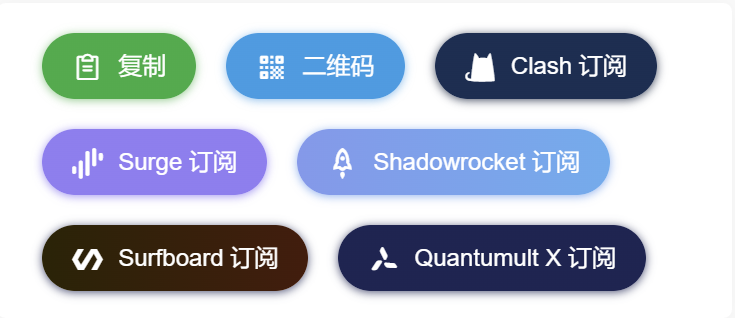

你可以理解为这些是魔法咒语的下载链接，一般我们点击**复制**

然后打开你下载的软件，这里使用 `Clash` 系列和 `v2Ray` 系列演示

- 导入你的配置

  |  | 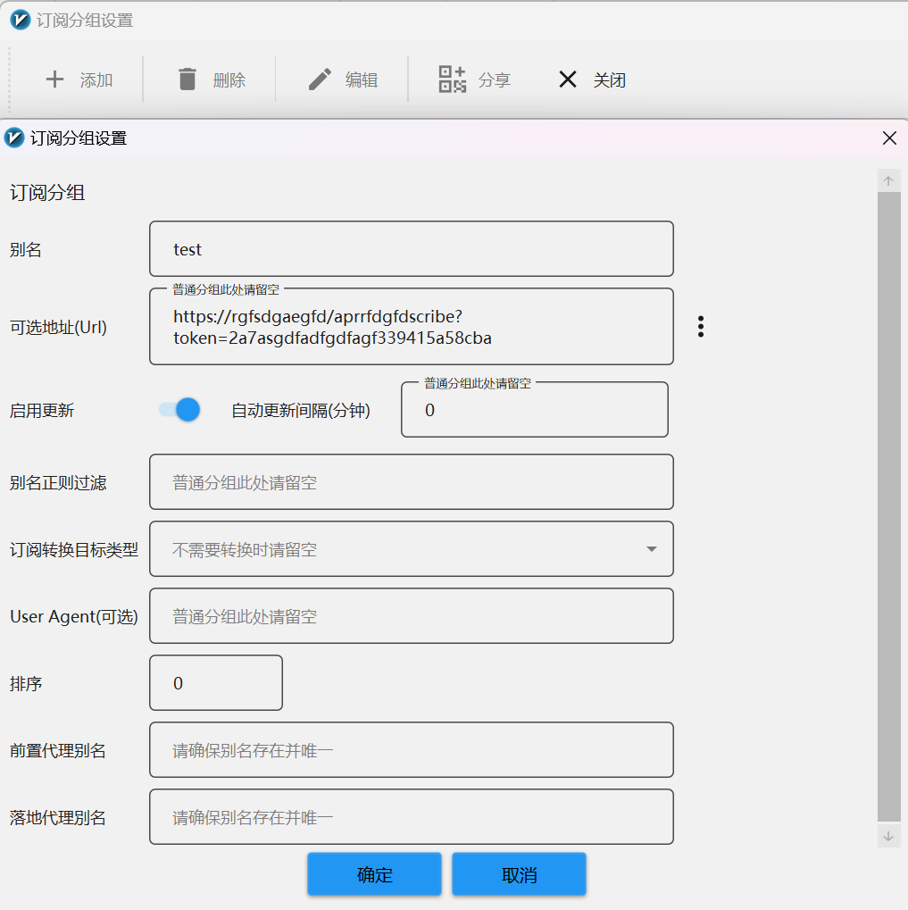 |
  | ------------------------------------------------------------ | ------------------------------------------------------------ |

- 按照你的需要选择线路（一般区别在于节点位置、费用、是否解锁ChatGPT、是否解锁Netflix等）

  |  | 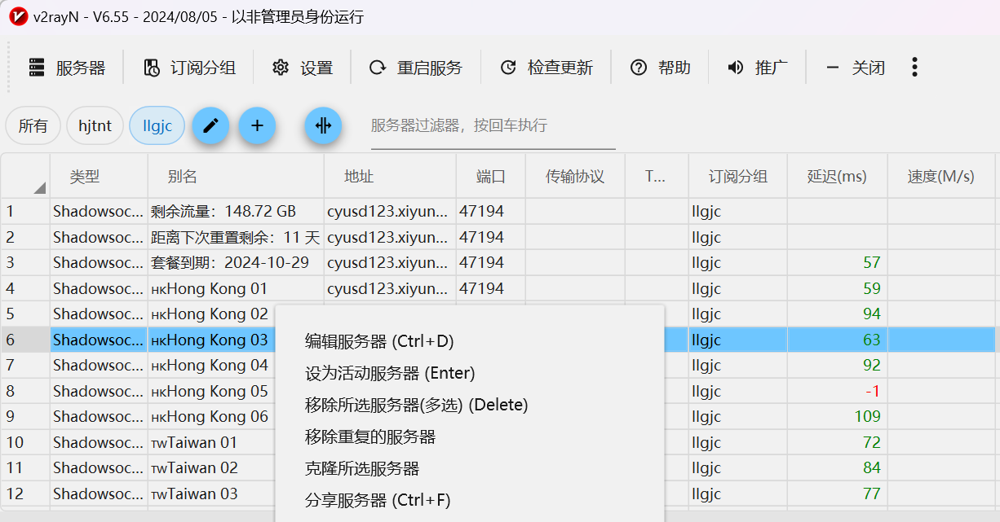 |
  | ------------------------------------------------------------ | ------------------------------------------------------------ |

- 按照你的需要开启系统代理（各种选项都是字面意思）

  |  | 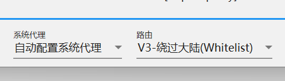 |
  | :----------------------------------------------------------: | :----------------------------------------------------------: |

### Android

安卓这个只是单纯想写一个目录hhh，具体操作和Windows区别不大，相信以你的聪明才智很容易就可以解决。

另外提醒，设备在使用魔法时会带来额外的功耗，移动端尤为明显，具体体现可能有发热、浏览器访问国内网页变慢等等

不是中毒了！！！
不是中毒了！！！
不是中毒了！！！

# 使用AI

笔者在此大发暴论，一个不会使用AI的大学生是不合格的！！！

AI 的种类有很多，他们的偏向各不相同，在不同的领域也应该使用不同的AI。

## 生成式人工智能在文档方面的应用

### 为什么要使用？

使用生成式人工智能能够极大地提高编写各类文档的效率。通过合理利用这些先进技术，不仅可以显著提高工作效率，还能增强文档的专业度和吸引力。

然而，值得注意的是，尽管AI能够很好地辅助人类工作，但它并不能完全取代人的角色。最佳实践是在充分利用AI潜力的同时，保持批判性思维，确保所有产出都经过仔细校验，从而共同创造出更加出色的工作成果。

### 注意什么

和人一样，大模型的产出也需要通过不断的反馈来提高输出质量

~~但和人不同的是，你说了它真的回去做（虽有有时未必会改~~

#### 定义清晰的目标

清晰定义你希望通过AI达成的目标是什么，比如特定主题的文章、产品描述等，尽可能使目标不具有二义性。

#### 提供详细输入

向模型提供更多关于所需输出的具体信息，如背景资料、期望语气等。

通常更详细的背景信息能使模型输出更贴合主题的内容。

有时将一个示例提交给它能使得它更好地完成任务。

#### 迭代反馈

根据初步结果进行调整并重复过程，逐步优化直到满意为止。

**非常重要**

这时请把自己想象成一个无情的甲方。

#### 编辑后审查

即使是最先进的AI系统也可能产生错误，因此对最终产物进行全面检查是必要的步骤。

对于一些专业领域，请确保自己对该领域有一定了解，不要全权交给大模型。

### 一些使用体验

GPT系列的综合能力在诸多大模型中处于领先地位，但不同大模型在不同的领域仍有一些优势，譬如更全面的中文语料、趋近于免费的廉价使用成本以及访问的便捷性等

#### GPT系列

无需多言，但中文语料的实时性稍逊。

适用于各种文本生成任务，包括但不限于文章撰写、修改，代码生成、问答等。

特别适合需要高质量和多样化内容输出的应用场景

#### 智谱清言

在文本生成领域，各方面优点都具备一些但没有特别突出。

逊于GPT的代码能力，但在国产大模型中较为领先。**输出大规模代码会出错**

具备一定线上搜索能力，且标定来源。**总结会糅合多个结果，信息有时错位，请注意核实**

#### 通义

国产大模型中较为领先的多模态，但逊于GPT，额度不足时可少量替代。

强悍的结合线上搜索结果风格化文案生成，~~比如社团招新文案~~

提供PPT生成，长文本解读等小工具，傻瓜式操作

#### 文心

更像一个助手而非生成工具

有时会突发奇怪的风格化语句

#### 讯飞星火

体验稍差，有时理解存在偏差，尚堪一用

提供更丰富的小工具

中英翻译功能在国产大模型中准确性较好（仅个人感受）

#### WPS AI

翻译功能可堪一用

文本理解和生成能力较差，有时结果中会混入奇怪的符号，复杂要求的文本工作尽量不要使用

但和WPS相关功能结合，在办公三件套领域专业性很强

## AI 代码补全的使用

笔者最推荐的是 `GitHub Copilot`，无需多言，你应该也在各种地方听说过它。

注意：作为一名大学生，你可以免费使用 `GitHub Education` 提供的 `Copilot`，具体申请方式请自行搜索。

如果你懒得搞这个，那也有替代项，`CodeGeex` 也是不错的选择。

### 生成式代码补全

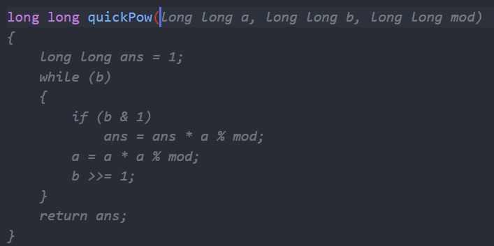

如图，对于简单的功能，你只需要对你的类或函数进行合理的命名，`Copilot` 会自动猜测你的下文，呈现为图中的灰色字体，按下 `Tab` 键就可以一键补全。

这也就是我们常说的 **面向Tab编程**

### 代码纠错

| 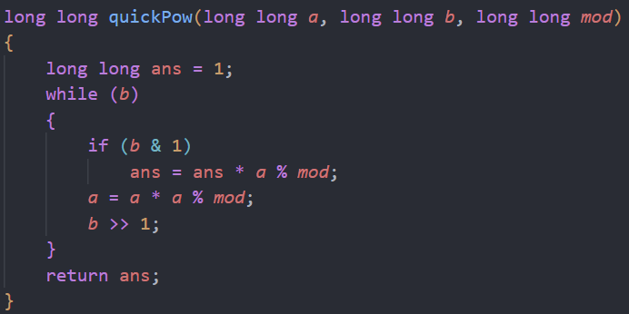 | 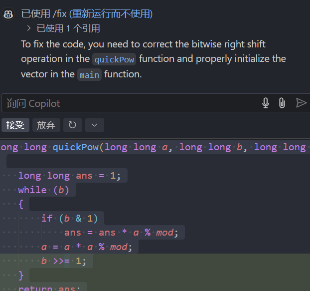 |
| ------------------------------------------------------------ | ------------------------------------------------------------ |

左图，我故意将快速幂的 `b >>= 1` 这一步的 `=` 删除，使用 `Copilot` 内联聊天来询问（纠错快捷指令： `/fix` ），它会给出修改建议，覆盖在原代码之上，点击接受即可使用。

### 全新生成

如果你已经添加了 `Copilot` 插件，那么应该会有类似的界面

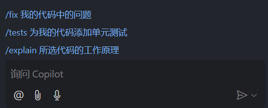

你可以像使用 `ChatGPT` 一样来跟它对话，阐述你的要求。

# 深度解析 ChatGPT

## 写在前面

- 项目教学部分基于chatGPT生成
- 部分文章内容基于chatGPT生成

关于AI的具体实现技术，我们在此不多做探讨，本篇博客聚焦于如何使用AI，工欲善其事必先利其器，在学习如何使用之前，我们首先要了解我们的工具。

在AI火得一塌糊涂的当下，不少公司都推出了自己的大模型，生成式AI已经成为强大的生产力，纯AI创作的短片、AI主播等昭示了AI流水线工作的实力，而你需要的是做一个优秀的“资本家”，学会如何使用恰当的AI做恰当的事情。

从chatGPT横空出世震惊世界开始，我就一直在用AI进行各种尝试，如今AI已经成为我最重要的生产力，每天不打开AI用一用都会觉得难受。在此我分享一些我使用AI的心得体验，也欢迎大家多多进行AI用法开发，搭上时代的快车，提高生产力。

我们主要结合生成文本的对话AI模型进行使用教学，绘画咒语或者其他特殊应用在此不多涉及，大家也可以在学会今天的内容之后拷打AI进行学习。

## 关于如何使用chatGPT？


对于正版的chatGPT4，openAI提供了两种方式进行选择，一种是官网直接访问，另一种是通过调用API进行各种类型的访问，两种方式价格不同，使用方式也有差别。

官网访问呢非常简单，只需要施展魔法，打开官网，点击注册登录后就可以使用，免费的chatGPT3.5的代码能力还是略差一些，有钱可以试试chatGPT4，但是官网收费还是比较贵的（~~富哥忽略~~）。

如果没有账号或者不想自己注册账号充钱用gpt4，可以tb买共享账号，但登录仍然需要魔法。个人觉得，如果用3.5，不如国内选一个好用的AI平替，省点梯子费，效果也差不多。

登录官网使用gpt4需要注意两点，一个是魔法建议采用全局模式，另一个是注册账号尽量不要用qq邮箱之类的，可以申请gmail或者outlook邮箱，因为openAI对国内访问限制还是比较严格，这些一不小心就暴露你是国人的地方（比如非全局模式被发现，比如采用疑似中国人爱用的qq邮箱等）可能会导致卡你资格，不让注册。

调用API访问就比较多样了，国内你看到的有些套皮GPT4就是调了API，然后搭了一个页面给你用，真假未知。如果自己不会官网买API然后用，也可以到中间商那里购买API，tb搜索关键字gpt key，可以找到对应的商家，不同tokens数价格不同。由于openAI官网的一些收费机制，比如先用后付等，很多商家会钻空子用各种方式降低成本卖API获得利润。（仔细甄别小心被骗哦）

API访问GPT4需要部署，tb还有一个好处就是可使用的模型比较全，一般也会提供一个部署好的页面，你直接输入API就可以在页面上访问进行对话，不需要自己部署。

如果要自己部署，可以买一个API，然后开始开发各种好玩的用法啦，GitHub上也有一些有趣的部署应用。

至于怎么部署一个简单API应用，先卖个关子，我们先继续探讨一些其他的东西。

~~更多chatGPT4相关信息可以拷打群主~~

## 主流对话式AI模型

笔者列出了当前主流的一些AI大模型以及对应网站和信息，供大家参考，主要列举国内的（因为大部分较便宜或免费且不需要梯子以及复杂的验证，具有一定可用性）。

若会使用ChatGPT4，则推荐强烈使用，工业水准上GPT4吊打国内产品，而专门训练写代码的AI吊打GPT4。除了生成质量高，最重要的是速度非常快！！！如果有过使用对比体验会深刻感受到快有多么重要。

### **世界主流对话式AI模型**

1.**OpenAI - ChatGPT**

- **简介**：ChatGPT是由OpenAI开发的基于GPT-4的对话式AI。它能够进行多轮对话，支持多种语言，广泛应用于客服、内容创作、编程等场景。

- **收费**：

  免费版：基于GPT-3.5。

  付费版：ChatGPT Plus，基于GPT-4，每月$20。

- **官网**：[https://openai.com/chatgpt](https://openai.com/chatgpt)

2.**Anthropic - Claude**

- **简介**：Claude是Anthropic开发的AI聊天机器人，以安全性和对话质量著称。Claude也有多版本的迭代，支持复杂对话和任务。
- **收费**：提供免费版本以及企业定制服务，定价根据企业需求而定。
- **官网**：[https://www.anthropic.com](https://www.anthropic.com)

3.**Google - Bard**

- **简介**：Bard是由Google开发的基于其语言模型PaLM的对话式AI工具，专注于生成高质量的文本、进行复杂查询等。
- **收费**：目前免费使用。
- **官网**：[https://bard.google.com](https://bard.google.com)

4.**Microsoft - Azure OpenAI (GPT-powered models)**

- **简介**：微软通过其Azure平台提供GPT模型服务，企业用户可以通过API调用GPT-4等语言模型，用于客户服务、数据分析等场景。
- **收费**：按API调用次数和计算资源收费，具体费用取决于使用量。
- **官网**：[https://azure.microsoft.com/en-us/services/openai/](https://azure.microsoft.com/en-us/services/openai/)

5.**Meta - LLaMA (Large Language Model Meta AI)**

- **简介**：Meta推出的LLaMA是一款专注于高效推理和训练的语言模型，开放给研究人员进行开发和实验。
- **收费**：主要用于研究，暂未提供商业定价。
- **官网**：[https://ai.facebook.com/blog/large-language-models-are-having-their-stable-diffusion-moment/](https://ai.facebook.com/blog/large-language-models-are-having-their-stable-diffusion-moment/)

### **中国主流对话式AI模型**

1.**百度 - 文心一言 (Ernie Bot)**

- **简介**：文心一言是百度推出的对话式AI，基于文心大模型（Ernie），能够进行中文和英文对话，并支持文本生成、语言翻译、情感分析等功能。
- **收费**：
  - 免费版：提供基础功能。
  - 企业版：根据API调用量和服务种类进行收费。
- **官网**：[https://yiyan.baidu.com](https://yiyan.baidu.com)

2.**阿里巴巴 - 通义千问 (Tongyi Qianwen)**

- **简介**：通义千问是阿里巴巴推出的AI大模型，支持多种场景的自然语言处理、智能客服、语音识别等功能。
- **收费**：提供免费体验和企业定制服务，具体定价根据使用量。
- **官网**：[https://tongyi.aliyun.com](https://tongyi.aliyun.com)

3.**讯飞 - 星火认知大模型**

- **简介**：由科大讯飞开发的星火认知大模型，专注于中文处理和行业解决方案，应用于教育、医疗、法律等领域。
- **收费**：提供免费版本及付费企业解决方案。
- **官网**：[https://xinghuo.xfyun.cn](https://xinghuo.xfyun.cn)

4.**商汤科技 - 商量SenseChat**

- **简介**：商汤科技推出的商量大模型，主打智能对话、客服和内容创作，支持多种语言。
- **收费**：根据企业需求提供定制化方案。
- **官网**：[https://www.sensetime.com](https://www.sensetime.com)

5.**华为 - Pangu Model（盘古大模型）**

- **简介**：华为推出的盘古大模型覆盖多种场景，主要应用于金融、医疗、制造业等领域，支持多种语言和对话功能。
- **收费**：根据服务和API调用收费，主要面向企业客户。
- **官网**：[https://www.huawei.com](https://www.huawei.com)

国内如果要免费的AI，文心一言免费的就够用了，收费版我没用过（钱都投给GPT4了），访问不需要梯子，效果似乎也不错。

## 你可以用AI做任何你想做的事情

这个标题放在这里，乍一看有些唬人哈，但是毫不夸张地说，如果你真的会使用AI，已经可以做到很多你想做的事情了。

在讨论如何使用AI之前，我们先来看看“正确的使用AI的思维方式”

- AI可以做到什么？
- 如何正确提问

#### **AI可以做到什么？**

日常生活中，简单的文本生成，比如发通稿写点文案以及一些简单的代码，这些AI都可以轻松做到，利用一些固定的prompt甚至可以做得更优。但是这些仅仅是AI使用的很小的一部分——你甚至可以让它帮忙做心理疏导，工数考试复习计划表，个人爬虫学习计划制定，各类事情决策分析，把一列文本里所有空格去掉，把表格里所有特定信息提取等，都可以用AI完成。

毫不客气地说，任何人类可以做到的比较轻松但花心力的小事情，都可以用AI来解放生产力！

AI可以做到什么？思考这件事也许能帮助你开法更多AI用法，不断提高你的生产力。而作为一位计算机学生，如何用AI辅助学习是一件很值得研究的事情。

众所周知，做项目是提升能力很重要的一个方法，因此，**在这里我们以一个项目为例子，来手把手教你如何用AI做到你想做的任何事情，来学习新技术**。

#### **如何正确提问**

以下内容由chatGPT和笔者共同完成。

向AI提问的技巧在使用对话式AI（如ChatGPT、Claude或其他大型语言模型）时至关重要。如何组织你的问题或提示词（prompt）会直接影响AI生成结果的质量和精确度。以下是一些详细的技巧和策略，帮助你更好地与AI互动、提高回复的有效性。

##### 1. **明确清晰的提问**

避免模糊不清的问题，确保问题的结构清晰并准确传达你希望获取的答案。AI通常会根据你的提问生成相应的内容，因此问题的精确性会决定输出的相关性。

**示例：**

- 不明确的提问：*“给我讲个故事。”*
- 更明确的提问：*“请写一个关于勇敢和友谊的短篇故事，字数控制在300字以内。”*

个人认为这点非常重要，清晰的描述，准确的形容词动词能够让AI很好完成你真正需要的任务。

##### 2. **设置具体的上下文**

提供足够的上下文信息，使AI更好地理解你的需求。上下文包括任务的背景、对输出的要求、以及你想要涵盖的内容。

**示例：**

- 无上下文：*“解释人工智能。”*
- 有上下文：*“用简单的语言向一位高中生解释什么是人工智能，并举一个日常生活中的例子。”*

对于一些特殊情境，比如小组作业、发言稿、发给大众的通告、课程大作业等需要不同的语气和侧重点的生成内容，这些都是重要信息，需要向AI解释。有时也许会有意想不到的好效果。

##### 3. **指明输出格式**

如果你对输出格式有要求（如表格、列表、代码片段等），可以明确告诉AI，以确保AI生成的内容符合你的期望。

**示例：**

- 普通提问：*“帮我总结一下这个章节的要点。”*
- 指定格式：*“请用一个三段式的结构总结本章的要点，每段100字左右。”*

**代码输出示例：**

- *“请使用Python编写一个计算两个数之和的函数，并加上注释。”*

建议大家让AI写代码都说句加上详细注释，尽管它自己也会加，但是这句可以让它解释更详细更清楚。

##### 4. **逐步引导，分解复杂问题**

对于复杂任务，可以将其分解成多个步骤，逐步引导AI进行每个步骤的处理，这样AI的生成结果会更加准确。

**示例：**

- 复杂提问：*“帮我写一个商业计划书。”*
- 分解步骤：*“首先，帮我写一个商业计划书的执行摘要。然后，描述一下市场分析和目标受众。”*

这大概是我等会要介绍最重要的一点，一个大项目，一篇论文，都是非常复杂的，AI无法一次输出很多东西，我们需要分解任务，将简单的小任务丢给AI，然后我们做大老板验收成果并组合。

##### 5. **控制文本长度**

如果你希望生成的文本有特定的长度，或者你需要简明的回答，可以在提问时设置文本的长度或限制。
**示例：**

- 没有限制：*“请解释一下量子计算。”*
- 有长度限制：*“请在50字以内解释量子计算。”*
  个人觉得AI生成的字数有时不是很准确，主要起到控制一下长度，使得AI更有重点的作用。

##### 6. **多轮对话上下文**

在多轮对话中，AI可以记住前面的对话内容，并根据先前的讨论进行扩展。因此，在多轮对话中，不必重复已知的信息，可以直接基于上下文提问。

**示例：**

- 你可以先问：*“解释一下机器学习是什么？”*
- 接着问：*“它和深度学习有什么区别？”*
- AI会基于之前的讨论，直接进行对比和解释。

国内大部分AI的上下文记忆能力都堪忧，所以建议你说句“结合上文”来让AI重复学习前面的内容，以免遗忘，性能不好的AI，大概几轮对话下来它就会忘掉前面所有的，哪怕你再说结合上文AI也纹丝不动，这点也需要在使用时格外注意。

##### 7. **提示设计（Prompt Engineering）**

提示设计是影响AI生成内容质量的核心技巧之一。你可以通过优化提示词，引导AI给出更符合预期的答案。

- **提供示例**：有时提供示例可以更好地引导AI生成类似风格的内容。
  **示例：** *“写一个类似于这段话的故事开头：‘在一座古老的森林里，一位年轻的猎人迷失了方向。’”*

- **给出角色或身份**：让AI以特定身份回答问题，可以生成不同风格或视角的内容。
  **示例：** *“假装你是一位历史学家，解释一下罗马帝国的衰落。”*

相信大家都刷到过prompt提高AI回答效果的文章或者信息。我对于prompt最初的印象，大约就是AI绘画，高三紧迫的时刻刷着魔法宝典学习各种咒语以求绘制符合要求的精美的图，似乎就在不久之前，而如今AI已经走进千家万户，个人认为，将prompt用到极致的大概就是AI绘画了。

其特点大概就是，极致准确的关键词，明确的重点，合理的提问顺序安排。

而人设法，应该都听烂了吧，在此不多赘述，感兴趣可以查阅相关信息。


##### 8. **调整“温度”与“最大token”**

如果使用API进行调用，你可以通过调整参数（如温度和最大token数）来控制生成内容的多样性和长度。

- **温度（temperature）**：调整生成的随机性。值越高，生成的内容越随机；值越低，内容越确定。
  - 示例：将温度设为0.8时，输出会更具创意；将温度设为0.2时，输出会更加保守和严谨。
- **最大token（max_tokens）**：控制生成内容的长度。增加token数可生成更多内容，减少则生成较短的回答。

部署页面一般会提供，感兴趣查阅相关的

##### 9. **连续优化**

有时你可能会对AI的初次回复不满意，可以根据其生成的内容进行进一步的优化，通过追加问题或重新描述提问方式获得更好的结果。

**示例：**

- 初始提问：*“帮我写一个介绍环保的段落。”*
- 回复后：*“这段文字过于技术化了，能用更简单的语言改写一下吗？”*
- 优化提问：*“请用通俗易懂的语言为初中生解释环保的重要性。”*

有时候一直问得可能会红温，人工智障总爱走极端，慎用吧，有时效果也许不错。


##### 总结：

与AI的互动不仅仅是简单提问，提示设计和问题结构会极大影响生成结果。通过提供足够的上下文信息、明确的目标、控制输出的格式和长度、分解复杂任务，甚至多轮对话的引导，你可以显著提升AI的回答质量和实用性。


## **用AI部署一个AI**

在我向chatGPT提问如何写一个分享使用AI技巧的博客时，GPT向我推荐了部署一个调用chatGPT的API的应用的项目，只能说不愧是自家的产品，这广告打得真有水平。

好，接下来我们的任务就是，用openAI的API部署一个可以进行对话的web应用。

*ps：以下内容纯新手向，几乎不需要你有任何基础，如果有我没提到但是你不懂的，问AI就对了。*

很多人可能要摸不着头脑了，这要怎么做呢？我也不会搭页面啊，我也完全没思路啊，要怎么问AI比较好呢？很简单，我们直接问—— 


我向AI直接表达了我的需求如上，说明了我要做的事情，要求它告诉我怎么做，以及所有具体的实现。

我们有时候可能会想到底要怎么做怎么问AI，但其实最重要的是直接问，让AI给你一个回答，也许这个回答你并不满意，很多也看不懂，但是最重要的是——我大概知道我需要干什么了，或者说，我可以通过它提供的步骤，知道我不知道什么。

gpt给了我如下回答：（代码部分没放）

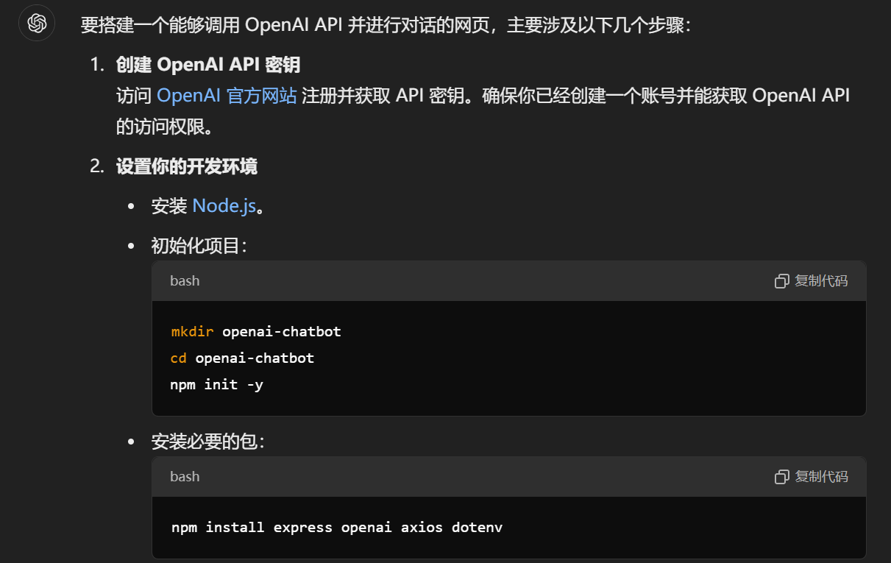

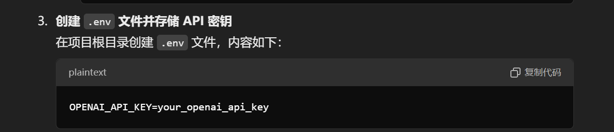

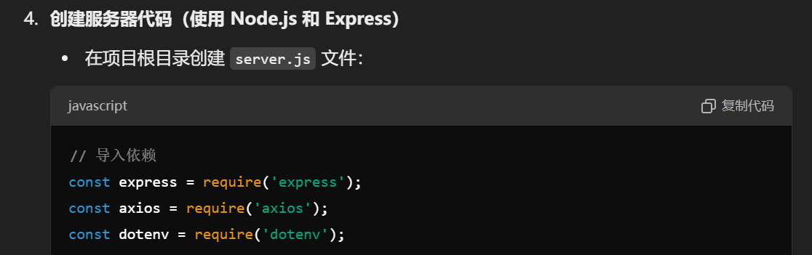

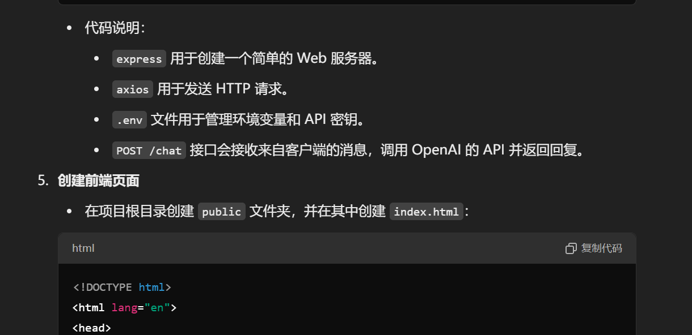

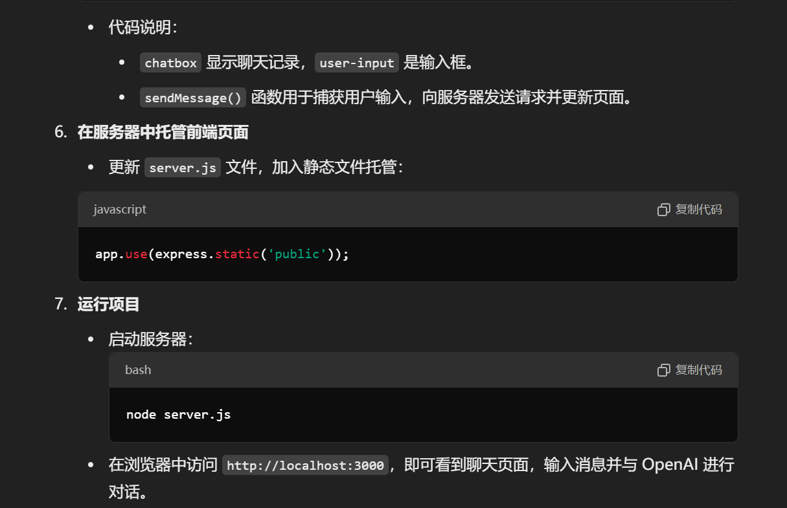

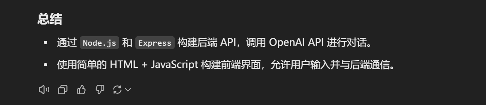

ok，接下来我们就好好读读它的回答。

我们可以看到，其实主要就做两件事，第一是做一个前端页面，也就是一个用于展示对话的页面，使用的语言是HTML和js，再构建后端API即可。

有的人可能就疑惑了，什么是前端什么是后端，什么是API，什么又是Node.js，什么又是Experss。

来，我们继续问AI——


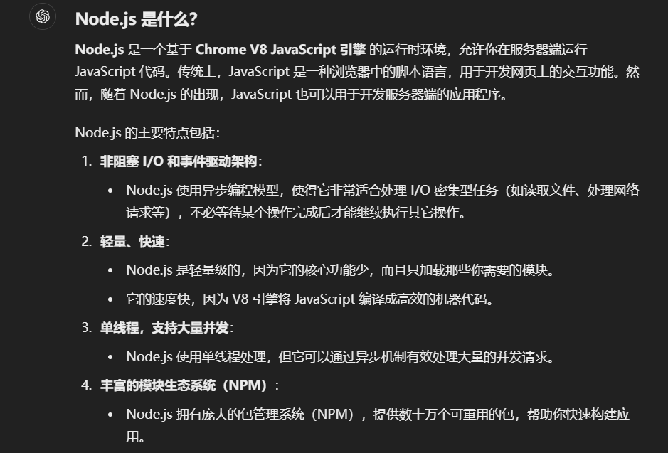

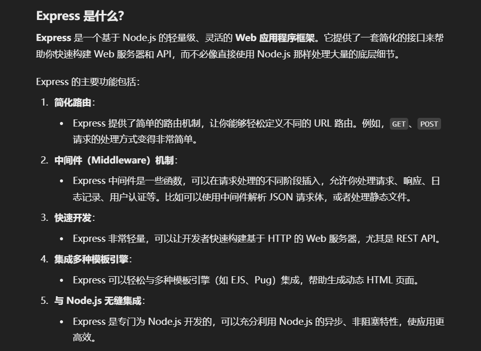

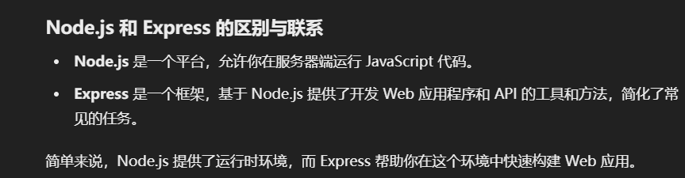

怎么办，还是好多看不明白的东西，但是总有你能明白的吧，对，我们的原则就是——看不懂的狂问AI（*你甚至可以开两个AI，一个专门负责给你解释各类名词教会你，另一个负责进行具体项目的指导，把AI当成老师，你当成最不耻下问的学生，提问的方式只要表达清晰就可以，其他花哨方法等到没有特别好回答时候再用即可*）

然后，你的知识库就多了很多名词，有的不理解，问了也不理解，没关系，只要你有这个印象，以后总会遇到的，说不定就懂了，我们的能力就是在这种一次次不理解和一次次看着不懂的东西里成长起来的。

**最重要的是，我们要直面这些海量的无法理解的东西，理解能理解的，想办法理解不能理解的——这就是自主学习，这就是高中课堂无法教会你的。**

没人可以告诉你，这些你是否应该理解或者你的能力是否能知道，这些全都交给你自己去判断，这就是为什么，同样的AI在不同人手中有不同的效果——总有人能够从中挖掘出自己需要的。

现在我们大概知道了，就是有一个东西叫node.js，我们需要安装一下，来提供运行环境（原理继续问AI），还有一个东西叫做Experss，是一个框架，也就是工具，我们就要用Experss来做具体的API调用这个事情，它会非常方便。

好了，接下来我们就照着gpt老师的方法开干——

首先要有一个API密钥，大家通过前面提到的途径，假设已经有了这么一个访问API的密钥。

接着继续第二步，安装node.js，这个简单，直接找官网。

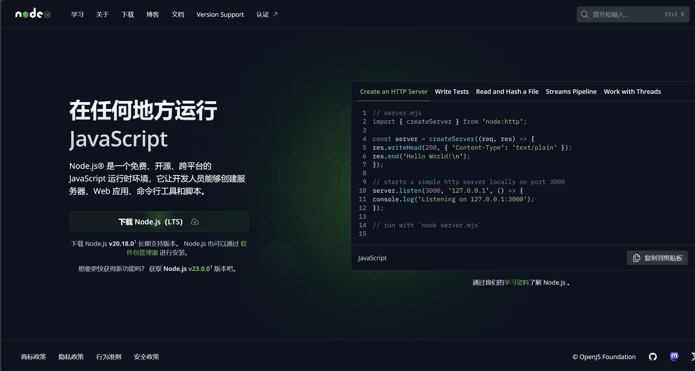

*官网还挺好看的*

直接下载安装，这些都简单。基本就是download，目录，next，next，next...finish这类流程，多安装一些就熟悉了。

安装完之后继续按照说明进行。

gpt给了我们一些命令，需要在命令行窗口运行，这个应该都会打开吧。各类命令有一定规律，我们可以读一下命令，理解大概意思，这里主要是创建文件夹，进入目录，安装包管理器并确认。如果看不懂直接问AI，关于命令语法，感兴趣可以学一下。

在此我们直接打开终端，cv命令：

```
mkdir openai-chatbot
cd openai-chatbot
npm init -y
```

结果如下，输出了一些信息，大概是安装好了，其他看不懂没关系，我们继续。

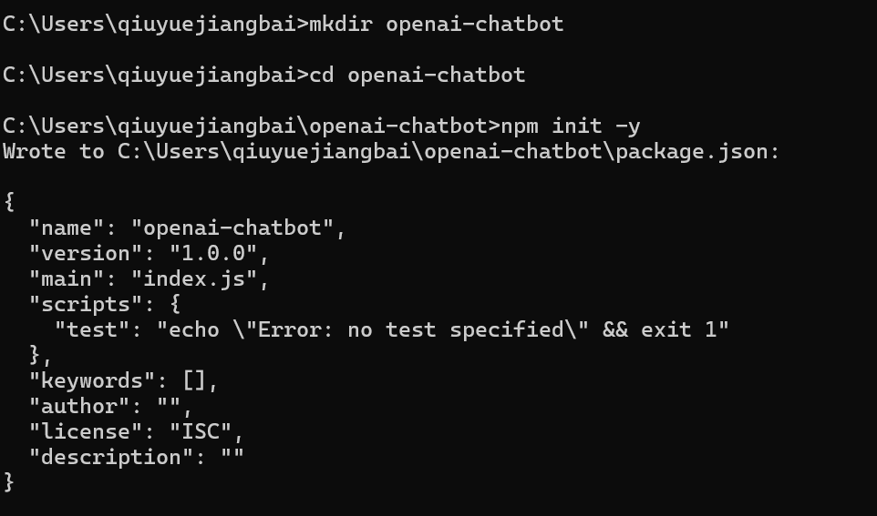

依据gpt说的，下一步要安装一些需要的包，它给了一行命令，我们也直接cv进去，等着安装就行。

```
npm install express openai axios dotenv
```

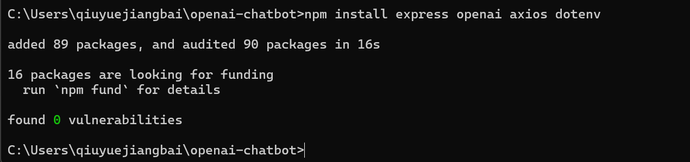

读一下输出，没有报错，看样子也是成功安好了。那我们继续——

gpt让我们在项目根目录创建一个.env文件，等等，.env文件是什么？怎么创建？于是我们复制粘贴这一步到输入框进行提问，来请教gpt老师。

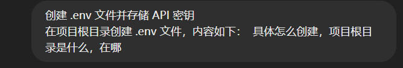

gpt老师说：

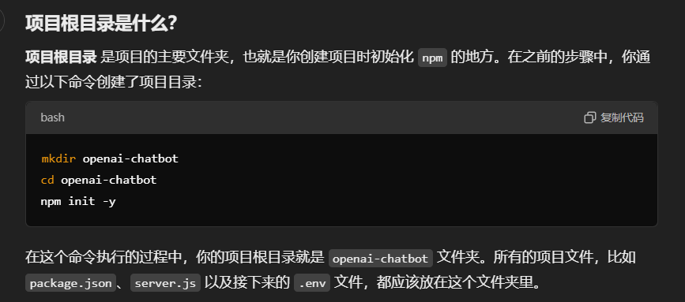

ok，这下我们明白了，直接在之前创建的openai-chatbot文件夹里创建文件就行，我们的命令行输入提示前有文件夹路径，看到是openai-chatbot，说明我们就在根目录，这就没问题了，我我们继续。

gpt老师给我们解释了一下这个文件干什么的（环境变量是什么？不知道的话不如问问AI试试看呢！），接着提供了详细的操作步骤。

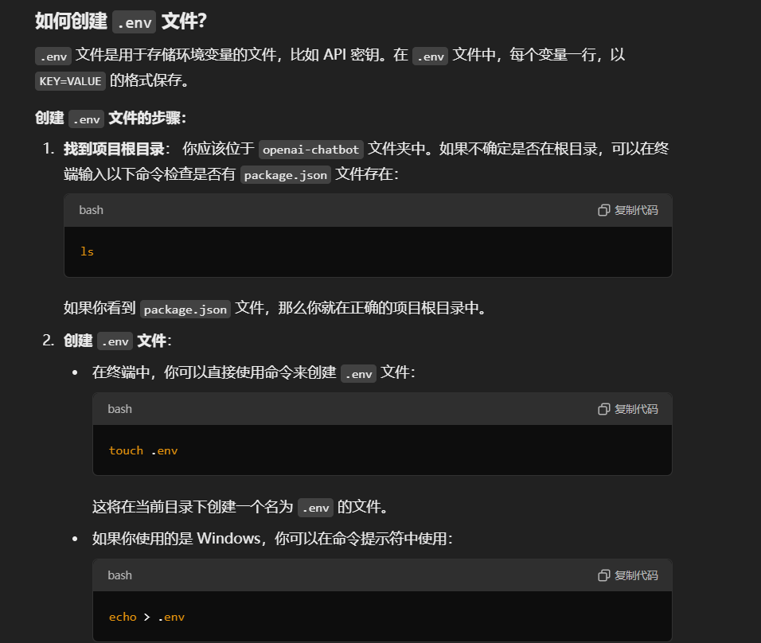

但是当我们兴冲冲输入命令，却发现报错了？

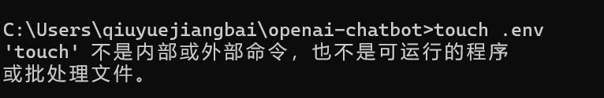

我们继续问gpt老师这是为什么，gpt老师说：

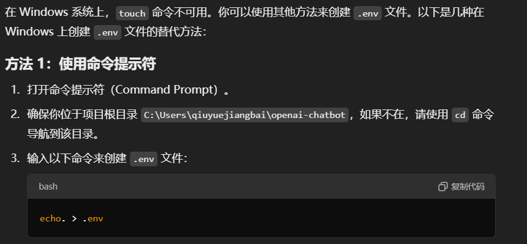

原来不同操作系统的命令有的地方也不同啊，我们又知道了很多东西，加深了理解。gpt老师将功补过，给了我们一个新方法，我们cv进去。

```cmd
echo > .env
```

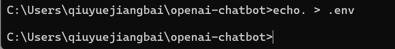

看样子也是创建好了，接下来我们打开.env文件并编辑。

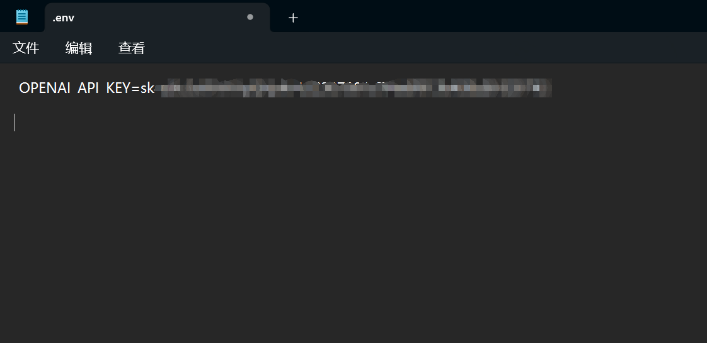

*ps：不要完全无脑照抄哦，右边需要存储你的密钥，而不是原本代码里的your_openai_api_key，这里我放上了我的密钥*，.env文件我采用记事本打开，vscode等代码编辑器都可以。

接着编写创建服务器代码，需要在根目录下创建serve.js文件，并添加代码，我采用vscode创建文件添加代码，也可以使用命令行创建文件，用记事本打开再添加代码。（命令行代码和具体操作也可以问AI，流程如上）

添加AI写的代码如下：

```js
// 导入依赖
const express = require('express');
const axios = require('axios');
const dotenv = require('dotenv');

// 读取 .env 文件中的配置信息
dotenv.config();

const app = express();
const port = 3000;

// 解析 JSON 请求体
app.use(express.json());

// OpenAI API URL 和密钥
const OPENAI_API_URL = 'https://api.openai.com/v1/chat/completions';
const OPENAI_API_KEY = process.env.OPENAI_API_KEY;

// 聊天接口
app.post('/chat', async (req, res) => {
    const { message } = req.body;

    if (!message) {
        return res.status(400).json({ error: 'Message is required' });
    }

    try {
        const response = await axios.post(
            OPENAI_API_URL,
            {
                model: 'gpt-3.5-turbo',  // 选择模型
                messages: [{ role: 'user', content: message }]
            },
            {
                headers: {
                    'Authorization': `Bearer ${OPENAI_API_KEY}`,
                    'Content-Type': 'application/json',
                }
            }
        );

        const chatResponse = response.data.choices[0].message.content;
        res.json({ response: chatResponse });

    } catch (error) {
        console.error(error);
        res.status(500).json({ error: 'Error calling OpenAI API' });
    }
});

// 启动服务器
app.listen(port, () => {
    console.log(`Server is running on http://localhost:${port}`);
});
```

注意，上述的API_URL是openai官网提供的，购买时应该选直连官网的API。密钥就是购买后给你的一连串乱七八糟的字符，已经存到.env文件里了。

vscode添加后：

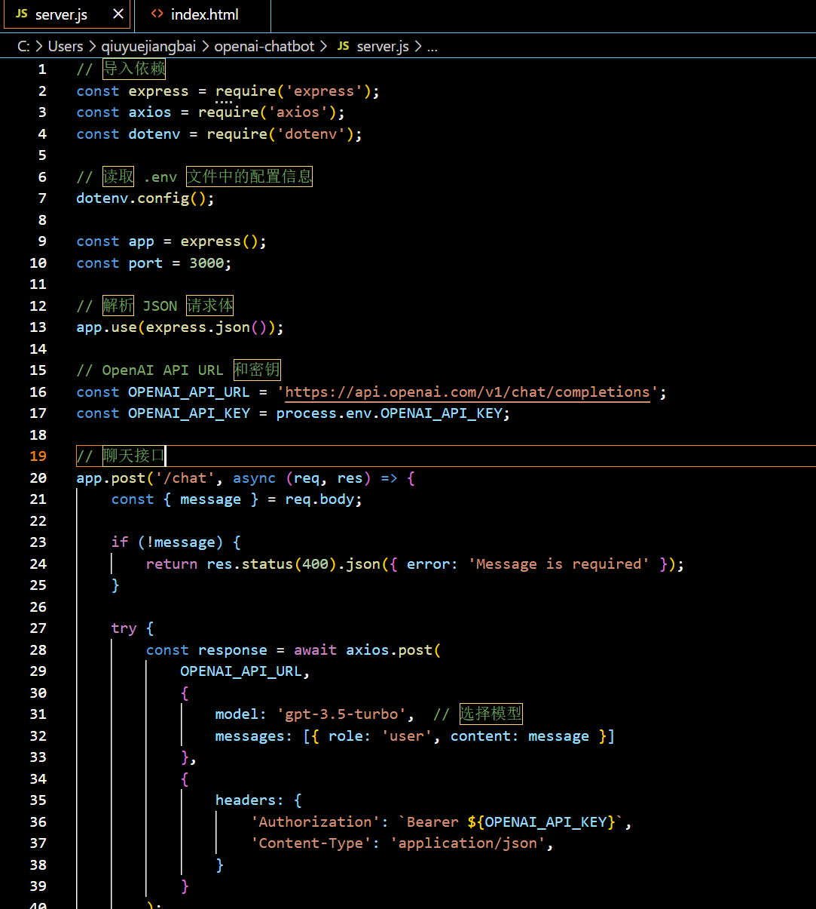

上述代码感兴趣的话，可以一句一句问AI让它解释，有C++语法基础的话，直接看代码应该也不是很难理解，尽管不知道语法，**但是适当阅读一下代码，理解大概意思，判断是否可以直接套用，是否需要修改部分细节也是必要的，我们可以不会写完整的代码，但是也需要“动着脑子抄”**。

接着，再创建public文件夹，在里面添加html文件，并向文件中添加代码。

上一步是创建了一个服务器，这一步则是写一个网页。我这里也采用vscode进行文件创建和编写，同样，命令行创建，记事本打开进行编辑也是ok的，在此不多赘述。

添加代码如下：

```html
<!DOCTYPE html>
<html lang="en">
<head>
    <meta charset="UTF-8">
    <meta name="viewport" content="width=device-width, initial-scale=1.0">
    <title>OpenAI Chatbot</title>
    <style>
        body { font-family: Arial, sans-serif; }
        #chatbox { width: 100%; height: 300px; border: 1px solid #ccc; padding: 10px; overflow-y: scroll; }
        #user-input { width: 100%; padding: 10px; }
    </style>
</head>
<body>
    <h1>Chat with OpenAI</h1>
    <div id="chatbox"></div>
    <input type="text" id="user-input" placeholder="Type your message here" />
    <button onclick="sendMessage()">Send</button>

    <script>
        async function sendMessage() {
            const message = document.getElementById('user-input').value;
            if (!message) return;

            // 更新聊天框
            const chatbox = document.getElementById('chatbox');
            chatbox.innerHTML += `<p><strong>You:</strong> ${message}</p>`;

            // 发送请求到后端
            const response = await fetch('/chat', {
                method: 'POST',
                headers: { 'Content-Type': 'application/json' },
                body: JSON.stringify({ message })
            });

            const data = await response.json();
            const reply = data.response;

            // 显示 OpenAI 的回复
            chatbox.innerHTML += `<p><strong>AI:</strong> ${reply}</p>`;
            chatbox.scrollTop = chatbox.scrollHeight;

            // 清空输入框
            document.getElementById('user-input').value = '';
        }
    </script>
</body>
</html>
```

由于这段代码是写了一个网页页面，所以不牵扯什么具体需要改的东西，我们不需要实现很好看的页面，只要有这么一个页面能用就行了，如果想写出更好看的页面，也可以阅读代码，让AI进行修改（用AI写前端的体验真的很无敌）。

搜一下前端相关的知识，大概了解一下有哪些语言，然后就一通描述，交给AI实现，你看看对不对就行。

这里我们不对页面进行修改了，直接下一步。

vscode添加后：

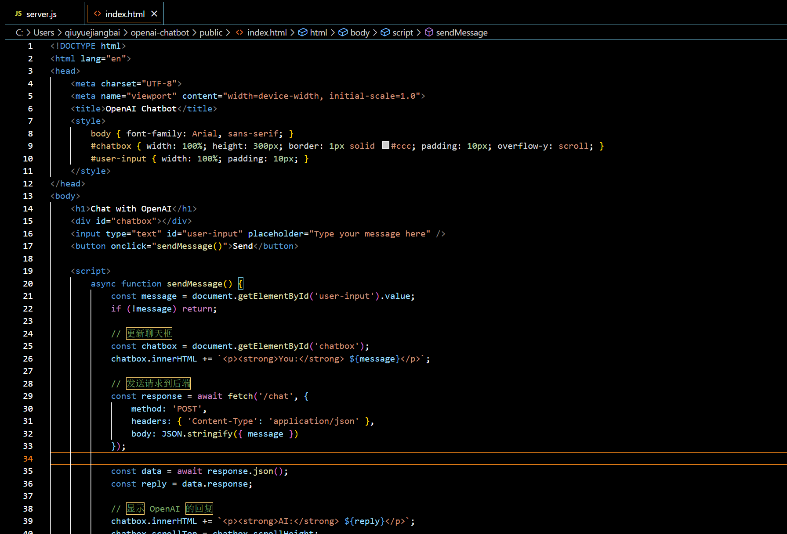

我们写了一个页面，也写了服务器，这两个步骤该怎么连起来呢？gpt老师也告诉我们了，直接打开server.js文件，加入静态文件托管即可。

在文件末尾添加代码：

```
app.use(express.static('public'));
```

ok，所有的代码编写就完成了，接着进行最后一步，启动服务器，就可以登上我们的网页了！

终端中输入：

```
node server.js
```

显示如下：


意思大概就是我们的服务器正在运行，按住ctrl右键网址，就可以打开页面啦！

看看我们的页面长什么样~

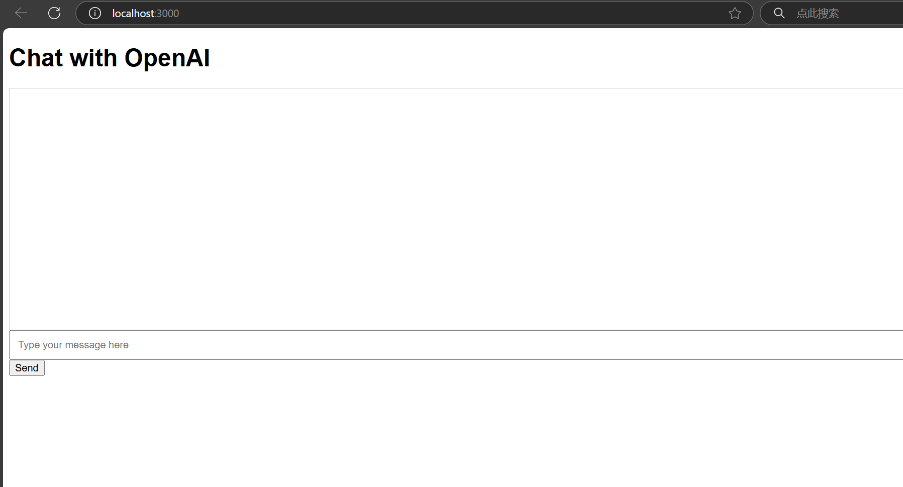

嗯...似乎有些简陋，但是也可以用，不错，我们来试试能否和AI对话。


ok，AI正常回复啦！

至此，我们已经实现了构建了一个简单的多文件小项目，搭建一个简单的服务器，在一个自己的网页上部署了我们的chatBot，并调用API进行连接对话。

而我们甚至不理解服务器原理，不会js和html！仅仅是使用AI，花费一点点时间，就已经能实现这样的效果了。这放在几年前，简直是无法想象的事情，我们跳过了大量的学习时间，直接以最快的路径走向了我们需要的地方。

诚然，基础知识仍然是必要的，但是我们不再需要花费大量精力熟练语法或debug，也不再需要花费大量精力编写重复的代码，我们的注意力可以自然而然放在代码的思路和架构，放在背后的原理上，解放了多少时间！

而在手动做一个小项目的基础上，我们对很多东西都有了一个了解，又能学到很多东西，往后再看相关内容，也会有深刻印象，学起来更轻松。

这句话毫不夸张，AI几乎可以帮你做到你想做的任何事情。

我们必须遗憾地承认，随着大量工具的开发，程序员的门槛在不断降低，造轮子的效益和意义也无限下降，但是这并不意味着死路一条，相反，我们更要拥抱新技术，搭上时代的快车，只有懂得运用工具，敢于创新，不断学习的人，才有底气和能力实现自己想做的事情。

我希望以上内容能帮助大家体会到使用AI工具的一个简单思路和方法——把它当最任劳任怨的工人，最耐心教导的老师，而我们是背后的操纵者设计者，也是最不耻下问的学生。

还等什么呢？今天就可以开始，打开AI，朝着你想做的事情出发！

我们要体悟着时代，而不是被洪流裹挟，最后，以我非常喜欢的一句话作结。

**The Best of Times, The Worst of times**


*以上内容若有不理解的地方，欢迎与我讨论！*
