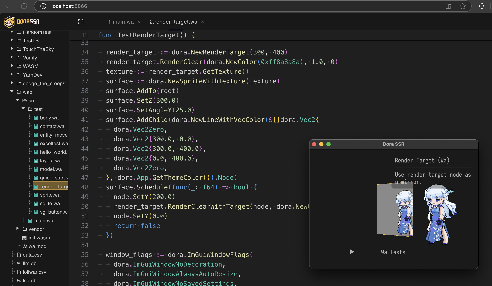

# 用凹语言为游戏引擎装上一颗开源的心

&emsp;&emsp;本文中，我们会先聊聊一些关于技术话题或许稍显枯燥的“干货”，后面再聊关于凹语言社区或许是国内开源社区首创的一些活动的思考。文中相关开源项目实践的链接如下：

- 凹语言项目：

	https://github.com/wa-lang/wa

- 跨平台编译凹语言编译器为 C 程序库：
	
	https://github.com/pigpigyyy/wa/blob/dora/build_wa.sh

- 把凹语言用作支持热重载的 WASM 游戏开发脚本：

	https://github.com/IppClub/Dora-SSR

&emsp;&emsp;在很多游戏引擎的设计中，脚本语言通常扮演着 “交互逻辑层” 的角色。它必须具备三个特点：程序嵌入友好， 能方便地集成进宿主引擎的运行时中；跨平台，保证在不同终端（PC、移动设备）上的一致性表现；可热更新 / 快速迭代，支持游戏开发过程中的调试与内容频繁修改。

&emsp;&emsp;然而随着 WebAssembly（WASM）技术的成熟，我们一直很希望 WASM 能成为构建“高性能、可移植、可嵌入”的游戏脚本语言运行时的新的选择。WASM 的优势在于提供了沙盒安全、接近原生速度的执行环境，同时具备与宿主环境之间良好的互操作能力。WASM 提供了接近理想的执行环境，可是要用什么语言来写 WASM 脚本呢？这成了新的“灵魂问题”。从 2022 年开始，我们一直都在探寻，是否存在最适合构建为游戏引擎脚本语言的 WASM 语言方案？

## 一、寻找一门适合游戏引擎的 WASM 脚本语言

&emsp;&emsp;在当时，我们有调研过很多种 “WASM 语言” 的技术方案，对于我们在做的 Dora SSR 开源游戏引擎项目，它的目标是将游戏开发工具链内置到引擎程序中在跨平台环境中使用，所以对于大部分 WASM 语言，想要将其编译器嵌入跨平台使用的目标是难以做到的。

&emsp;&emsp;比如把 C/C++ 的 GNU 或者 Clang 编译器再加 LLVM 后端运行到 Android 或是 iOS 的应用中，基本是不可想的难度；发现了 AssemblyScript，可它要求运行在 Node.js，或是自举编译为 WASM 二进制运行，没法简单的嵌入；发现了 MoonBit，在当时并没有开源；直到我们发现了凹语言，这个同样是 WASM 上的原生开源编程语言，作为 Go 语言开发的项目，在交叉编译的能力优势，以及通过 Cgo 导出跨语言交互的接口的功能上看，似乎变得很有戏。并且它从项目之初便公开源码，使用类似 Go 语言这样大家熟悉易上手的语法风格，并且很早便在网页端提供了易于访问的 WASM 在线试用环境，这种项目的透明度与开放性也赋予了我们极大的信心。

&emsp;&emsp;对于原生运行的游戏引擎的环境中，跨平台嵌入一个 WASM 虚拟机运行时有 C 语言开发的 WASM3，用 Rust 语言开发的 Wasmtime 等等多种方案。然而，仅仅拥有编译器与运行时，还不能直接让一门 WASM 语言顺畅地在游戏引擎中发挥作用。我们还需要面对一个更核心的问题：如何高效且安全地实现 WASM 脚本与游戏引擎本身的交互调用呢？这意味着我们需要实现一种可靠的跨语言调用机制（IDL，Interface Definition Language）以及配套的自动绑定工具，以实现引擎功能在脚本语言中有效的导出。

## 二、落地技术实践和凹语言绑定之路

&emsp;&emsp;从理论探索到实践落地，任何技术方案都必然经历具体实现中的挑战与收获。为 Dora SSR 引擎引入凹语言支持的过程，也是同样充满了技术落地的折腾。我们先来看一看已达成的成果吧。

&emsp;&emsp;目前在启动 Dora SSR 开源游戏引擎（v1.6.9 版本）后，在浏览器中访问引擎自带的 Web IDE，在左侧“工作空间”资源树下从右键菜单就能新建一个凹语言工程。

&emsp;&emsp;在编写凹语言的代码后，按下 `Ctrl + S` 保存代码就能触发自动编译。或是直接按下 `Ctrl + R` 自动保存代码，自动编译并开始运行凹语言游戏。

&emsp;&emsp;目前 Dora SSR 的凹语言绑定约有 1.8 万行的凹代码，凹语言编译器截至发文还暂未增加多线程和增量编译的加速优化，但是在我的设备上编译生成 WASM 二进制的时间也只用 800 毫秒。完胜 Dora 引擎的 Rust WASM 绑定动辄需要几秒的编译时间。下面再来聊聊这个项目是怎么做到的。

### 1. 阶段一，对语言绑定的探索（从 Rust 到 WASM 再到 C++）

&emsp;&emsp;在最初，我们才开始关注 WebAssembly（WASM）技术的时候，Rust 因其对 WASM 原生友好的支持，自然成为我们做实践的首选语言。于是我们在做学习研究的过程里，在 Rust 中实现了简单的逻辑模块，然后将其编译为 WASM 模块，再通过解析生成的接口描述语言（IDL）自动生成代码绑定的胶水代码到 C++ 引擎中。

&emsp;&emsp;这个过程虽然涉及较长的调用链路（Rust → WASM → C → C++），但清晰地验证了一个事实：将高级语言编译为 WASM，再嵌入到底层游戏引擎中，是完全可行的。尤其是 IDL 机制的使用，为复杂语言绑定提供了一种结构化和可扩展的方案，这也为后续尝试将 Rust 的经验迁移到凹语言上铺平了道路。

&emsp;&emsp;随后，我们便将这一经验迁移到凹语言的绑定工作上来。虽然凹语言的 WASM 生态，文档相对 Rust 而言也并不完善，但得益于凹语言项目本身开源且易于阅读和修改的特性，我们很快便成功地进行了初步的绑定测试。这一实践的具体细节波折又有趣，也可以参见：[《给凹语言编写游戏引擎绑定的故事》](https://zhuanlan.zhihu.com/p/17593012053)。

### 2. 阶段二，运行时嵌入的突破（Go 与 C++ 之间的协作）

&emsp;&emsp;然后真正的难点在于如何将基于 Go 语言的凹语言编译器和运行时环境嵌入到基于 C++ 的 Dora SSR 引擎中。Go 语言天然与 C++ 并不直接兼容，要涉及到 Cgo（Go 与 C 语言交互）和 gomobile 工具链的交叉编译。

&emsp;&emsp;在这个过程中，我们主要解决了以下几个关键技术难题：

- **Cgo 跨语言调用问题**： 我们通过 Cgo 编写了一系列接口，封装 Go 编译器的调用接口，以 C ABI 的方式导出。C ABI 提供了跨语言调用的稳定桥梁，能够被 C++ 项目直接调用。
- **跨平台 Cgo 交叉编译问题**： 使用 Go 和 Cgo 进行交叉编译需要适配多个平台的 C 编译器。例如，在 Windows 上，游戏开发涉及底层图形接口 DirectX 的调用，通常绕不开 MSVC 编译器的编译环节。Go 默认的交叉编译工具链依赖 GNU 工具链生成动态库，但生成的库无法直接被 MSVC 使用，因此需要额外处理生成 MSVC 兼容的链接库。而在 Linux 和 macOS 平台，也需要精心配置不同平台特定的编译工具链，确保生成的静态库和动态库可以顺利链接到 C++ 工程中。
- **内存管理与生命周期协调**： 凹语言编译生成的 WASM 模块加载到 Dora SSR 引擎后，需要妥善管理内存和资源释放。这部分我们实现了一套引用计数与生命周期管理机制，确保了凹语言模块和 Dora 引擎之间资源的安全回收。
- **Android 平台特有的挑战**： Go 语言编写的库在嵌入跨平台程序时遇到的问题尤其突出在 Android 上。为了实现 Go 库的跨平台兼容，我们不得不设计一套复杂的调用链路：C++ 通过 JNI 调用 Java，Java 再通过 JNI 调用 Go 绑定对接 Go 动态库。同时必须密切关注 Go 库加载的初始化时机，确保 Go 库的 Thread Local Store（TLS）正确附加到主线程上。此外，由于 Dora 游戏引擎使用了 SDL2，还需协调 SDL2 的 JNI 环境，以确保各组件能协作完成初始化。

&emsp;&emsp;最终的实现结果令人振奋，Dora SSR 引擎不仅成功实现了对凹语言编译器的调用和运行，还支持脚本在运行时的热加载与实时更新，真正将凹语言融入到游戏逻辑开发的实际流程中。

&emsp;&emsp;更重要的是，Dora SSR 项目也因此成为首个实现凹语言原生集成的跨平台应用框架，拓展了凹语言在实时交互内容开发领域的边界，也为国产编程语言打通了通向游戏创作生态的全新路径。作为 Lua 脚本语言多年爱好者的我们，也为找到游戏开发脚本，是由国内开发者主导的新语言方案而感到一种莫名的欣慰。

&emsp;&emsp;这一实践的成功，也印证了凹语言开源项目作为嵌入式脚本语言方案的潜力，为后续相似项目的技术方案选型提供了参考范例。

## 三、社区协作的回响，凹语言社区的共创实践

&emsp;&emsp;在完成技术落地之后，我们原以为这段协作也告一段落。但凹语言社区的回应，远超出我们的预期。

### 不只是技术合作，更是价值共鸣

&emsp;&emsp;2024 年底，凹语言项目申报“武汉市优秀开源软件项目”并成功入选，获得了来自武汉市软件产业发展专项资金的支持，共计 30 万元人民币。这是大家做开源这么多年，第一次见到做开源得到官方真金白银认可的事件。并且他们在获奖后做出的决定也是国内开源社区中的首例：立即将奖金中的一部分，按社区授予的贡献点的比例，发放给在项目中做出贡献的个人和协作项目。

&emsp;&emsp;我们收到了这份来自凹语言社区的回馈。这并不是一笔巨额奖金，但它所代表的，是对开源协作最朴素的尊重与信任——哪怕没有法律合同或是正式雇佣关系，也要公平地回馈每一份劳动。

&emsp;&emsp;而对于我们 Dora SSR 的社区来说，这不仅是对我们做开源技术支持工作的认可，更是一次理念上的共振。

### “共玩技术”到“共建社区”

&emsp;&emsp;凹语言社区一开始便呈现出一种罕见的自组织状态。他们没有明确的商业目标、没有大公司背书，而是聚集了一群有自由的技术信仰、拥抱共同构建的技术理想主义者。

&emsp;&emsp;他们不只是在“做产品”，而是在探索一种新的社会协作关系。

&emsp;&emsp;我们曾一度质疑这种模式是否能走远 —— 没有明确的领导者、没有 KPI，没有稳定资金支持，这些在传统团队看来是“缺陷”。但正是这种对中心化掌控的抗拒、对协作的极度开放，构成了这个社区最独特的生命力。

&emsp;&emsp;凹语言不止是一个语言项目，它正在成为一个“社区实验场”，探索在没有雇佣劳动的前提下，如何通过透明贡献值记录、开源成果确认、收入共建分配等方式，搭建起一种更平等的技术生产关系。

### 向未来的一种可能性低声发问

> “有没有一种协作关系，可以不依赖公司、合同与老板，也能持续演进，甚至创造出比商业项目更具意义的成果？”

&emsp;&emsp;很多人都有过类似的畅想，但大多数时候，我们不得不与现实妥协，回归既有的雇佣与分工结构。而凹语言社区试图以实际行动回应这个问题。他们选择不只是造梦，而是真正走上这条不知在何方的路。

&emsp;&emsp;在这样一个时代，开源本来就不该只是技术工具的开放，更应该是组织方式与价值观的重新定义。

&emsp;&emsp;我们很荣幸能在这个探索中，成为一个协作者，也成为一个受益者。

### 致每一位相信“共建能带来改变”的朋友

&emsp;&emsp;从一次跨语言绑定实践，到一次关于“共建”的真实回响，我们见证了技术与理念在开源中的交织。
 凹语言社区让我们再次相信：

> “协作不是资源分配的问题，而是共同为建立信任的努力。”
> 
>  “真正的自由，不是拒绝合作，而是能在没有控制的前提下依然自发地共创。”

&emsp;&emsp;这就是我们所期待的未来。它并不遥远，它正在开源社区悄悄发生。

